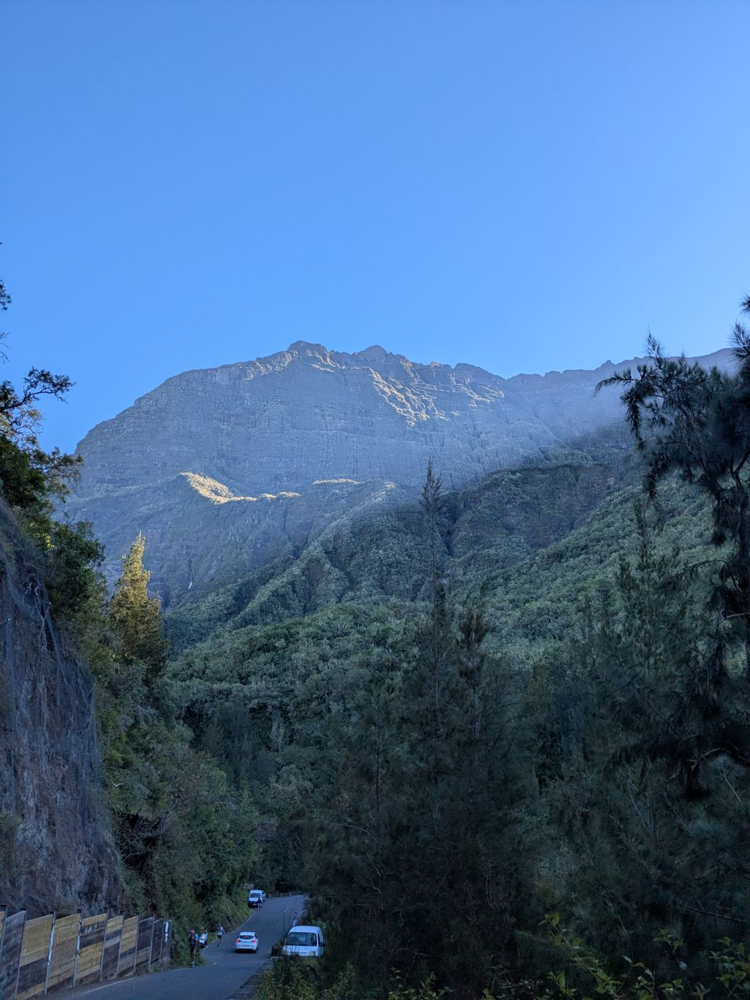
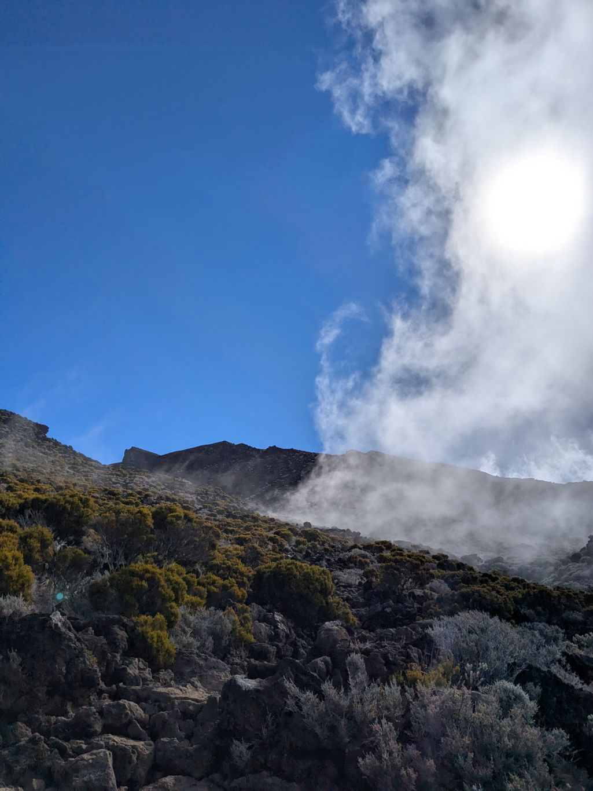

+++

title = "Storming the Piton des Neiges"

draft = "false"

date = "2025-07-12"
+++

The night spent at our bivouac spot turned out to be very pleasant, and William and I wake up feeling good. We have breakfast with our friends and take the time to make coffee. Today, the goal is indeed not to finish the stage too early. We plan to climb the Piton des Neiges and arriving early would mean enduring intense cold for too long.
<!--more-->

The climb is particularly arduous; we stick together to tear ourselves away from Cilaos. A mountain hut halfway allows us to take a well-deserved lunch break and say goodbye to Camille and his partner. They're descending via a different route and we won't see them again until the end of the GR.

We continue our way toward the summit, through volcanic rocks, on red and slippery pozzolana. The higher the altitude, the more the sun beats down and the scarcer the oxygen becomes. We take a few breaks to catch our breath; it would be a shame to suffer from altitude sickness.






Finally, under a radiant sun, the roof of the Indian Ocean unveils itself before us. We are alone, not a sound disturbs our wonder. We gaze for a long time at the city, the basalt chimneys, the plump clouds crashing against the flanks of the old volcano. Time stands still.








The setting sun calls us to order; once it disappears behind the mountain, the temperature will drop below freezing and we'll need to be already in our sleeping bags. 
Quick dinner, a few more photos, and by 6:30 PM we're already snug and warm.
If we're lucky, we'll watch the sunrise tomorrow, before heading back down to the plain.







