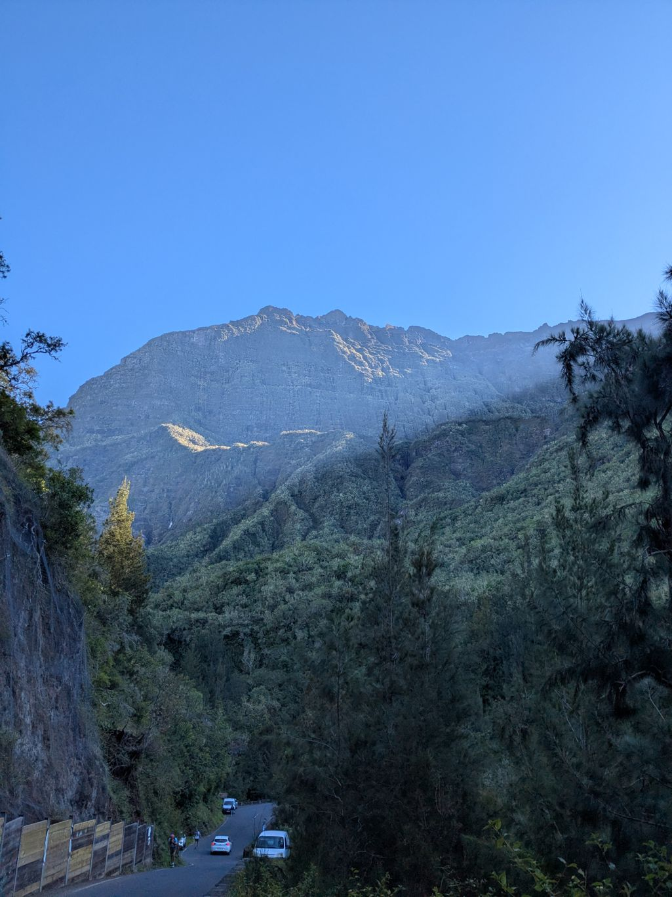
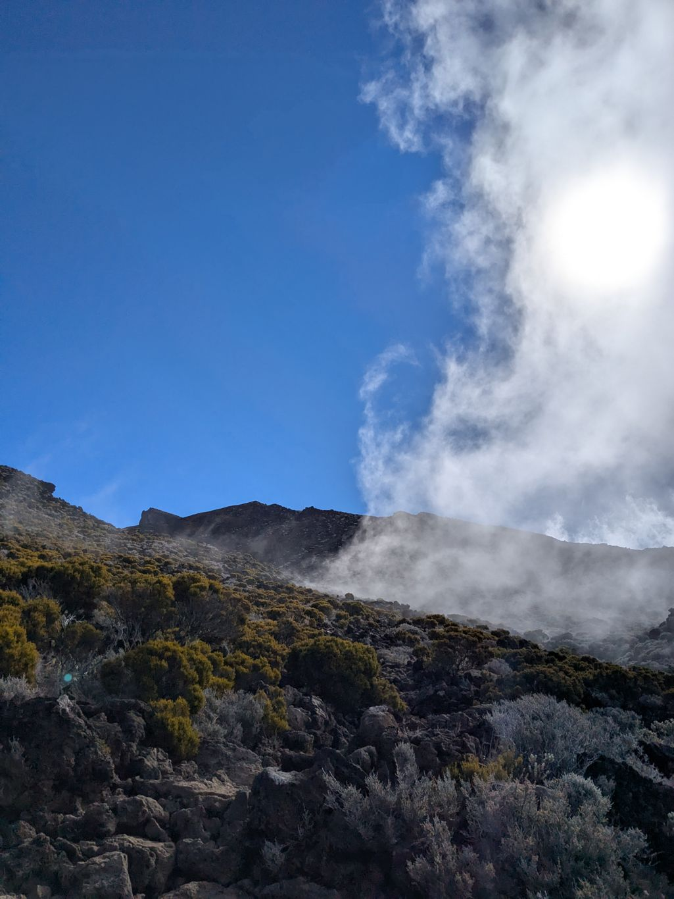

+++

title = "A l'assaut du Piton des Neiges"

draft = "false"

date = "2025-07-12"
+++

La nuit passée dans notre point de bivouac s'est révélée très agréable et nous nous réveillons en bonne forme avec William. Nous déjeunons avec nos amis et prenons le temps de faire du café. Il s'agit en effet aujourd'hui de ne pas finir l'étape trop tôt. Nous avons pour projet de gravir le Piton des Neiges et y arriver tôt signifierait subir un froid intense pendant trop longtemps. 
<!--more-->

La montée est particulièrement ardue, nous nous serrons les coudes pour nous arracher à Cilaos. Un gîte à mi-parcours nous permet de prendre une pause déjeuner bien méritée et de dire au revoir à Camille et sa compagne. Ils descendent par un autre itinéraire et nous ne les retrouverons qu'à la fin du GR. 

Nous continuons notre chemin vers le sommet, à travers les roches volcaniques, sur la pouzzolane rouge et glissante. Plus l'altitude augmente, plus le soleil cogne et l'oxygène se fait rare. Nous faisons quelques pauses pour reprendre notre souffle, il serait dommage d'être pris du mal des montagnes. 






Enfin, sous un soleil radieux, le toit de l'Océan Indien se dévoile devant nous. Nous sommes seuls, pas un bruit ne vient troubler notre émerveillement. Nous observons longuement la ville, les cheminées basaltiques, les nuages replets qui s'écrasent sur les flancs du vieux volcan. Le temps est suspendu. 








Le soleil déclinant nous rappelle à l'ordre, une fois qu'il sera derrière la montagne, la température chutera sous le zéro et nous devrons être déjà dans nos duvets. 
Dîner rapide, quelques photos supplémentaires et voilà qu'à 18h30 nous sommes déjà bien au chaud.
Si nous sommes chanceux, nous assisterons demain au lever du soleil, avant de redescendre dans la plaine.







