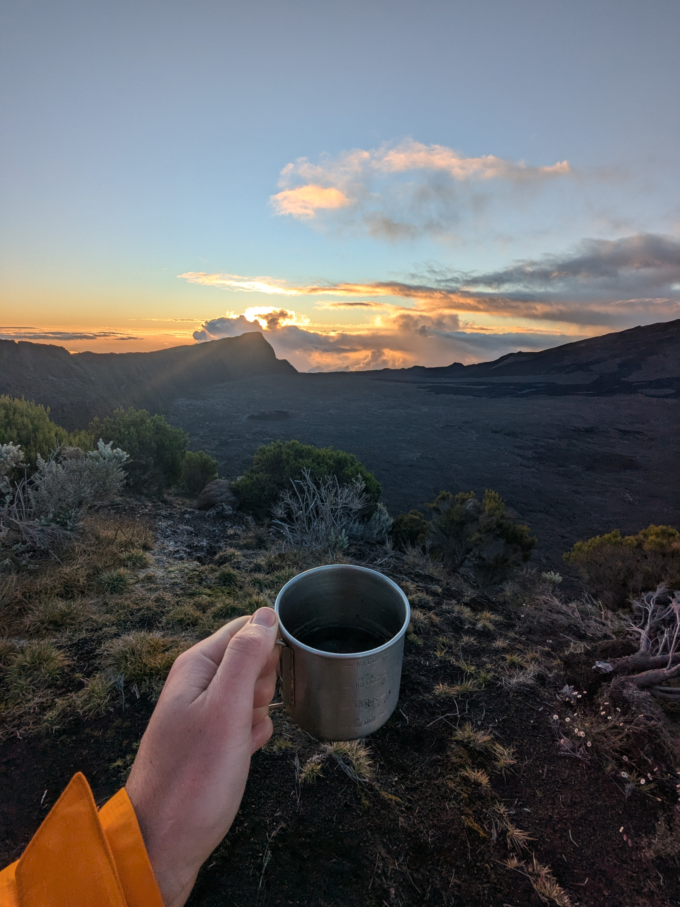
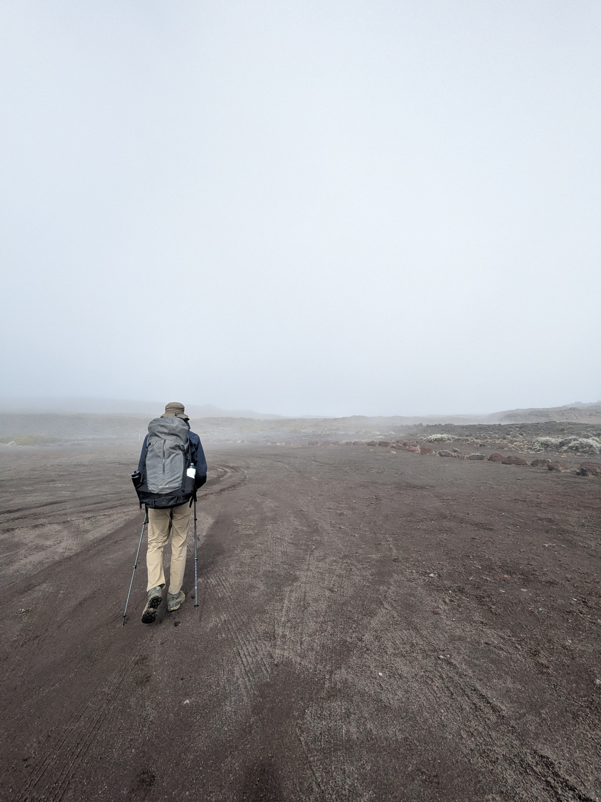
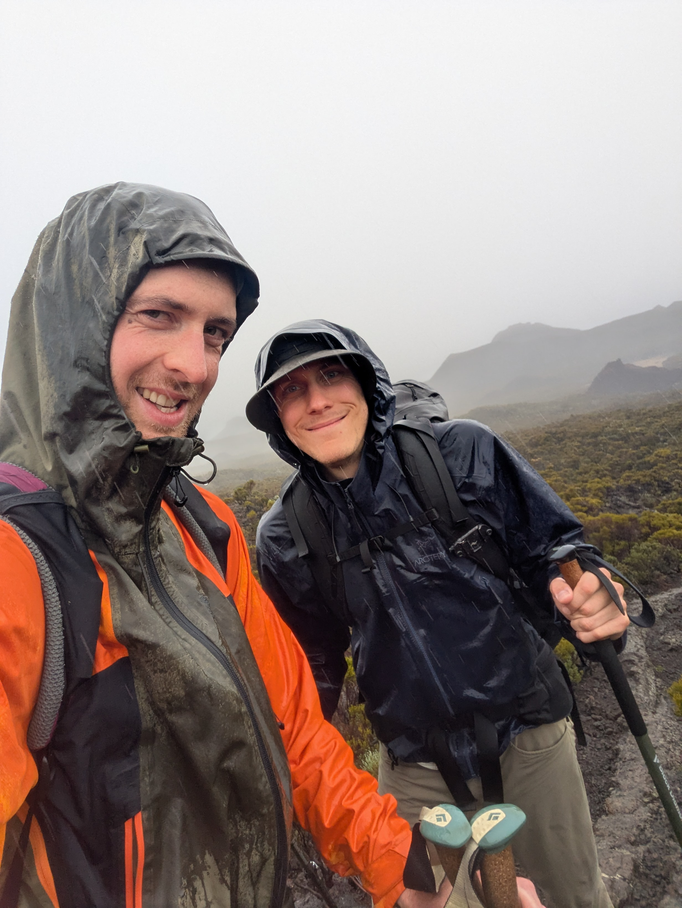
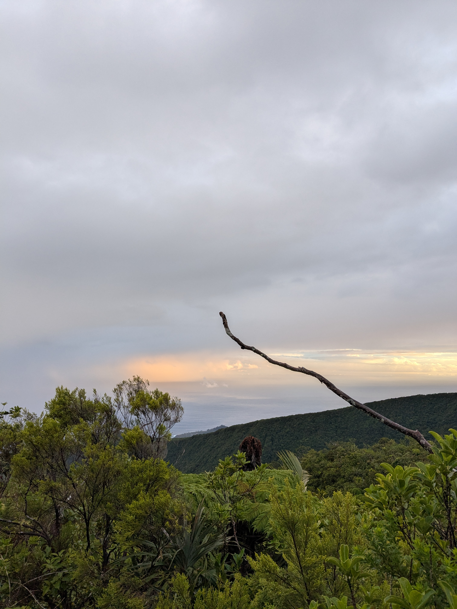
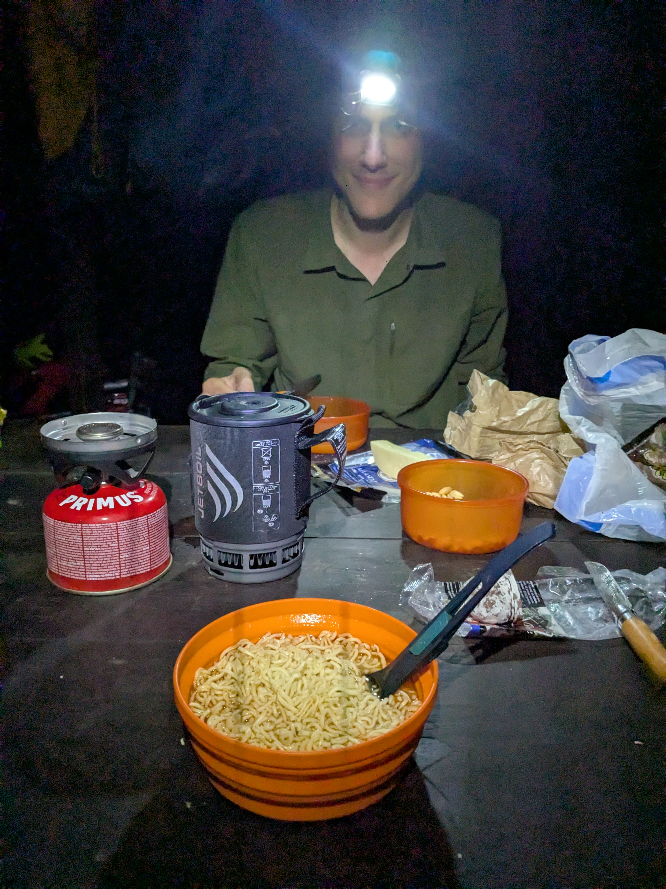

+++

title = "Shall We Go Down?"

draft = "false"

date = "2025-07-15"
+++

The night is a bit restless; the tent is pitched on a bump and I have to twist around to avoid feeling it. Fortunately, the extraordinary view of the Piton de la Fournaise makes up for this inconvenience; we enjoy it with a nice hot coffee.
<!--more-->

The goal of the day is to climb the volcano, then go back to sleep a bit further around the crater. The ascent is long but easy, if you disregard the swarm of tourists and the ballet of helicopters flying over the crater. The crossing of the lava field is magnificent, the ground lunar (it looks like the cracked crust of a big brownie). In two hours, we're at the top.







Hardly had we started the descent when a big cloud came down on the summit. We quicken our pace to get out of it and reach the volcano restaurant where we're supposed to have lunch.
We have a beer there, which has the effect of making us sleepy, then some delicious rougail sausages, the best so far. Meanwhile, the weather deteriorates; we see droplets through the restaurant window and big clouds surrounding us. After a coffee, we decide to finally set off into this fog.

The path is flat; we chat despite the rain. We reach Piton Berte, where we're supposed to sleep. It's grey, it's raining, it's only 3:30 PM, the question arises: shall we go down?
We decide to take the risk of starting the descent, which we know is extremely long, toward the coast. The rain intensifies; we're quickly soaked, history repeats itself...

No spot allows us to stop and pitch the tent. So we quickly understand that we'll have to go all the way. From scoria we move on to clay soil, from scrawny bushes to tropical ferns. Stones and roots are slippery, not a moment of inattention. Relief when we spot the sea, but unfortunately the sun sets.

By headlamp, we finish the remaining 200 meters of elevation down to a kiosk where we had planned to sleep. Exhausted, we arrive. The air is warm, the kiosk is dry, it's a simple little pleasure. We eat the last sausage, some peanuts, and hot noodles. Tomorrow we only have eight kilometers left, a bit of bus, then we'll meet our friends. A bit of comfort, at last!

