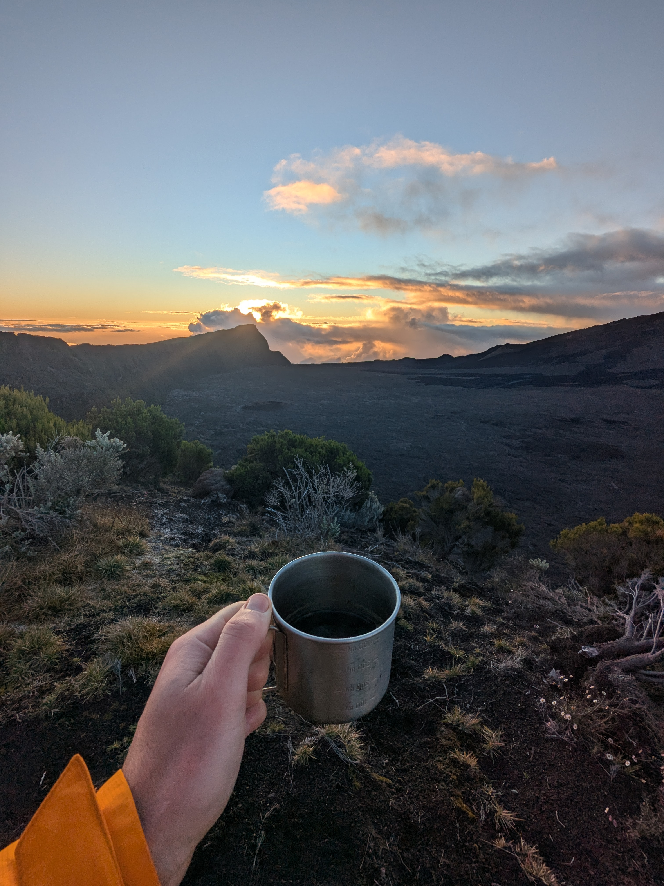
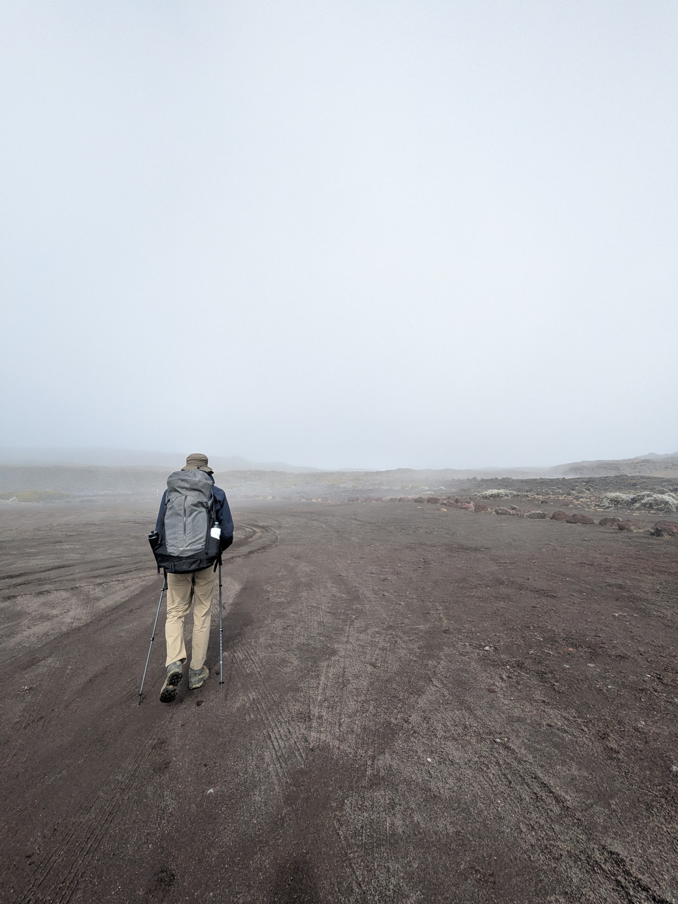
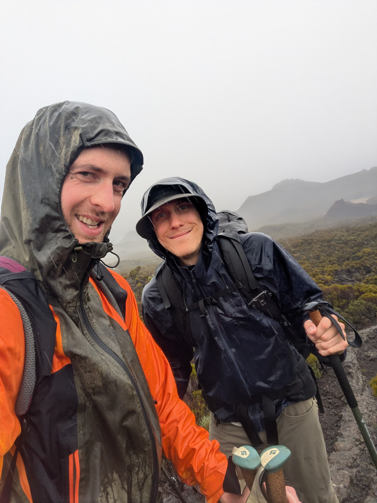
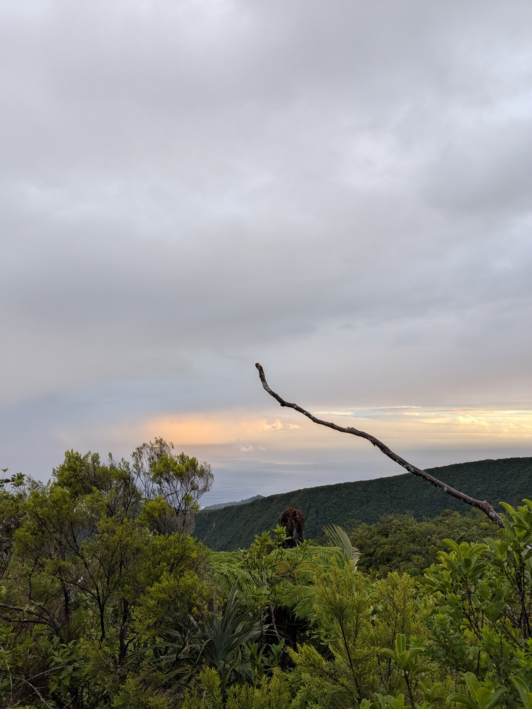
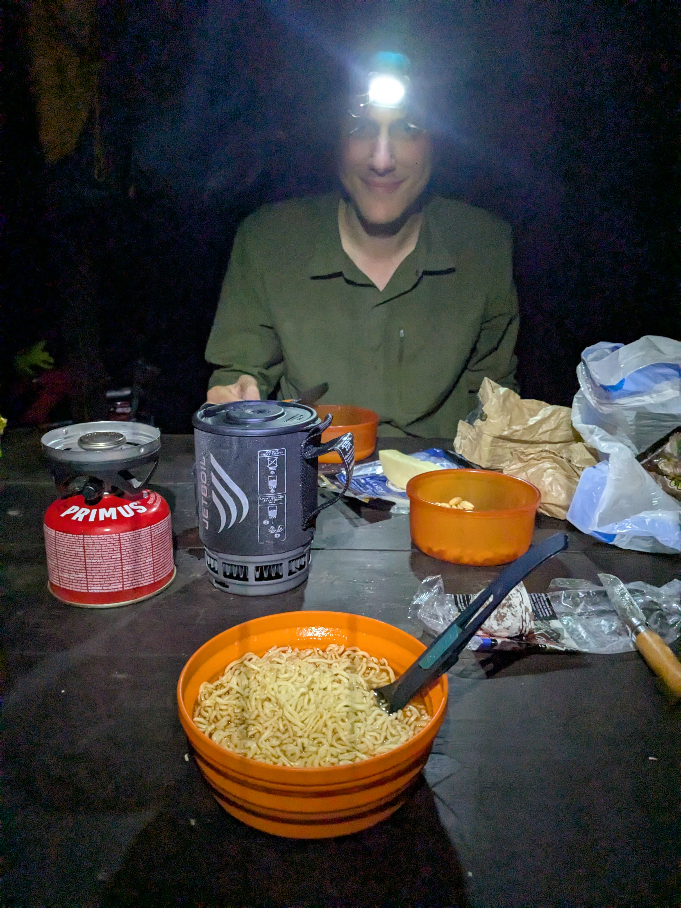

+++
speed = "2.8317316"
title = "On descend ?"
gps = "On descend.png"
draft = "false"
distance = "30659"
elevation = "580"
duration = "10:49:37"
date = "2025-07-15"
+++

La nuit est un peu agitée, la tente est installée sur une bosse et je dois me contorsionner pour ne pas la sentir. Heureusement, la vue extraordinaire du Piton de la Fournaise vient compenser ce désagrément ; nous en profitons avec un café bien chaud.
<!--more-->

L'objectif du jour est de gravir le volcan, puis de retourner dormir un peu plus loin autour du cratère. L'ascension est longue mais aisée, si l'on oublie la cohorte de touristes et le ballet des hélicoptères qui survolent le cratère. La traversée du champ de lave est magnifique, le sol, lunaire (on dirait la croûte craquelée d'un gros brownie). En deux heures, nous sommes en haut.







À peine la descente entamée, un gros nuage vient s'abattre sur le sommet. Nous pressons le pas pour en sortir et rejoindre le restaurant du volcan où nous devons déjeuner.
Nous y prenons une bière qui a le don de nous donner sommeil, puis de délicieux rougail saucisses, les meilleurs jusqu'à présent. Pendant ce temps, la météo se dégrade, on voit des gouttelettes à travers la vitre du restaurant et de gros nuages nous encercler. Après un café, nous décidons de nous mettre enfin en route dans ce brouillard.

La route est plate, nous discutons bien malgré la pluie. Arrive le piton Berte, où nous devons dormir. Il fait gris, il pleut, il n'est que 15h30, la question se pose : on descend ?
Nous décidons de prendre le risque d'entamer la descente, que nous savons extrêmement longue, vers la côte. La pluie s'intensifie, nous sommes rapidement trempés, l'histoire se répète...

Aucun emplacement ne nous permet de nous arrêter pour poser la tente. Nous comprenons donc assez vite que nous devrons aller jusqu'au bout. Des scories l'on passe à de la terre grasse, des arbustes maigrichons aux fougères tropicales. Les pierres et racines glissent, pas un instant d'inattention. Soulagement lorsque l'on aperçoit la mer, malheureusement le soleil se couche.

À la frontale, nous finissons les 200 mètres de dénivelé qu'il nous reste jusqu'à un kiosque où nous avions prévu de dormir. Épuisés, nous arrivons. L'air est chaud, le kiosque bien au sec, c'est un petit plaisir simple. On mange le dernier saucisson, des cacahuètes et des nouilles chaudes. Demain il ne nous reste que huit kilomètres, un peu de bus, puis nous retrouverons nos amis. Un peu de confort, enfin !

