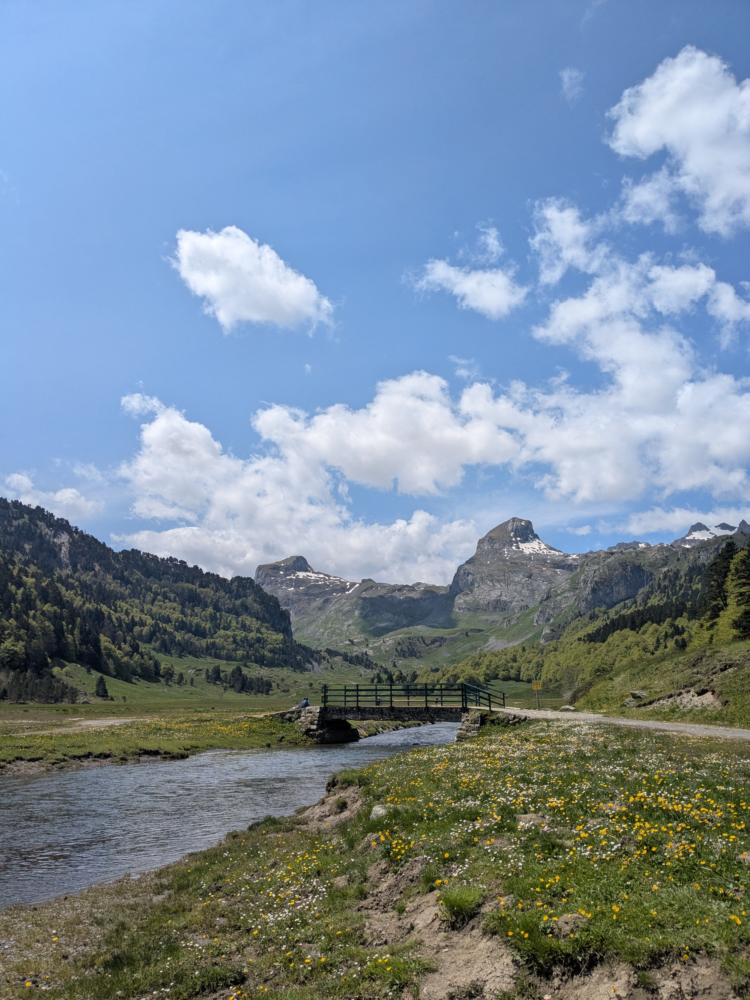

+++
speed = "2.7787943"
title = "Randonnée avec les copains"
gps = "Randonnée avec les copains.png"
draft = "false"
distance = "9566"
elevation = "388"
duration = "3:26:33"
date = "2025-06-30"
+++

On a fait une super randonnée avec les copains dont voici une photo : 

