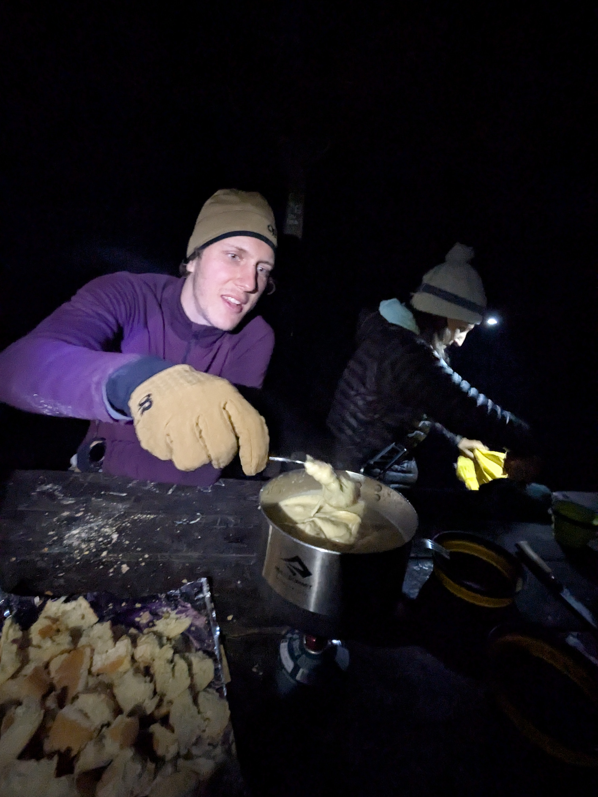

+++

title = "Getting Out of Mafate"

draft = "false"

date = "2025-07-11"
+++

The night is rather good near the river, but unfortunately I wake up around 4am and can't get back to sleep.
The three of us have breakfast before taking the "rempart" path that borders the Mafate cirque. Today's
stage consists of getting out of it to reach the town of Cilaos.<!--more-->








Our friend Camille, who has become a hiking guide since we last met, never tires of telling us
stories and secrets of the cirque, its inhabitants, and its flora. We delight in these tales as we
climb the endless wall.






I'm really not in great shape today, maybe because of my too-short night. I struggle to keep up with
my companions who are racing in the sun.
Finally, the pass and the tipping into a new cirque, the discovery of new landscapes. We have lunch near a
magnificent waterfall after passing by a small "tisane shop".







The day ends with a short climb back up toward Cilaos, after which we can finally enjoy some local pastries
and a good drink.
It's time to do some shopping — especially warm clothes — and stock up for the days ahead.
In theory, from tomorrow onwards, we'll be nearly self-sufficient until the Piton de la Fournaise, the second-to-last stage of the
trip.







We bivouac on an area near the town with Camille's girlfriend, who joins him for the weekend. She had the
great idea of preparing a Savoyard fondue that we thoroughly enjoy, while keeping a small wood fire more
pleasant for its light than its warmth.

