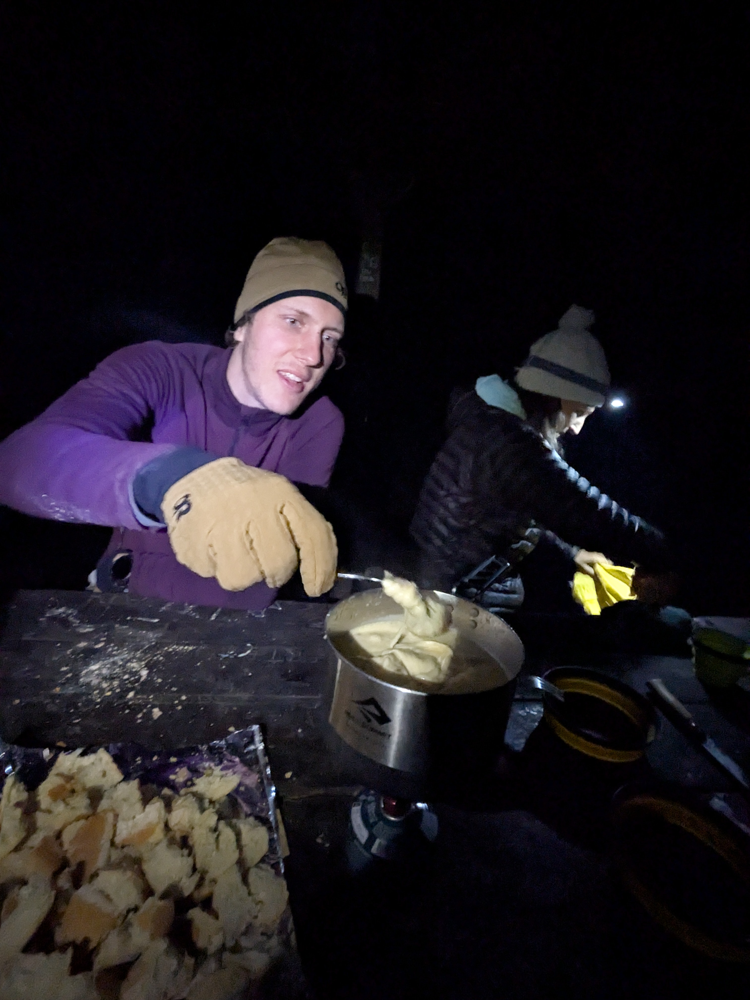

+++
speed = "1.9305474"
title = "Sortir de Mafate"
gps = "Sortir de Mafate.png"
draft = "false"
distance = "19158"
elevation = "1221"
duration = "9:55:25"
date = "2025-07-11"
+++

La nuit est plutôt bonne près de la rivière, malheureusement je me réveille vers 4h sans pouvoir me rendormir ensuite.
Nous petit-déjeunons tous les trois avant de prendre la route du "rempart" délimitant le cirque de Mafate. L'étape d'
aujourd'hui consiste à en sortir pour rejoindre la ville de Cilaos.<!--more-->








Notre ami Camille, qui est devenu guide de randonnée depuis notre dernière rencontre, ne se lasse pas de nous raconter
histoires et secrets du cirque, de ses habitants et de sa flore. Nous nous régalons de ces histoires pendant que nous
gravissons l'interminable mur.






Je ne suis vraiment pas très en forme aujourd'hui, peut-être la faute à ma trop courte nuit. Je m'accroche pour suivre
mes camarades qui galopent au soleil.
Enfin le col et la bascule dans un nouveau cirque, la découverte de nouveaux paysages. Nous déjeunons près d'une
magnifique cascade après être passés par une petite "tisanerie".







La journée se termine par une petite remontée vers Cilaos, après quoi nous pouvons enfin profiter de pâtisseries locales
et d'une bonne boisson.
Il est temps de faire quelques emplettes — notamment des vêtements chauds — et du ravitaillement pour les jours à venir.
En théorie, à partir de demain, nous sommes en quasi-autonomie jusqu'au piton de la Fournaise, avant-dernière étape du
voyage.







Nous bivouaquons sur une aire proche de la ville avec l'amie de Camille qui le rejoint pour le weekend. Elle a eu
l'heureuse idée de préparer une fondue savoyarde dont nous nous régalons, tout en entretenant un petit feu de bois plus
agréable pour sa lumière que sa chaleur.

