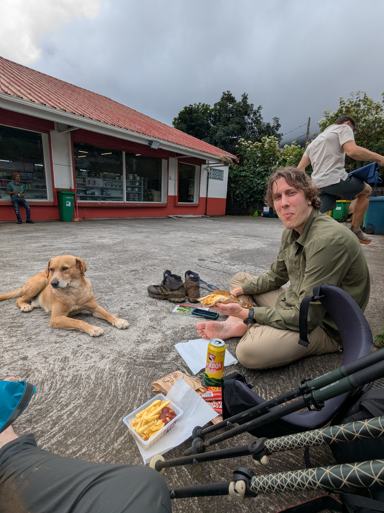

+++

title = "Under the Fog, the Rain"

draft = "false"

date = "2025-07-08"
+++

Around 2am, a rain that starts light then becomes intense wakes us up. We had hoped to get up at 6am, but faced with so much water, we postpone until 7am. The calculation proves unwise; it's still raining just as hard. We meet hikers we'd seen the day before in the common room. Everyone is waiting for the fog to clear to climb up to Roche Écrite and see the panorama. We run out of patience, walk for 30 minutes in the rain, soak our shoes, then turn back: we won't see anything.

No matter, back at the hut after this unsuccessful round trip, we head off toward Dos d'Âne where, we're assured, we'll find gas. This time the descent is almost rain-free and we can finally admire the first vertiginous slopes of the Mafate cirque.






At Dos d'Âne, no gas, but a good little supply of big sandwiches and some reserves for the evening. We continue the descent toward Deux Bras, all the way at the bottom of the valley. The trail is technical, we slip, we laugh, we get a little scared.

Once the right bivouac spot is found, we set up quickly; night falls at 6pm. A quick swim cleans us off, we do some laundry, then it's time for a simple meal. Dark bread sandwich, cheese, ham, endives, barely cheered up by a mediocre lemon tart.






Luckily, tonight it's warm, the wind is hot, we can enjoy our evening under the full moon.
