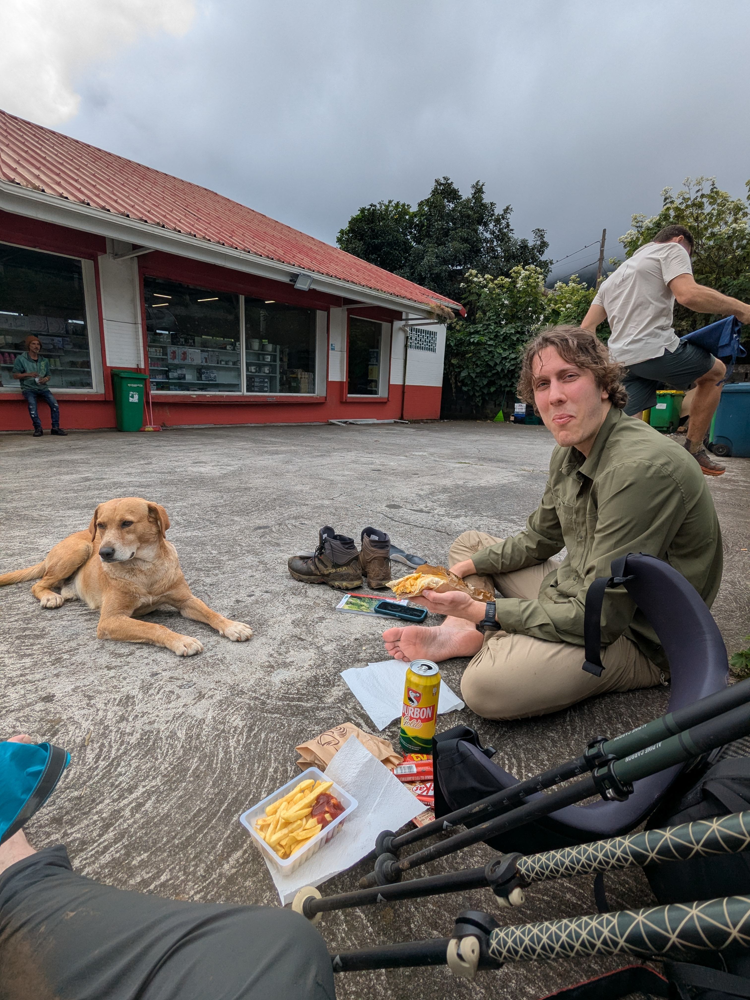

+++
speed = "2.7221935"
title = "Sous le brouillard, la pluie"
gps = "Sous le brouillard, la pluie.png"
draft = "false"
distance = "22201"
elevation = "262"
duration = "8:09:20"
date = "2025-07-08"
+++

Vers 2h du matin, une pluie d'abord légère puis intense, nous réveille. Nous espérions nous lever à 6h, mais devant tant d'eau, nous repoussons jusqu'à 7h. Le calcul s'avère peu judicieux; il pleut toujours autant. Nous retrouvons des randonneurs rencontrés la veille dans la salle commune. Tout le monde attend que le brouillard se dissipe pour monter à la Roche Écrite voir le panorama. Nous manquons de patience, faisons 30 minutes de marche sous la pluie, trempons nous chaussures, puis faisons demi-tour : on ne verra rien. 

Qu'à cela ne tienne, de retour au gîte après cet aller-retour infructueux, nous repartons vers Dos D'âne où, on nous l'assure, nous trouverons du gaz. La descente se fait cette fois presque sans pluie et nous pouvons enfin admirer les premiers pentes vertigineuses du cirque de Mafate.






A Dos D'âne, point de gaz, mais un bon petit ravito constitué de gros sandwichs et de quelques réserves pour le soir. Nous continuons la descente vers Deux Bras, complètement au fond de la vallée. Le sentier est technique, on glisse, on rit, on se fait un peu peur. 

Une fois le bon spot de bivouac repéré, nous nous installons rapidement; la nuit tombe à 18h. Une petite baignade nous décrasse, nous faisons un peu de lessive puis vient l'heure d'un repas simple. Sandwich au pain noir, fromage, jambon, endives, à peine égayé d'une tartelette au citron médiocre. 






Heureusement ce soir il fait bon, le vent est chaud, nous pouvons profiter de notre soirée, sous la pleine lune.

