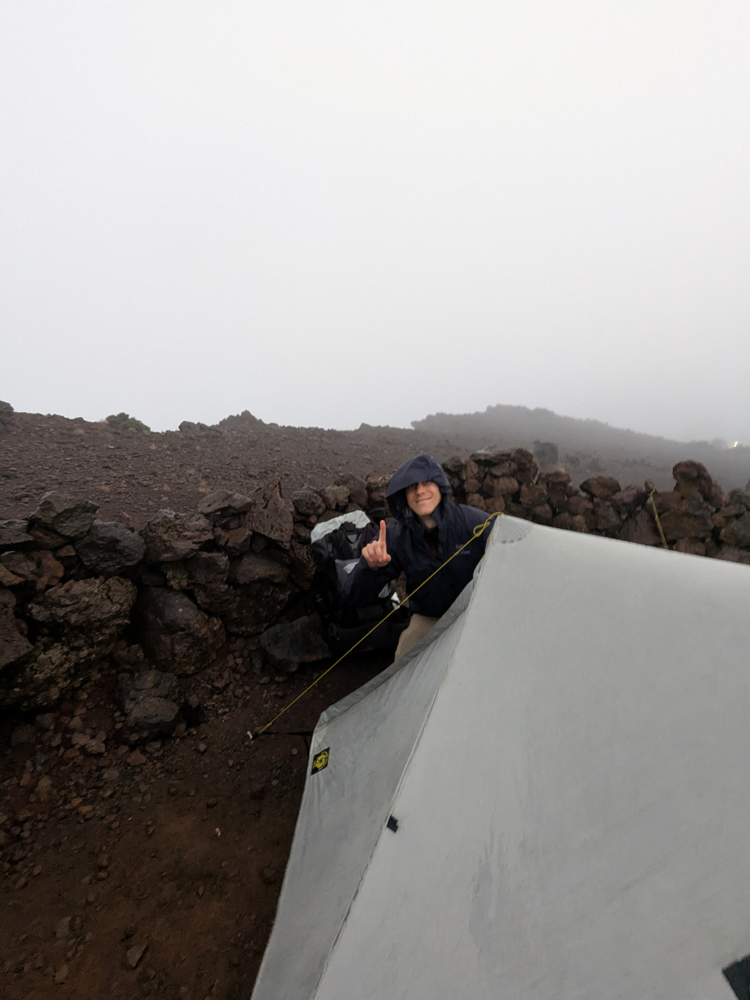

+++

title = "Soaked Through (Like Chayote Soup)"

draft = "false"

date = "2025-07-13"
+++

In the end, luck was not on our side.
This morning upon waking, we are greeted by clouds, rain, wind — the very same ones that had shaken our poor little tent all night long.
No sunrise then, disappointment for the countless hikers who had come to admire it.
<!--more-->

We quickly pack our bags; many things are wet, the tent has taken on some water. The descent is made at full speed toward the hut, where we hope to have breakfast. We encounter many tourists, wrapped in emergency blankets, who didn't seem at all prepared to face the weather conditions.
At the hut, we're served large coffees and hot chocolates, along with slices of brioche; finally a bit of comfort.






The pleasure is short-lived, because we have to face the facts: the rain won't leave us today.
Then begins an interminable descent toward the Plaine des Cafres, along a ridge that seems magnificent, but of which we'll see nothing.
Hours of suffering; the path is a river, we grit our teeth.

Finally arrived at Bourg-Murat, we take a guesthouse — we had promised ourselves one at the midway point, and the time has come.
Laundry, shower, snacks, we recover from this exhausting day. Dinner is brought forward to 6:30 PM because we couldn't have lunch.
Tomorrow, we tackle the final ascent of this GR, toward the entry point of the Piton de la Fournaise.





