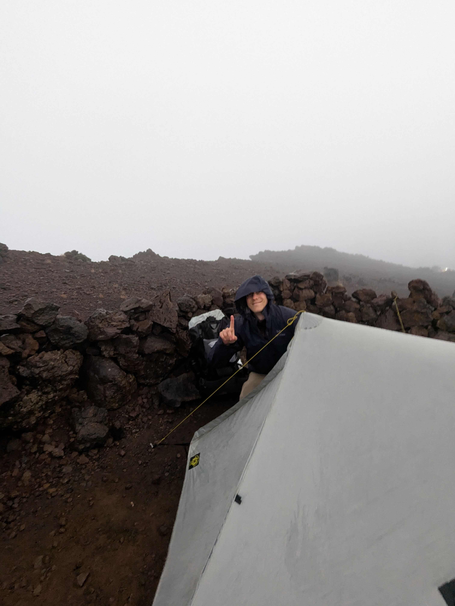

+++

title = "Trempés comme des soupes (de chouchou)"

draft = "false"

date = "2025-07-13"
+++

Finalement, la chance n'aura pas été de notre côté.
Ce matin au réveil, nous sommes accueillis par des nuages, de la pluie, du vent, ceux-là mêmes qui avaient ballotté notre
pauvre petite tente toute la nuit durant.
Point de lever de soleil donc, déception pour les innombrables marcheurs qui étaient venus l'admirer.
<!--more-->

Nous plions rapidement nos bagages, beaucoup de choses sont mouillées, la tente a un peu pris l'eau. La redescente
s'effectue en quatrième vitesse vers le gîte, où nous espérons pouvoir petit-déjeuner. On rencontre de nombreux
touristes, enveloppés de couvertures de survie, qui ne semblaient guère préparés à affronter les conditions climatiques.
Au gîte, on nous sert de grands cafés et chocolats chauds, assortis de tranches de brioche ; enfin un peu de réconfort.






Le plaisir est de courte durée, car il faut se rendre à l'évidence : la pluie ne nous quittera plus aujourd'hui.
Commence alors une interminable descente vers la plaine des Cafres, le long d'une crête qui semble magnifique, mais dont
nous ne verrons rien.
Des heures de souffrances, le chemin est une rivière, nous serrons les dents.

Enfin arrivés à Bourg-Murat, nous prenons un gîte, nous nous en étions promis un à mi-parcours, le temps est venu.
Lessive, douche, grignotages, on se remet de cette journée éprouvante. Le dîner est avancé à 18h30 car nous n'avons pas
pu déjeuner.
Demain, nous attaquons l'ultime ascension de ce GR, vers le point d'entrée du Piton de la Fournaise.





