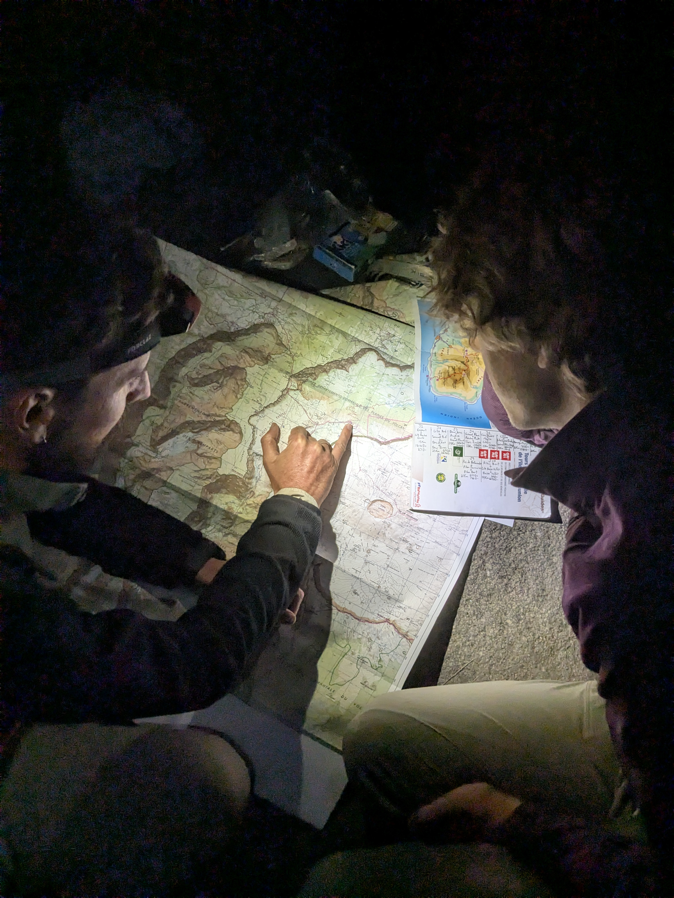

+++

title = "Three Rogues at the Three Rocks"

draft = "false"

date = "2025-07-10"
+++

Our day starts with a small pleasure: local bananas offered by the owner of the campsite where we're sleeping, who gives them to us to accompany our everlasting oatmeal with milk.
The descent toward the gorges is, as always, brutal, with large stone steps to step over; then we do it all over again in reverse on the other side.<!--more-->








We arrive with difficulty at Îlet des Orangers for a well-deserved break. Today the sun is beating down seriously and we're drenched in sweat, with our shirts and pants supposedly protecting us from mosquitoes.







A long descent dotted with a few violent climbs then takes us toward the Trois Roches, an emblematic waterfall of the region, where we meet up with our friend Camille, whom we met on the GR20 last September. We're short of fresh food, having been unable to shop at Roche Plate, the last village we encountered. Fortunately, Camille lends us a gas canister, which allows us to start on the freeze-dried products.

A long discussion follows, preparing for the coming days, which look complicated for some, as the stages have neither villages nor water points.

After a small spiced rum and a herbal tea, spirits calm down and we fall asleep confident and invigorated. What a pleasure to see our mutual friend again, who will walk with us tomorrow.
