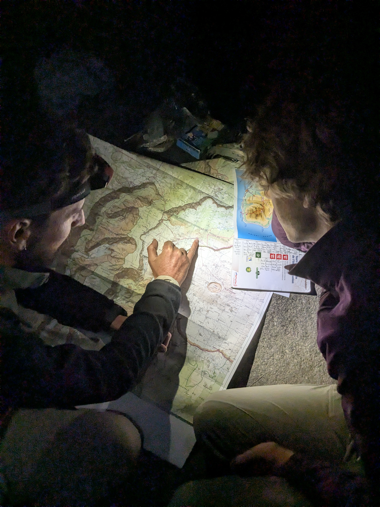

+++
speed = "2.310671"
title = "Trois larrons aux trois roches"
gps = "Trois larrons aux trois roches.png"
draft = "false"
distance = "20547"
elevation = "1457"
duration = "8:53:32"
date = "2025-07-10"
+++

Notre journée commence avec un petit plaisir: des bananes locales offertes par la tenancière du camping où nous dormons, qui nous les offre en accompagnement de notre sempiternel avoine au lait. 
La descente vers les gorges est comme toujours brutale, de grandes marches de pierre qu'il faut enjamber; puis recommencer en sens inverse de l'autre côté. 








Nous arrivons avec peine à l'ilet des orangers pour une pause bien méritée. Aujourd'hui le soleil tape sérieusement et nous sommes en nage, avec nos chemises et pantalons, censés nous protéger des moustiques. 







Une longue redescente parsemée de quelques violentes montés nous emmène ensuite vers les Trois Roches, cascade emblématique de la région, on nous retrouvons notre ami Camille, rencontré sur le GR20 en septembre dernier. Nous sommes à cours de nourriture fraîche, faute d'avoir pu faire des courses à la Roche Plate, dernier village rencontré. Camille nous prête heureusement une bouteille de gaz, qui nous permet d'entamer les produits lyophilisés. 

S'ensuit une longue phase de discussion et préparation des prochains jours, qui s'annoncent compliqués pour certains, tant les étapes ne rencontrent ni village, ni point d'eau.

Après un petit rhum arrangé et une tisane, les esprits s'apaisent et nous endormons confiants et revigorés. Quel plaisir de retrouver notre ami commun, qui marchera avec nous demain. 

