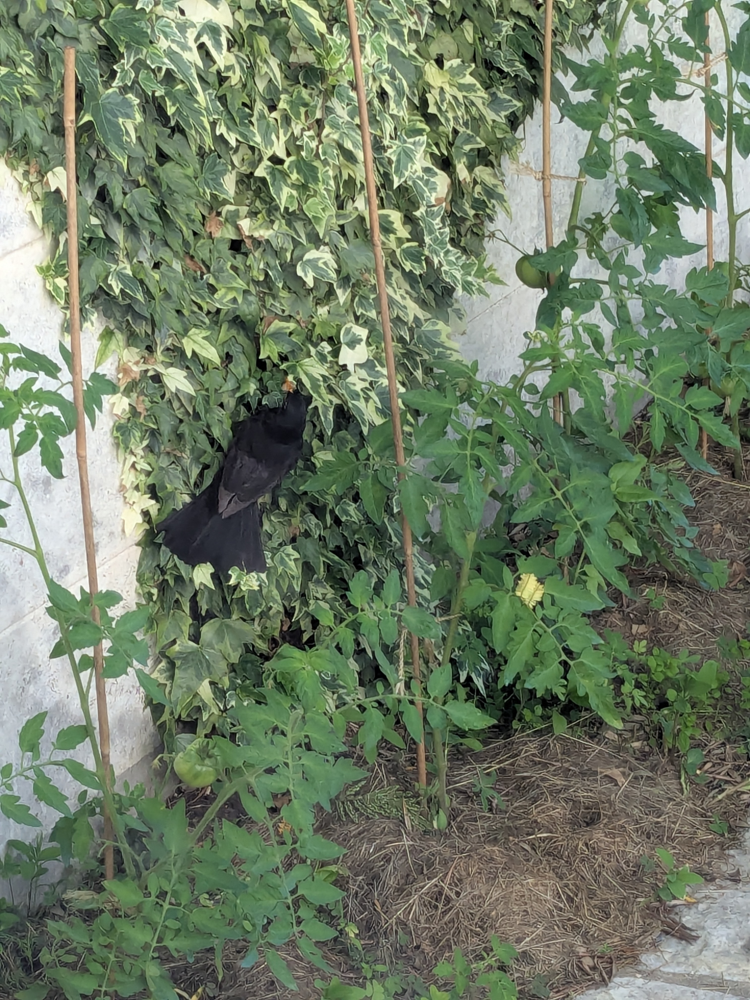

+++
speed = "9.457626"
title = "Un bien bel article"
gps = "Un bien bel article.png"
draft = "false"
distance = "8525"
elevation = "11"
duration = "0:54:05"
date = "2025-06-30"
+++

Voilà à quoi devrait ressembler un vrai article une fois que tout sera câblé.

On peut mettre une ou plusieurs photos : 






Et ça fonctionne !!

