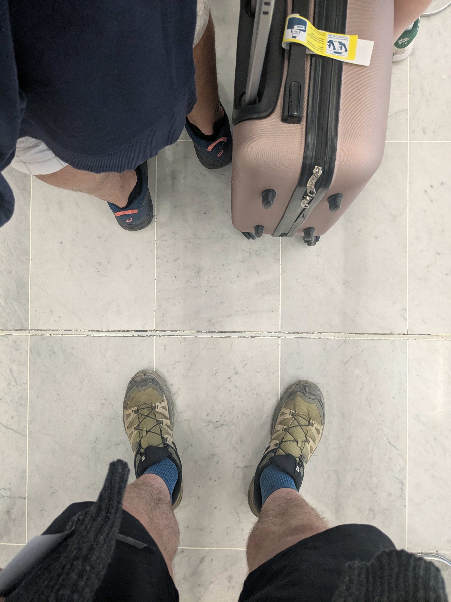

+++
title = "A First Time for Everything"
date = "2025-07-06"
draft = "false"
+++

## Bordeaux/Paris/Saint-Denis

An adventure often starts with a transfer — not always, mind you. This one is no exception to the rule, since getting to Réunion inevitably involves a flight, a rather long one at that.

The departure is from Bordeaux, under sweltering heat, on the train to Tourcoing, which stops at Charles de Gaulle. There, I meet my old friend William, whom I haven't seen since Corsica, almost a year ago. We're happy to see each other again; for each of us, the year has been long and rather short on paid leave.

The Air Austral flight is relatively comfortable; we're served a vanilla chicken shortly before midnight, perfect for me since I'm starving and ideal for helping me fall asleep in this crowded bird.

Arriving in Saint-Denis at noon the next day, with a 2-hour time difference, we find our hotel where we can finally freshen up. We're recommended a producers' market to enjoy a good barbecue, and we don't need to be asked twice.






The day will end, after a few wanderings around town, on the waterfront, with a beer.






Tomorrow's day promises to be tough, as it involves climbing to altitude toward the island's ridges!
