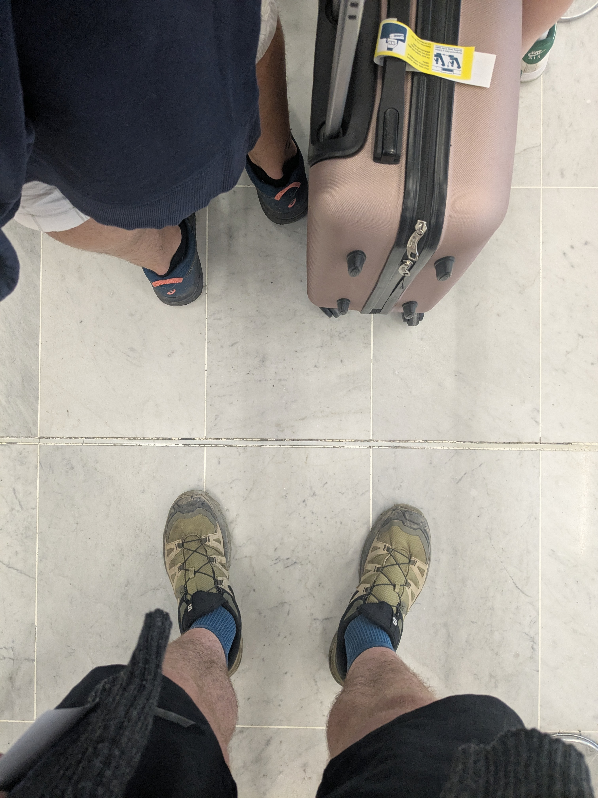

+++
title = "Un début à tout"
date = "2025-07-06"
draft = "false"
+++

## Bordeaux/Paris/Saint Denis
Une aventure commence souvent par un transfert -pas toujours ceci dit. Celle-ci ne fait pas exception à la règle puisque se rendre à La Réunion implique forcément un vol, plutôt long d'ailleurs. 

Le départ se fait à Bordeaux, sous une chaleur étouffante, par le train de Tourcoing, qui fait un arrêt à Charles de Gaulle. Là je retrouve mon vieil ami William, que je n'ai pas vu depuis la Corse, il y a presque un an. Nous sommes heureux de nous retrouver, pour chacun d'entre nous l'année a été longue et assez pauvre en congés payés. 

Le vol d'Air Austral est relativement confortable, on nous sert un poulet à la vanille peu avant minuit, parfait pour moi qui suit affamé et idéal pour m'aider à m'endormir dans ce coucou bondé.

Arrivés à Saint Denis à midi le lendemain, avec 2h de décalage, nous retrouvons notre hôtel ou nous pouvons enfin nous décrasser. On nous conseille un marché de producteurs pour déguster un bon barbecue, et nous ne nous faisons pas prier.






La journée s'achèvera, après quelques pérégrinations en ville, sur le front de mer, avec une bière.






La journée de demain s'annonce rude, puisqu'elle consiste à monter en altitude vers les crêtes de l'île !
