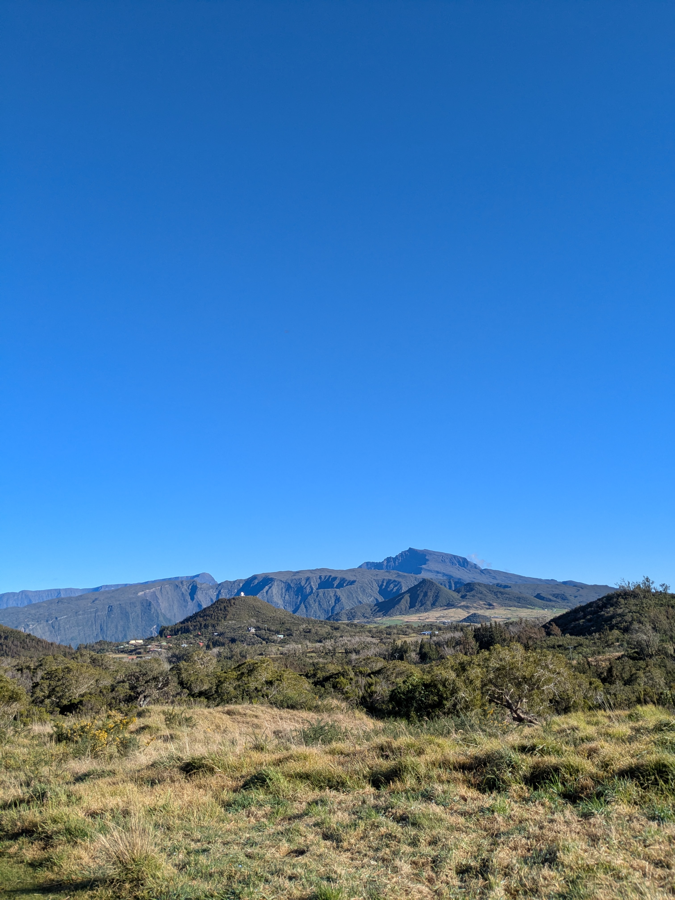
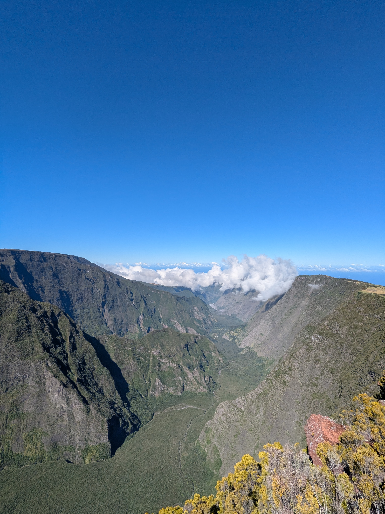
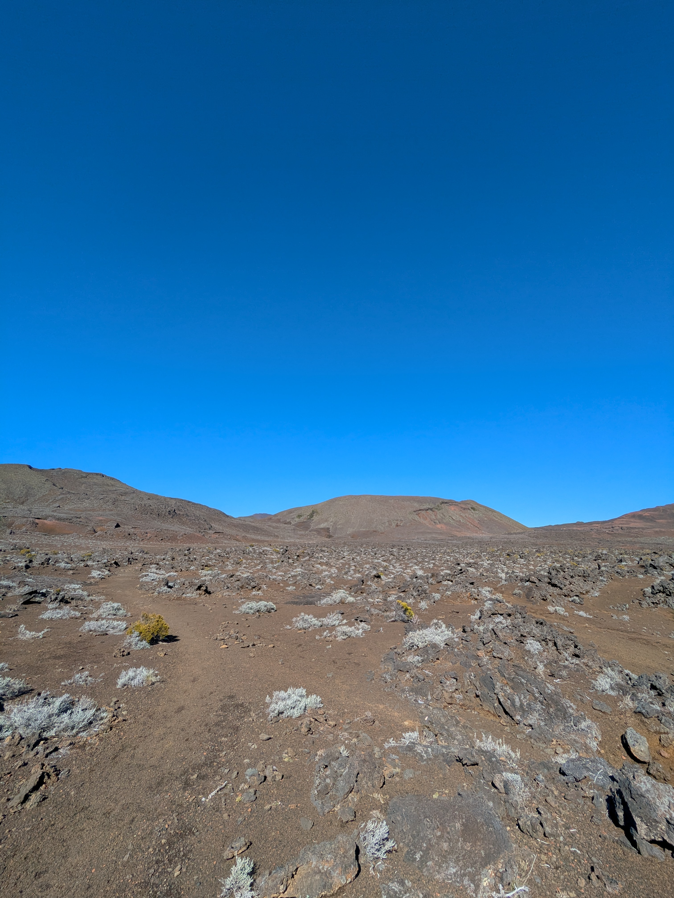

+++

title = "Toward a New Peak"

draft = "false"

date = "2025-07-14"
+++

The morning is quite fresh, and even sheltered in our guesthouse, we feel the cold of the "highlands." Nevertheless, the weather is radiant, our laundry is clean and dry, we're full of energy to hit the road again.
The crossing of the village strikes me; I feel like I'm in the Aubrac. Small houses, smell of wood fire, frosty pastures.
<!--more-->

We progress very quickly; there's little elevation gain today, but our packs are heavy because water supply is complicated. We chat cheerfully while contemplating simple and charming landscapes.






The climb up the Nez de Bœuf gives us a first glimpse of the wall surrounding the Piton de la Fournaise, as well as a deep lush valley.

Crossing this wall is particularly long, but pleasant. We quickly arrive in fields of reddish scoria, heralding the landscapes to come.

Crossing the desert and, finally, the Piton. An impressive mound of lava in the middle of a barren field that one would gladly call Martian. We pitch the tent away from the starting point of the path to the summit; the climb is for tomorrow, at sunrise.





