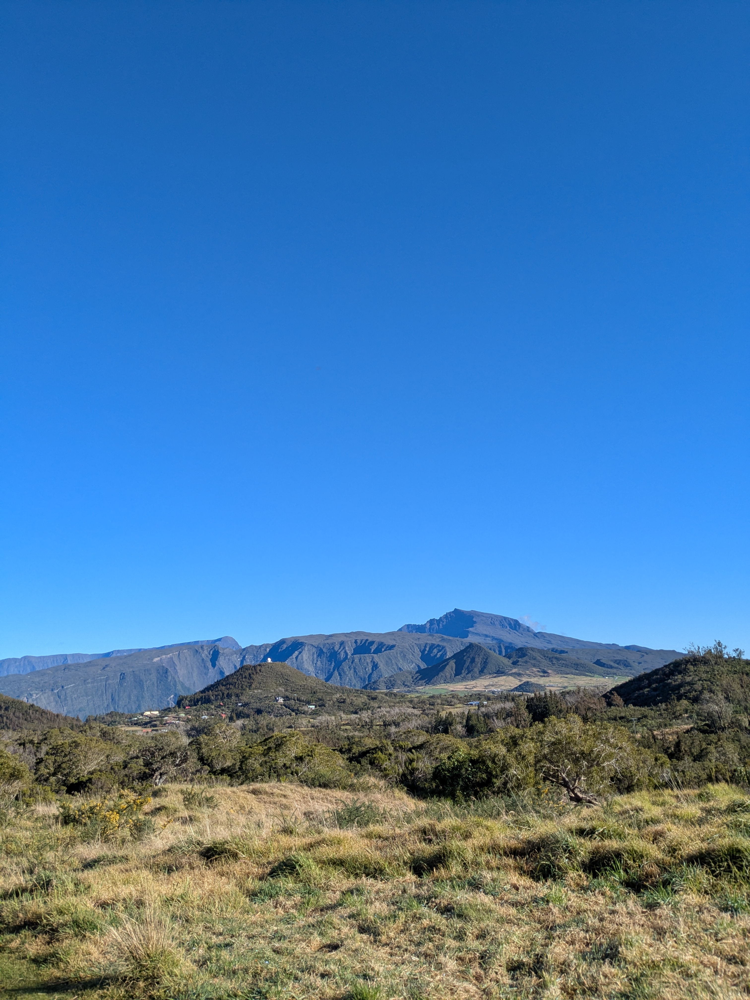
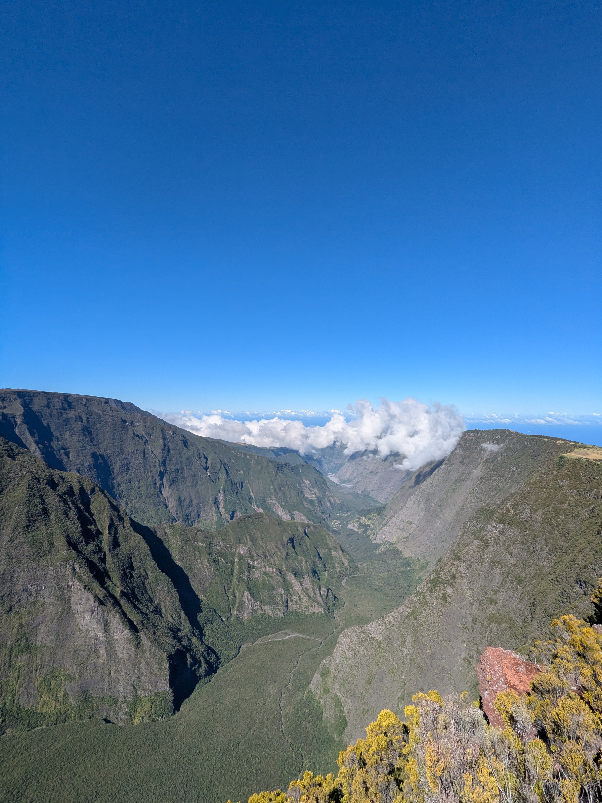
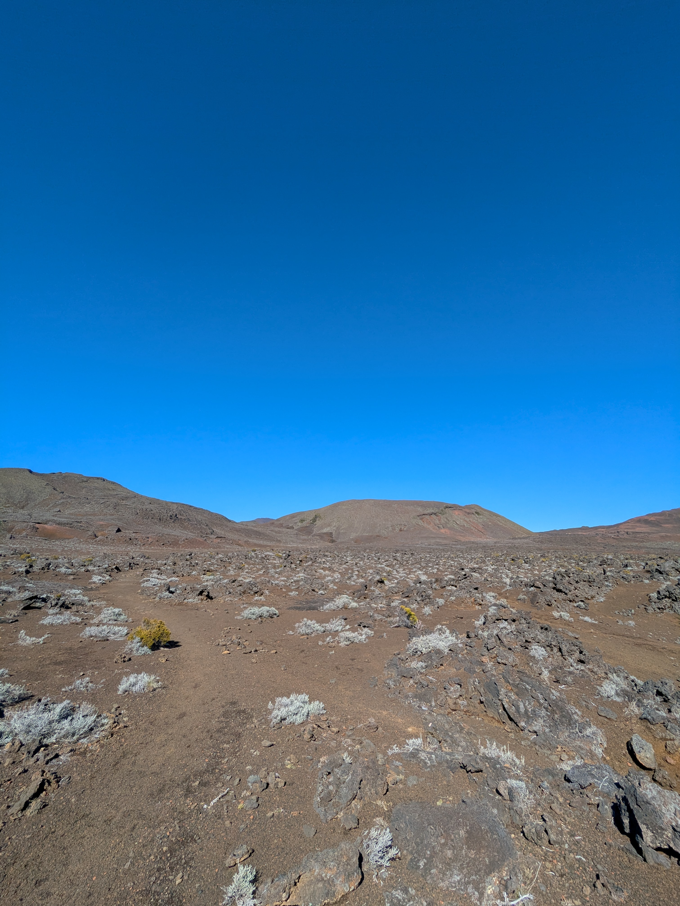

+++
speed = "2.8651686"
title = "Vers un nouveau piton"
gps = "Vers un nouveau piton.png"
draft = "false"
distance = "22950"
elevation = "1116"
duration = "8:00:36"
date = "2025-07-14"
+++

La matinée est bien fraîche et même à l'abri de notre gîte, nous ressentons le froid des "hauts". Il fait néanmoins un temps radieux, notre linge est propre et sec, nous sommes plein d'énergie pour reprendre la route. 
La traversée du village me frappe, j'ai l'impression d'être dans l'Aubrac. Petites maisonnette, odeur de feu de bois, pâturages givrés. 

Nous progressons très vite, il y a peu de dénivelé aujourd'hui, mais nos sacs sont lourd car l'approvisionnement en eau est compliqué. Nous discutons gaiement en contemplant des paysages simples et charmants. 






La montée du Nez de Bœuf est l'occasion d'apercevoir la muraille entourant le Piton de la Fournaise pour la première fois, ainsi qu'une profonde vallée verdoyante. 

Le passage de cette muraille est particulièrement long, mais plaisant. On arrive rapidement dans des champs de scories rougeâtres annonciatrices des paysages à venir. 

Traversée du désert et, enfin, le Piton. Impressionnant monticule de lave au beau milieu d'un champ désertique que l'on qualifie volontier de martien. Nous montons la tente en retrait du point de départ du chemin vers le sommet; la montée est pour demain, au soleil levant. 






