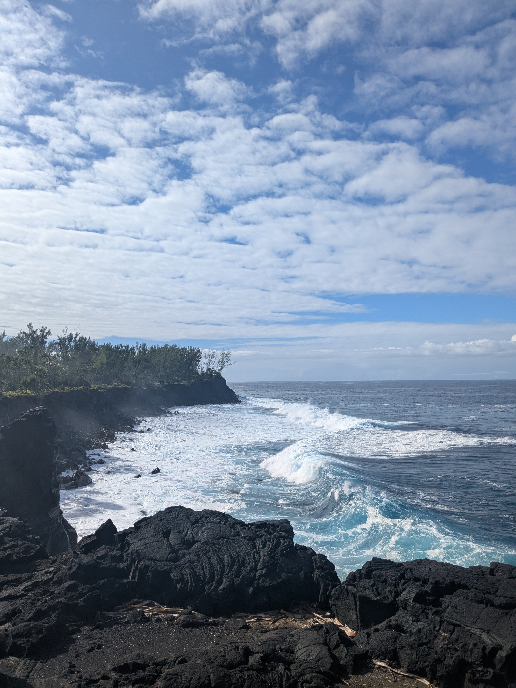

+++
title = "At the End of the Thrust, the Sea"
draft = "false"
date = "2025-07-16"
+++

The night was surprisingly good near our little kiosk. So much so that the tent dried out, unlike our clothes soaked by yesterday's rain. 
We're in high spirits, with only a few kilometers left to descend before the end of this GR. After a quick breakfast, we're already on the road, chatting eagerly. About an hour and a half later, we meet the sea again, this time on the south coast.

An hour-long bus ride takes us to Saint-Pierre, where our friend Camille comes to pick us up. Laughter, showers, laundry, and beers are on the afternoon's agenda. We can finally fully relax after these ten intense days filled with emotions. 
Once again, what a beautiful adventure!

