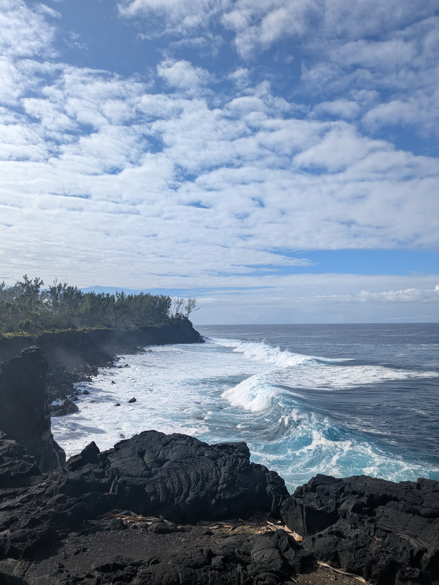

+++
title = "À la fin de l'envoi, la mer"
date = "2025-07-16"
draft = "false"
+++

La nuit a été étonnamment bonne près de notre petit kiosque. À tel point que la tente a séché, à l'inverse de nos vêtements trempés par la pluie d'hier. 
Nous sommes de bonne humeur, il ne nous reste que quelques kilomètres à descendre avant la fin de ce GR. Un petit déjeuner plus tard et nous voilà déjà sur la route, discutant avec entrain. Une petite heure et demie plus tard et nous retrouvons déjà la mer, sur la côte sud cette fois.

Une heure de bus nous emmène à Saint Pierre où notre ami Camille vient nous récupérer. Rigolades, douche, lessives et bières sont au programme de l'après-midi. Nous pouvons finalement nous détendre totalement après ces dix jours intenses en émotions. 
Une fois de plus, quelle belle aventure !

