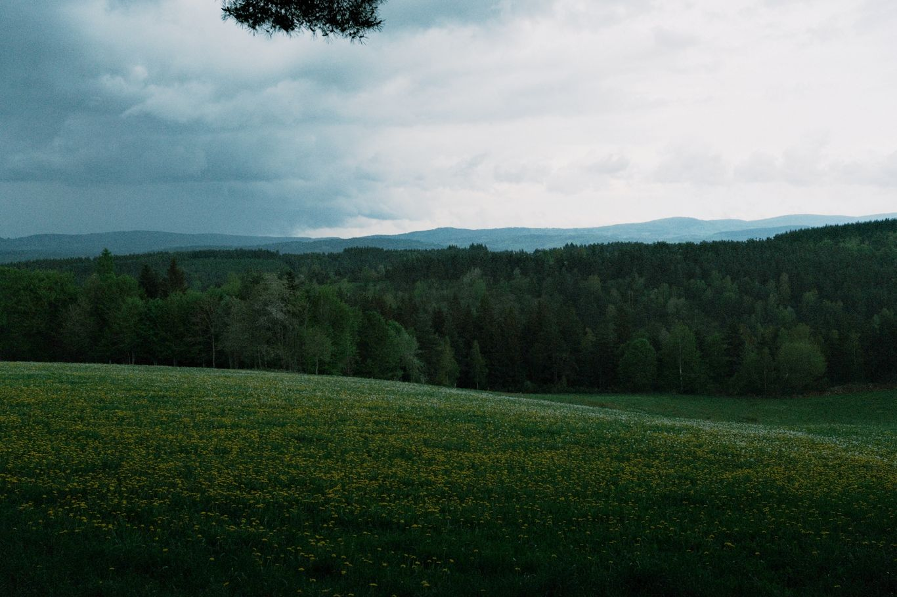
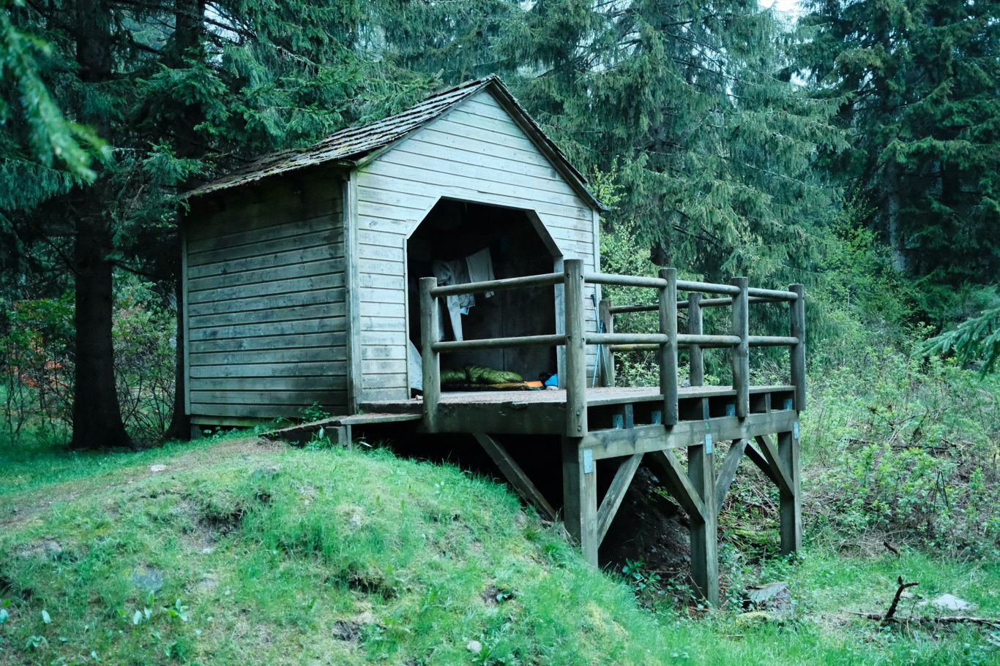
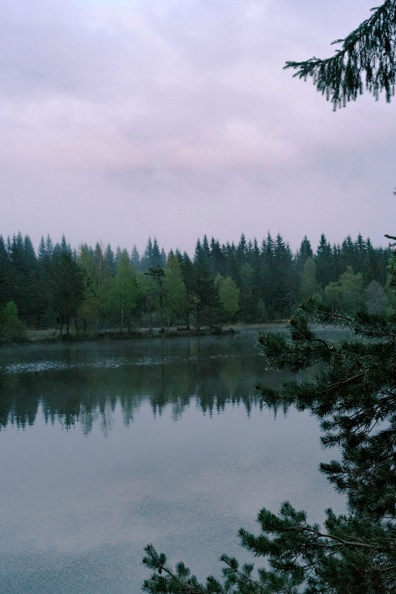

+++
title = "D'Arquejols à Luc"
date = "2026-04-28"
draft = "false"
+++

Une drôle de colique m'a animé toute la nuit, la faute à une eau de rivière trop saumâtre ? 
Ça ne m'empêche pas de me lever de bonne humeur et de préparer du (vrai) café face au soleil qui se lève à peine.

La descente vers Pradelles est facile et je suis d'excellente humeur. Le village m'accueille sous un beau soleil et j'en profite pour faire le tour des vieilles bâtisses. Je trouve une boîte à livres, qui sera le nouveau domicile du _Hussard_ que j'ai fini hier. 








Plongeon sur Langogne, il n'y a pas beaucoup de route. La ville est bien plus grosse, plus morne aussi. Je passe à la pharmacie, car mes pieds sont des sapins de Noël, puis j'atterris au café, pour recharger mes batteries, dans tous les sens du terme. L'endroit est assez glauque, je passe aux toilettes, elles sont à la Turque et je ne tiens pas debout. Décidément, je préfère faire mes petites affaires en plein air. 

Je file de cette ville qui ne me plaît guère, après avoir acheté un sandwich. 

Le Gévaudan m'ouvre grand ses bras ; le soleil se cache, un vent froid se lève et de gros nuages s'amoncellent en couches obscures. Au bout d'un moment, on entend tonner. Stevenson n'avait pas aimé ce passage, moi, je le crains. Arrivé à Saint-Flour-de-Mercoire, une fine pluie s'installe. Je continue ma route au snobant un petit café-théâtre (quelle erreur !), quand, sans prévenir, un déluge me surprend. Aucune toiture à l'horizon, il faut serrer les dents et continuer.

Cette histoire se répétera trois fois dans l'après-midi. Même si j'ai pris des dispositions, je suis trempé, surtout mes pieds. Je me dis que finalement, le gîte d'étape, c'est très bien aussi. Alors à Cheylard, je frappe à la porte, mais c'est déjà complet. Ceci étant dit, je n'étais guère inspiré par le lieu, dont les remugles de fond de baskets me parvenant depuis l'entrée, sans compter sur ces gros messieurs près à vrombir dès qu'ils seront sous la couette.

Un peu de pommade sur les pieds. J'ai repéré un lac où une prétendue cabane peut servir de refuge, mais c'est à huit kilomètres. Je me lance, encore une averse, la pluie est horizontale.

La lumière au bout du tunnel, enfin, la cabane existe bel et bien. Je m'y installe, mets tout à sécher et file prendre une douche à l'eau du lac. Enfin le calme, le sec, le repos. Un petit chevreuil sur la rive opposée me regarde faire. 

Je suis rejoint plus tard par un randonneur, nous partageons l'abri et le souper, c'est agréable. Je suis ravi d'avoir une petite étape demain, car je dois sérieusement soigner mes pieds, qui n'en font qu'à leur tête !

