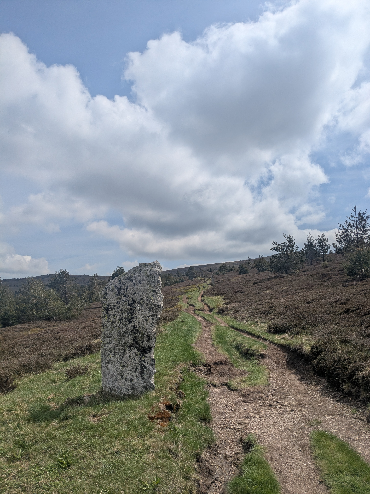
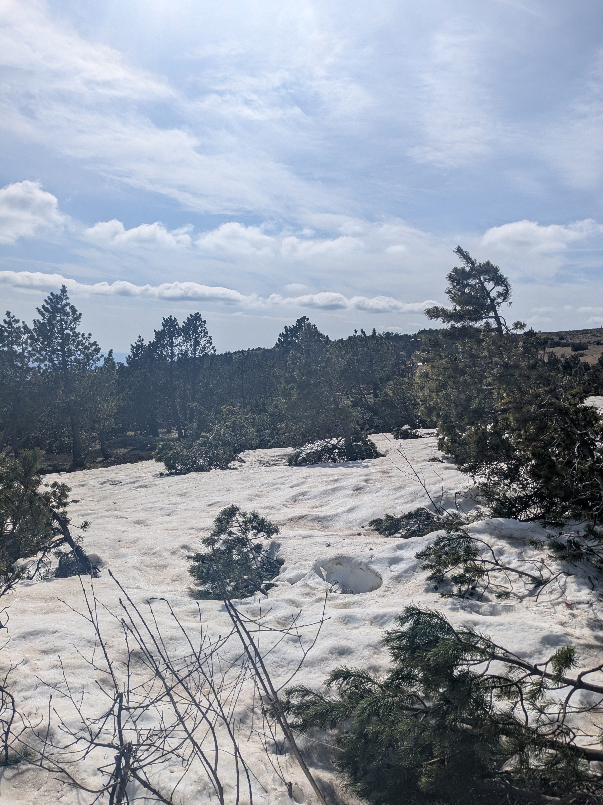
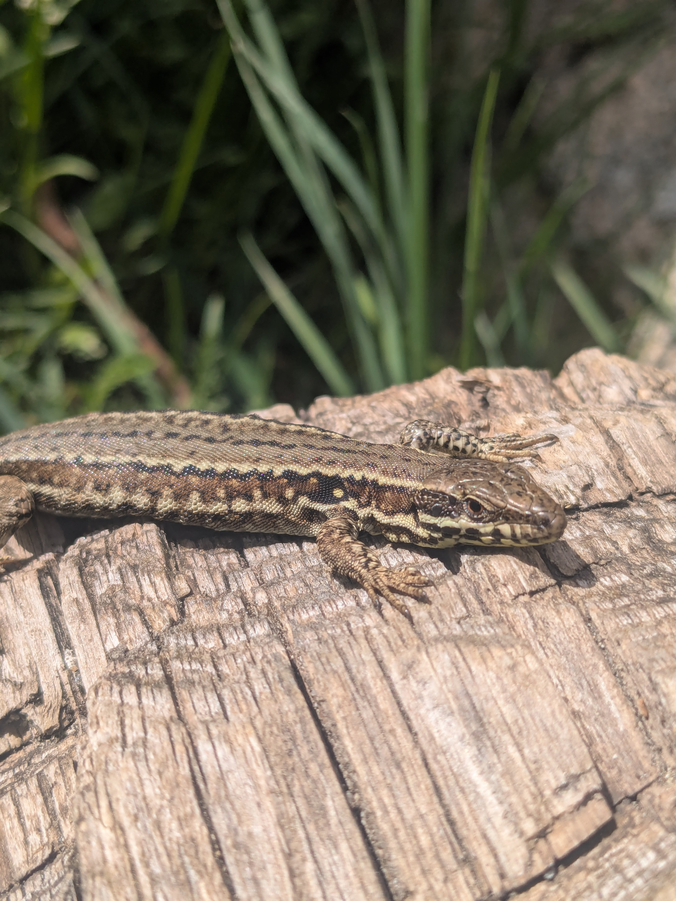

+++
title = "De Chasseradès à Finiels"
date = "2026-05-01"
draft = "false"
+++

Encore une nuit d'un sommeil lourd et sans rêves. Cependant ce matin je me sens réellement plus en forme, au point de m'autoriser un bol du café façon jus de chaussette, servi par le patron.
Les nouvelles vont très vite sur le GR. Au petit-déjeuner : "J'ai été malade avant-hier... -Ah oui, c'est toi qui a bu dans l'étang ?!". Certains ont manifestement vendu la mèche.

Je discute assez longtemps avec deux comparses qui étaient au dortoir, puis chacun vaque à ses occupations. Mes affaires sont déjà prêtes, je file sur le sentier. La forme est décidément très bonne, j'ai pu manger, les trente kilomètres prévus aujourd'hui ne devraient pas poser de problème.






La première partie de la journée, jusqu'au Bleymard, est ponctuée de passages à découvert dans de vertes collines ondulantes et des sous-bois de feuillus clairsemés. Le dénivelé pointe le bout de son nez, c'est une des premières fois où je me fais la réflexion que ça grimpe dur.






Au Bleymard, je me ravitaille et retrouve l'un des gars de ce matin. Nous déjeunons ensemble puis il m'invite au café, il termine aujourd'hui, pas le temps pour plus. Nous traînons en terrasse au soleil un long moment, j'ai bien du mal à repartir, la conversation est bonne.

Enfin, passé quatorze heures je me décide, il me reste tout de même l'ascension du Mont Finiels, point culminant de la Lozère, à avaler cet après-midi. Visite rapide du bourg, qui est magnifiques, vieilles boutiques et anciennes maisons bourgeoises en pierre.






La montée commence tout de suite. Elle est longue mais douce, ça grimpe dans les bois avant de déboucher sur la station de ski du Mont Lozère, ou ne se presse personne malgré le jour férié. On m'y confirme qu'une cabane forestière existe bel et bien sûr l'autre versant et qu'elle est alimentée par une source. C'est ce que je voulais entendre, ce sera mon objectif du jour.

Le sentier serpente à travers la bruyère rose et dense, typique du coin, parsemé çà et là de grandes pierres dressées, points de passage de la transhumance traditionnelle. Il souffle là-haut un vent terrible et froid. Je grimpe plein d'entrain et d'énergie, mais tout de même au sommet, je me couvre, ne serait-ce que pour prendre le temps d'admirer le merveilleux panorama, à 1699 mètres d'altitude.






Redescente rapide à travers les pins, incluant un très court passage sur la neige. Comme quoi, on ne m'avait pas menti, il neigeait toujours en avril.
Tout sent bon la résine et au détour d'un virage, j'aperçois le toit de lauzes de la fameuse cabane.

Elle est dans un état plutôt moyen, du genre qui laisserait un fleuve passer en cas d'orage. Mais la nuit prévue est dégagée, simplement très froide.
Je m'installe, attends une heure un peu tardive pour improviser une toilette ainsi qu'une lessive dans le ruisseau.
Lorsque le froid vient, je fais un petit feu. Pas par nécessité, mais par plaisir, c'est encore mieux.







La température baisse, comme prévu, très vite. Je me calfeutre dans l'endroit, qui me fait un peu penser à la cabane de _Walden_, le second livre que je viens d'entamer. Les dernières braises finissent de se consumer dans l'âtre, les merles et les coucous n'en finissent plus de chanter. 

