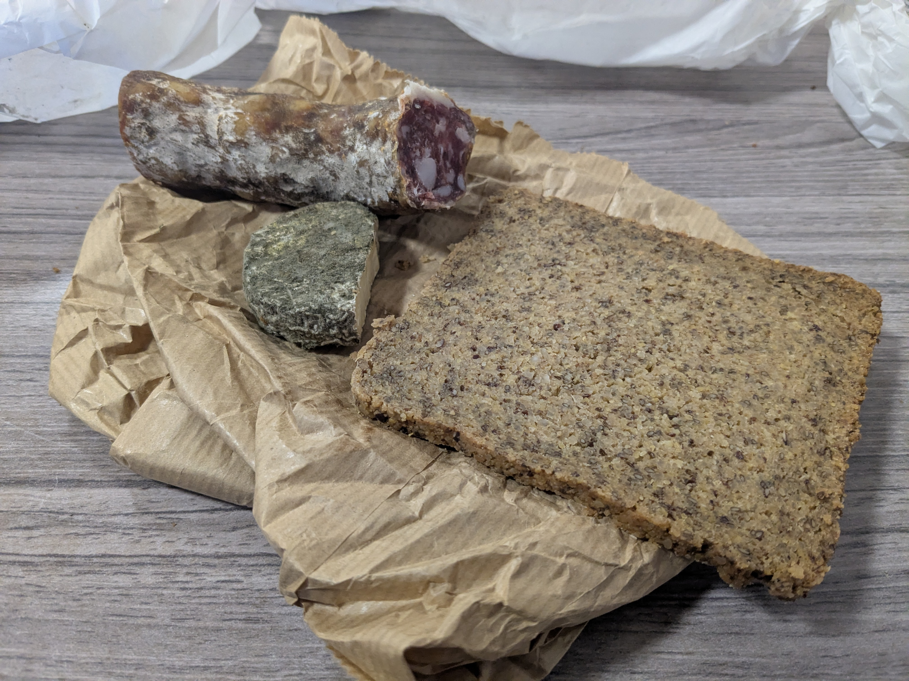

+++
title = "De Finiels à Florac"
date = "2026-05-02"
draft = "false"
+++

Est-ce _La Malédiction des Cabanes Forestières_ qui frappe ? J'ai encore mal dormi. Le pathogène récalcitrant qui m'habite a encore fait des siennes.
Pourtant, la nuit était belle, la lune presque pleine et les trous dans le plafond formaient autant d'étoiles dans mon ciel.

Je prends le temps de faire un café devant les sapins qui sont en feu dans le soleil levant. Je suis évidemment couvert de suie malgré mes mille précautions hier soir. 

Pliage rapide du campement et en route ! Aujourd'hui est une grosse journée. Le froid est mordant et je pousse la chansonnette pour me réchauffer un peu, et peut-être pour me donner du courage dans ce lugubre bois d'immenses sapins, dont la piste, que je suis, est traversée d'empreintes de sangliers.

Bien vite, Finiels. Charmant village, minuscule, perché en haut du vallon. Il y a une source d'eau fraîche, ce n'est pas le moment de se priver. Il faut encore s'armer d'un peu de courage pour traverser les grands troupeaux d'Aubrac, aussi curieuses que craintives. Il y a des veaux partout, quelques mouvements de panique parfois, mais, finalement, tout se passe bien.






Descente raide sur Pont-de-Montvert, qui est d'une certaine manière le point culminant de ce voyage, d'un point de vue esthétique. Les montagnes de genêts devant et derrière, de l'eau claire dans la vallée, et ce petit village engoncé entre ces reliefs.






Par miracle (dirait Soeur Sophie), un médecin me reçoit en quelques minutes. Il confirme tout, et notamment que rien n'est grave, mais me donne de quoi mieux appréhender le reste du voyage. Ragaillardi, je me mets donc en quête de quelques victuailles, sous la forme de saucisson de pays, Pélardon et baguette fraîche. C'est le médecin qui l'affirme, je peux !

Petit instant de bonheur, j'ai l'impression de vivre enfin ce que j'attendais, légitimement, de ce voyage. Mais avec tous ces arrêts, il est déjà bien tard, je tombe la polaire et me mets en ordre de bataille pour affronter le Signal du Bougès, longue et raide ascension dans les bois. Elle débouche sur un sommet décharné où souffle un vent apocalyptique, qui arrive à me faire vaciller. 







Marche sur le fil de cette arête ventée, j'y croise même un petit refuge, très beau et mieux entretenu que ma caverne.

Étonnamment, le sentier plonge ensuite dans une immense forêt de sapins et s'étire à n'en plus finir autour d'un petit mont que l'on s'épuise à contourner en larges lacets. Je rencontre un couple, eux aussi sont à bout. Enfin, raide sente vers Florac.

Ce week-end accueille le rallye des Cévennes, qui passe ici. La ville est en émoi. Pas moi, je file au refuge, ce soir, je n'avais pas envie de dormir dehors, le vent est fort, le ciel menaçant et je suis épuisé. Un petit lit superposé dans une chambre puante partagée avec d'autres marcheurs fera une parfaite alternative.

Le repas est un joyeux bazar, entre les pilotes qui dînent là, certains la combinaison à moitié sur les genoux, et les randonneurs en polaires quechua. C'est vivant, chaleureux, j'aime ça, aussi.

