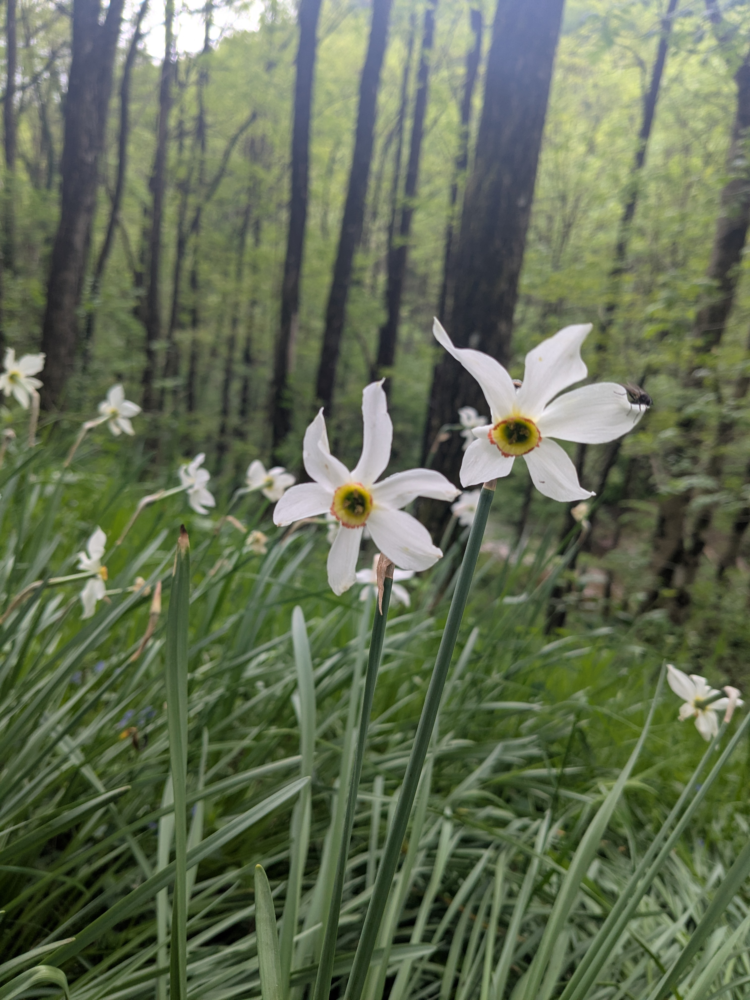

+++
title = "From Florac to Saint-Germain-de-Calberte"
date = "2026-05-03"
draft = "false"
+++

I feel like I'm just a shadow in this lodge, having taken neither dinner nor breakfast; I have to slip among the guests through to the common room to go nibble on my supplies.
A good sleep has put me in shape for this long day. Departure at 8:30 AM.

I thought I would stop today at Cassagnas. Good thing I booked a lodge in the next village, because this first morning of hiking is quite bland. We often follow the road, through undergrowth with blocked views. I can barely hear the distant roar of rally cars speeding through the Cévennes steep paths.








Some views of gorges or flower fields brighten this dreary path. At the old Cassagnas station, converted into a hikers' welcome center, they sell me a pasta salad. It's as tasteless as the sandwich from day two, but everyone is very kind, so that makes up for it.

The air is cold and the clouds low and dark. I wonder, and I'm not the only one, when it will break. A long climb through the woods follows and takes the small groups of hikers I cross towards some nondescript summit, dotted with menhirs and other archaeological oddities. A treeless spot offers an unobstructed, magnificent view of the valley.






When we finally descend, it's only to snake further through this never-ending forest. Around a bend, a horse, then a riding center, finally a village, Saint-Germain-de-Calberte.






At the lodge, the atmosphere is excellent; I only meet people I've already crossed paths with in previous days. Copious meal, local wine, generous laughter. I'm pumped up for tomorrow's stage, the last official one according to Stevenson's journal, which we will unfortunately spend under the rain...

