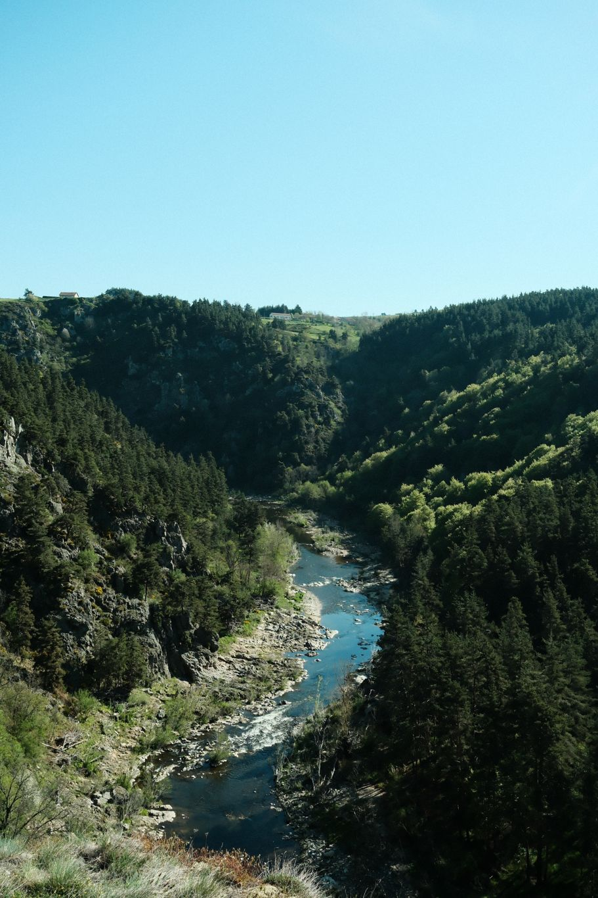
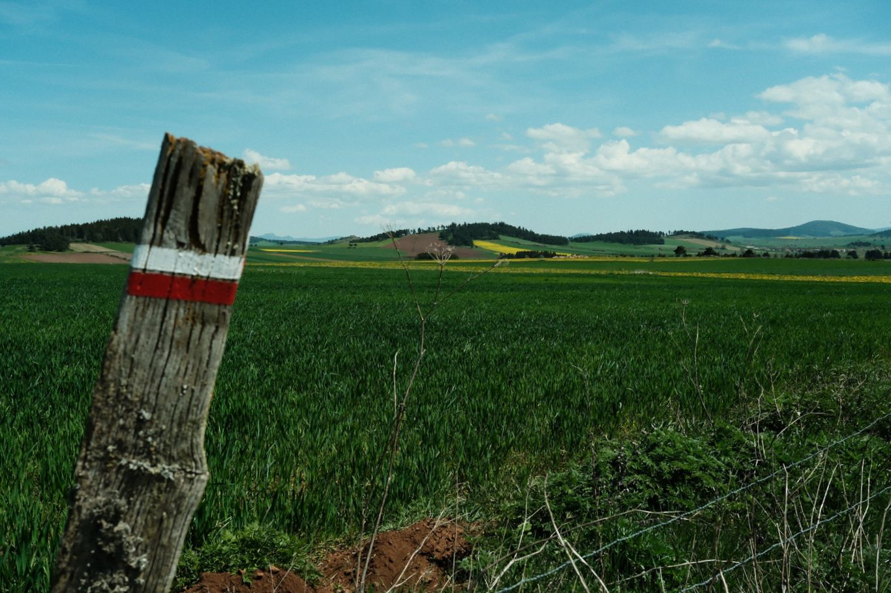
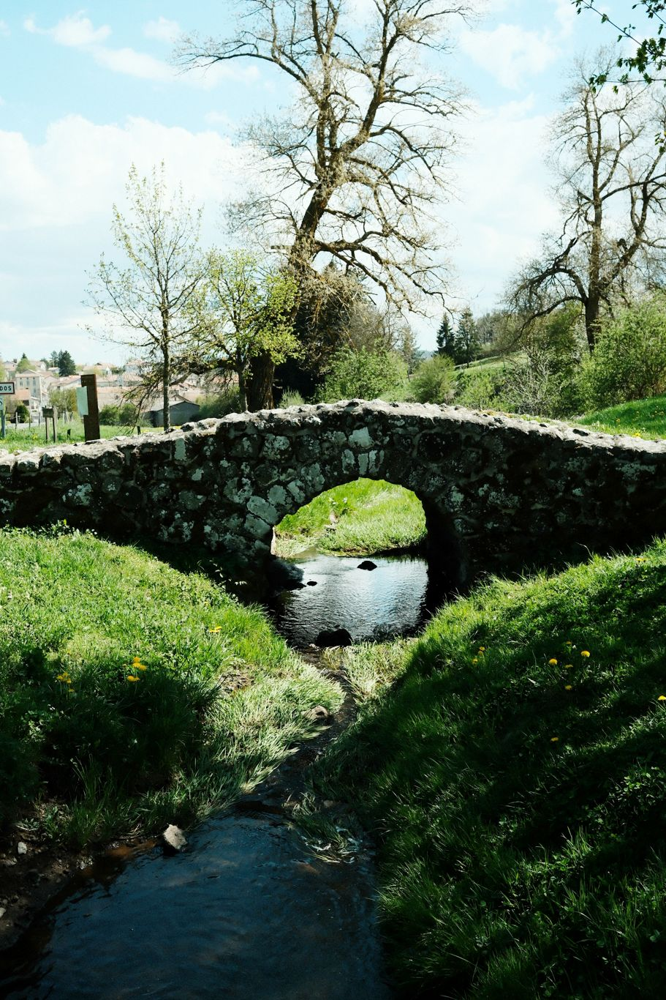
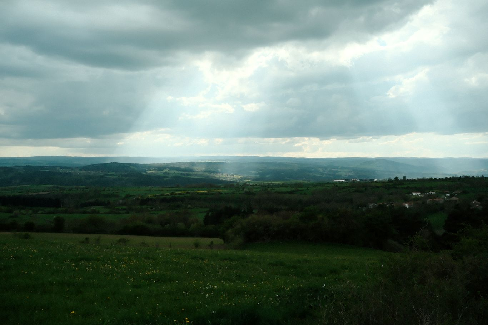

+++
title = "De Goudet à Arquejols"
date = "2026-04-27"
draft = "false"
+++

Une lune qui brille, des étoiles plein le ciel, des merles puis des chouettes... Voilà le résumé d'une nuit de bivouac réussie.
À la nuance près qu'elle a été très humide, à cause, de la rivière et que tout est trempé ce matin.
Qu'importe, je plie bagage, je ferai sécher tout au soleil à midi.

Le bon gars d'hier soir, qui était féru de vieilles pierres, comme moi, m'a indiqué que l'on pouvait suivre un peu le court d'eau par le GR3 pour découvrir le "premier château de la Loire". Il me vente le tableau, me fait saliver à grand renfort de superlatifs et d'onomatopées. Il a réussi à me faire envie, alors je me détourne de Stevenson pour aller voir ce fameux château, perché au sommet d'une ancienne cheminée volcanique.

Le spectacle est stupéfiant, c'est magnifique dans le soleil levant et tout à coup, c'est moi qui pousse des "oh" et des "ah", que c'est beau ! Je m'interdis cependant la visite, trop longue.

En remontant par un petit PR vers mon chemin, ce qui devait arriver, arriva, je me perds et me retrouve sur le GR400 pendant quelques kilomètres. Je m'en rends compte heureusement pas trop tard et bifurque à travers champs pour rattraper mon chemin. J'aurais raté Ussel. Et fait dix kilomètres de plus que prévu.






Déjeuner rapide et un peu insipide au Bouchet-Saint-Nicolas, avant de repiquer dard-dard sur Landos. Je suis un peu en retard sur mon programme. La marche est très facile, à travers ces grands replats herbeux. Quand le vent se met à souffler, ça me rappelle l'Islande, sauf qu'ici, des pissenlits ont poussé sur la pouzzolane.

Je fais enfin sécher mon duvet à Landos, sans un soleil de plomb, ça va vite. Mais je ne m'attarde pas, je compte rejoindre le village d'Arquejols, qui possède un petit et très cher camping.

Lorsque j'arrive, fermé, comme hier. Il a du monde et sans doute qu'il serait possible de négocier un emplacement. Mais... C'est si cher ! Je me rebelle un peu contre l'exploitation qui est faite du chemin.
Pour la peine, je continue, sachant très bien qu'il n'y a rien jusqu'à Pradelles, à treize kilomètres.

Dans un champ, je demande l'hospice à un agriculteur, qui m'envoie gentiment paître ; "tu trouveras de la place sur les hauteurs !". Ah oui, mais quelles hauteurs ! Je crapahute avec ma flasque remplie au village, sur un sentier poussiéreux, dans l'espoir de trouver un coin d'herbe plat.

Il ne se matérialise que bien des efforts plus tard, sous la forme de quelques mètres carrés de mousse légère, entre quatre sapins. C'est parfait.

Je m'installe devant ma vue monumentale sur la vallée et vaque à mon rituel de randonneur, traitement des ampoules inclus.

Demain, je ferai une pause à Langogne, je manque d'électricité, ma batterie ayant décidé de rendre les armes. Ce sera l'occasion de recharger l'électronique.

Je m'endors au bruit de mastication des grasses Holstein, qui paissent à deux pas.

