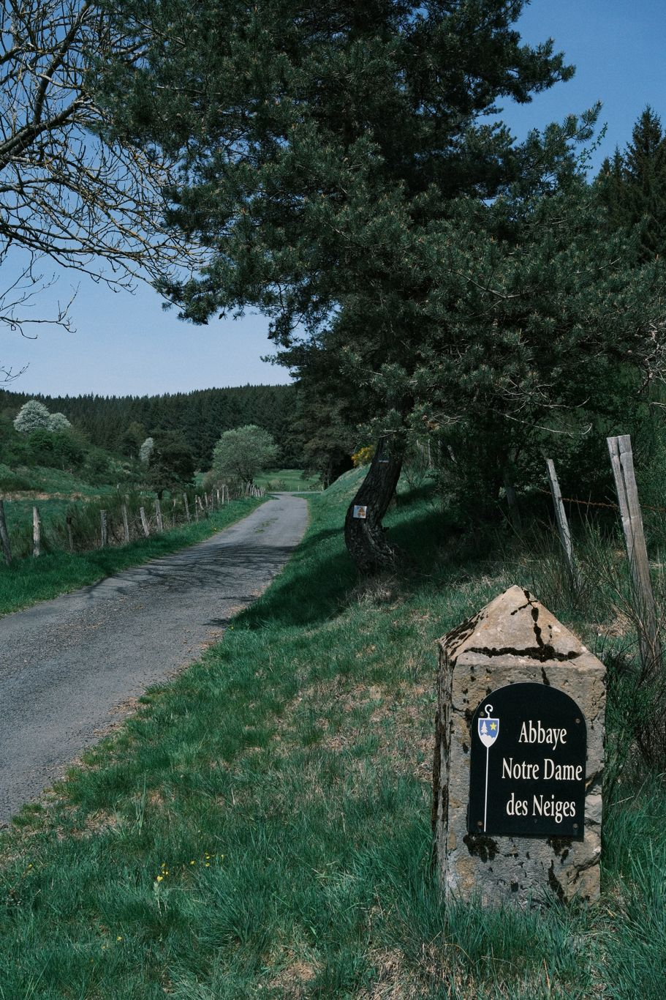
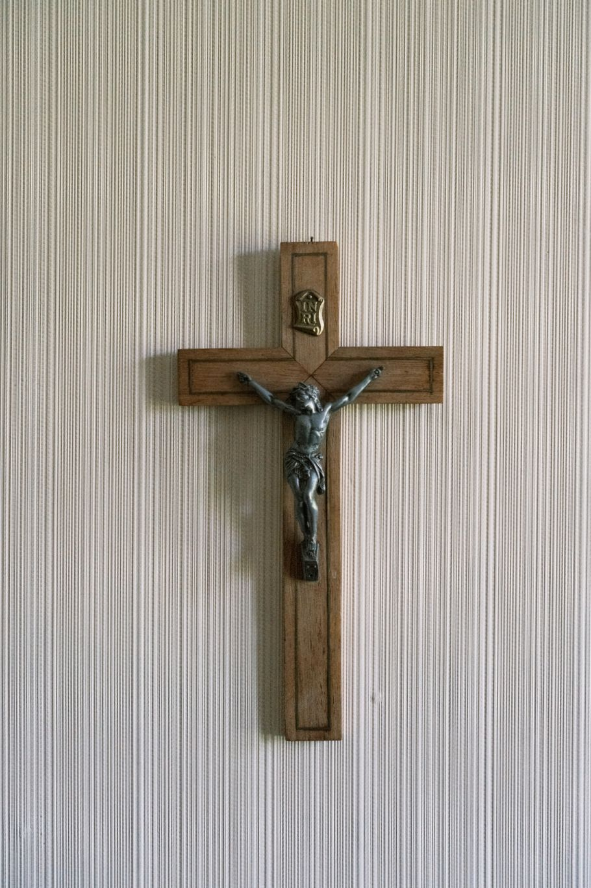

+++
title = "De Luc à Notre-Dame-des-Neiges"
date = "2026-04-29"
draft = "false"
+++

Ce joli petit bivouac avait tout pour être parfait, en tout cas un parfait cauchemar.
L'eau de l'étang s'est avérée plus coriace que mon filtre, qui, pourtant, garantit une eau pure. À minuit, je me réveille avec d'intenses coliques, je tremble comme une feuille, puis je sue à grosses gouttes. Ça va mal ! Je passe les trois heures suivantes dans un délire cauchemardesque, à me lever pour aller me vider dans la nature, puis à revenir grelotter dans mon duvet, sans même prendre la peine d'enlever mes chaussures. Les chevreuils sont bien étonnés du spectacle.

Je finis par m'endormir, le gros de la crise est passé. Au réveil, je suis déshydraté. Mon voisin qui avait eu, lui, la bonne idée de faire bouillir l'eau en plus de la filtrer, va bien. Il m'aide à préparer une tisane puis plie bagage. Je me traîne sur le sentier jusqu'à Luc, la vision trouble. 

Au village, on m'avait promis eau et toilettes, il n'y a rien. Je sonne à un gîte et on me sert un soda et du gâteau, que je ne touche pas. Les rires aux éclats de mes hôtes lorsque je leur explique ma situation me font réaliser à quel point j'ai été naïf. "Pardon hein, mais même les chiens, on leur interdit de la boire !". Je zone un peu, puis décide de faire du stop pour le rendre à la Bastide, je n'ai aucune chance de faire vingt kilomètres à pied aujourd'hui. On me prend tout de suite.

À La Bastide, je reprends des forces et décide de gravir les seulement trois kilomètres qui me séparent de Notre-Dame-des-Neiges. J'aurais au moins le plaisir de l'avoir fait moi-même.

À l'abbaye, je m'écroule dans l'herbe et dors deux heures. Quand enfin l'accueil randonneurs ouvre, je me précipite sur mon lit pour profiter d'un peu de confort.

Cette fois, on ne se moque plus, j'ai droit à beaucoup d'eau, du pain, une banane et au lit !
Si demain je suis en forme, je pousserai jusqu'à Chasseradès. Sinon, je m'arrête à la Bastide pour une journée complète de repos.

