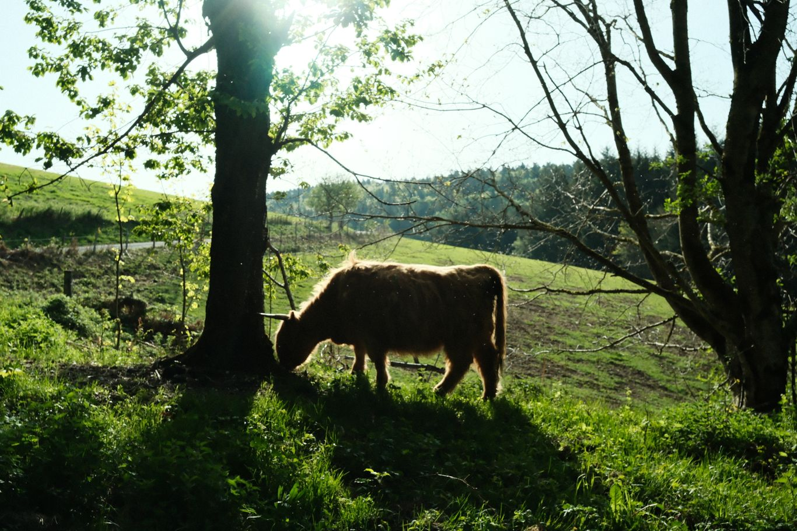
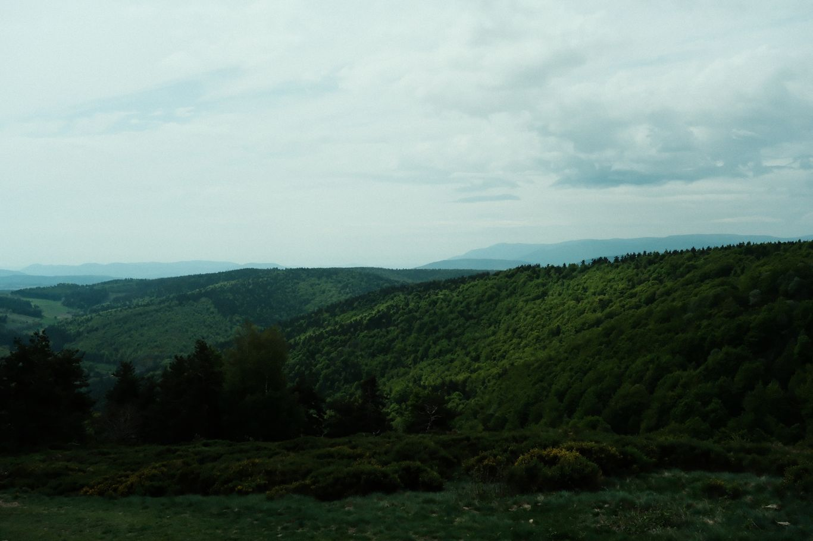
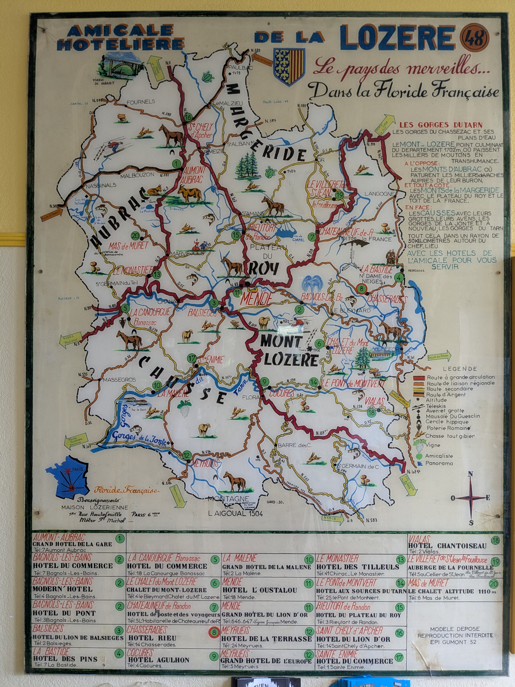

+++
title = "From Notre-Dame-des-Neiges to Chasseradès"
date = "2026-04-30"
draft = "false"
+++

I wake up in my boarding-house bed, feeling well. The after-effects of my little mishap are still there, but I can feel my body is rested. I have breakfast of bread and herbal tea, under the benevolent eye of the volunteers who run the lodge.
They wish me good journey and good luck; I'll need it, to recover.

The descent towards La Bastide is easy. Quick pharmacy stop and now I'm armed with Smecta and electrolytes to tackle my day!
I also buy some applesauce, which is part of the very restricted list of foods I'm allowed. I still have a piece of that good sausage in my bag and I'm starting to miss it.

I only plan a short stage; the goal is to check that I can hold up, nothing more. Rain is forecast for two in the afternoon; I'll try to arrive before that in Chasseradès, fifteen kilometers from here.

The hike is quiet, through undergrowth then along a wide ridge line, in a field of wind turbines. Nothing spectacular or flamboyant, but with a discreet charm, like many of the landscapes encountered so far.

I stop at the Hôtel des Sources, a bit shabby, but the cheapest in the village. I'll see later about sleeping outside again. It's only one in the afternoon; having so much free time ahead of me is unusual. It's quickly filled by a lunch (of bread and applesauce) followed by preparation for the days ahead. Unfortunately, I have to abandon my go-with-the-flow approach, because heavy rains are forecast for the beginning of the week; no question of walking eight hours under that.

A little tour of the village allows me to acquire some extra supplies (bread, and applesauce, therefore). I'm told that the church has a bread oven, hastily built in 1943 to escape the Wehrmacht's wheat requisitions. I'm shown how to access it, via a wooden staircase and a hidden door. I love these kinds of little secrets.







Back at the hotel, I finally start my journal that I've been carrying folded in four in a dry bag since my departure. Across from me, the owner and a farmer friend chat, amid vapors of pastis and a cloud of cigarillos.

I have a small tabbouleh for tonight. I think this second night "indoors" will end up completely reviving me!

