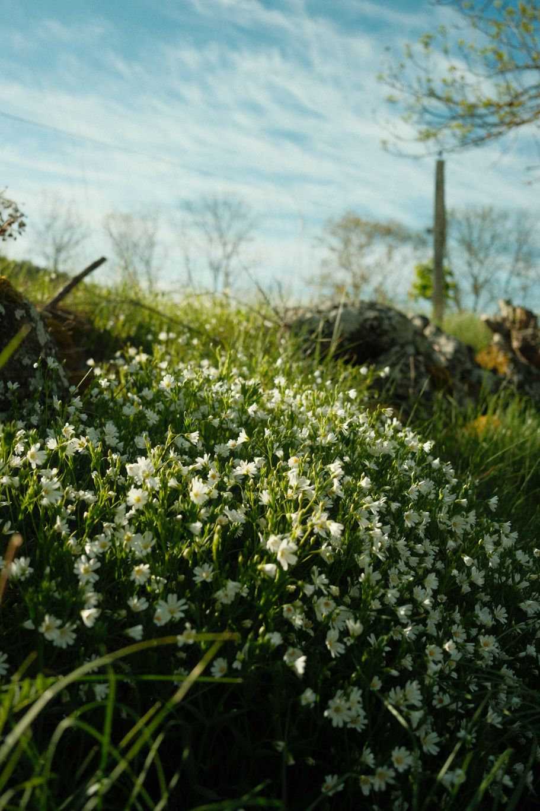
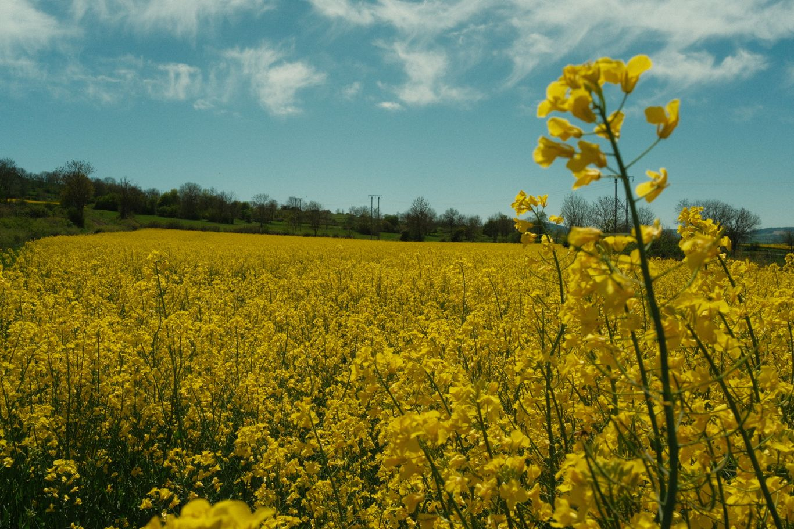
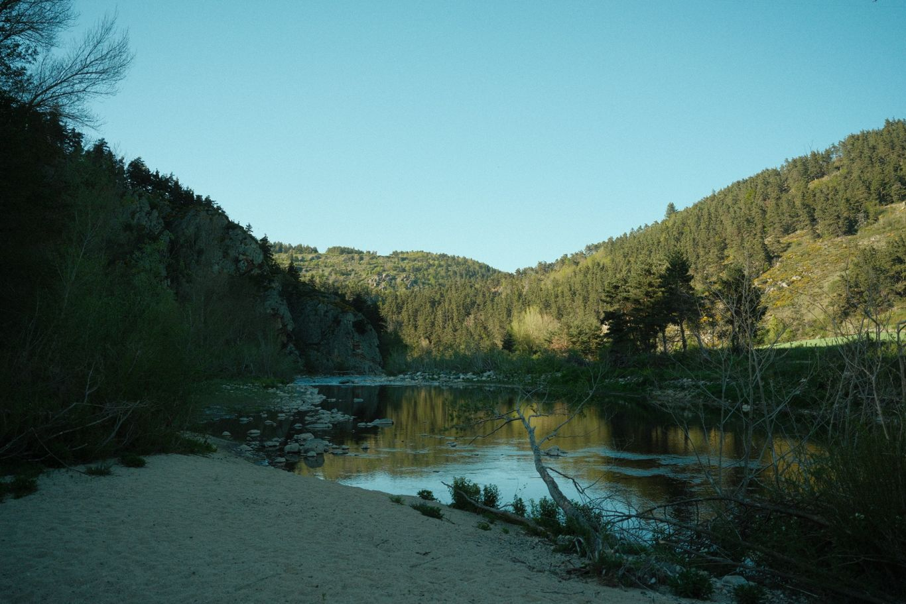

+++
title = "Du Puy à Goudet"
date = "2026-04-26"
draft = "false"
+++

Une bonne nuit réparatrice et un petit-déjeuner continental plus tard et me voilà sur pied pour attaquer la journée.
J'achète un pain aux noix pour compléter mes provisions, avant de prendre la route vers le Monastier.

Certains disent que cette étape est optionnelle, car elle ne correspond pas au tracé de Stevenson. C'est vrai, mais elle est dans le topo guide, et je suis tatillon.






Un grand sourire me fend bientôt le visage à mesure que je progresse dans les champs en fleur, il fait un temps magnifique et la saison est idéale. 

Je crapahute bien, rapidement, j'ai couvert quinze kilomètres, et je rencontre le troisième randonneur de la journée, avec qui cette fois, je discute. Il est du Nord et aime le cyclisme, je suis bon pour entendre parler du Liège-Bastogne-Liège.






Arrivé au Monastier, nous nous séparons, il va manger au petit restaurant du village tandis que je me dirige vers la place de l'église pour attaquer le saucisson et le pain, qui me fait très envie depuis ce matin.

À peine ce frugal déjeuner avalé, on me hèle pour me proposer de l'eau. C'est Nicole, qui est en train de dépoussiérer de vieux livres qu'elle a acquis en même temps que sa maison de village, et qui prennent le moisi à la cave. Nous discutons un bon moment, personnage fort intéressant, qui a beaucoup voyagé, un peu artiste déjantée sur les bords.

Elle fait chambre d'hôte, mais mon point de chute est encore à dix kilomètres, je décline l'invitation et repars sous une chaleur désormais bien installée.






Cette deuxième partie de journée se passe sans encombre, je traverse de charmantes fermé, l'on y fauche l'herbe, qui embaume l'air.

Rude descente sur Goudet, en bord de Loire. Tout est fermé, même la petite pizzeria/bar. J'ai de la chance, le propriétaire est en pleine pétanque devant l'établissement, mais accepte de me servir une bière. En même temps, son beau-père m'a déjà ouvert pour me faire rentrer.

Ce dernier est fort sympathique et semble connaître tous les coins et recoins du pays. C'est la chance, car le camping est lui aussi fermé. Il m'indique une belle pinède au bord de l'eau où je pourrais coucher sans problème. 

Je le quitte non sans le remercier chaleureusement. Quelle première journée ! Tant de rencontres m'ont fait paraître le temps court. Pourtant, il est déjà seize heures passé. Je file dans le sous-bois, me lave dans la Loire gelée et pends mes affaires à sécher.

La température va tomber d'un coup, je le sais. Un rapide repas plus tard et me voilà dévorant de nouveau le _Hussard_. C'est la belle vie.

