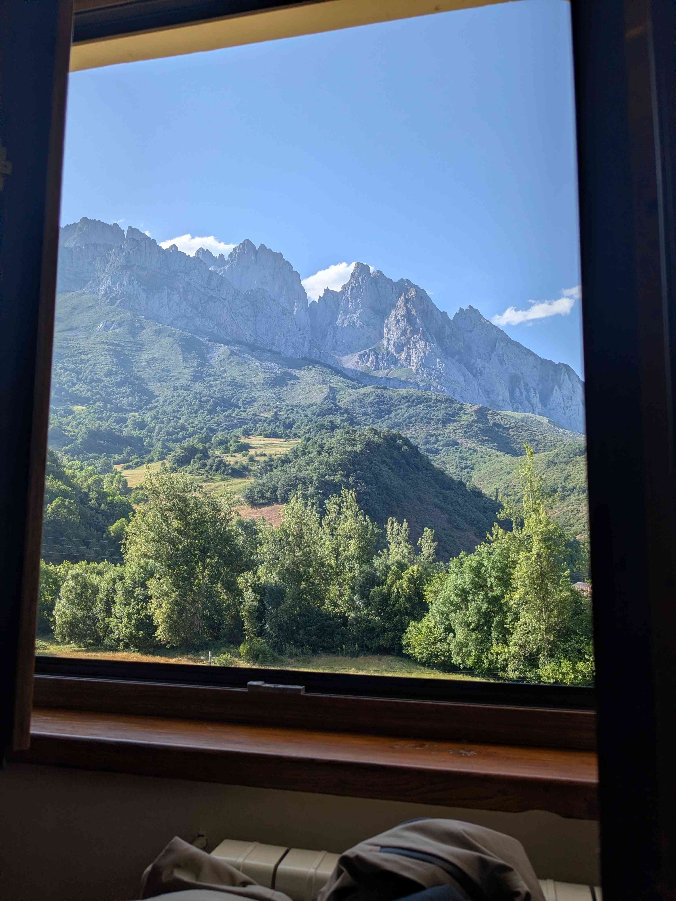
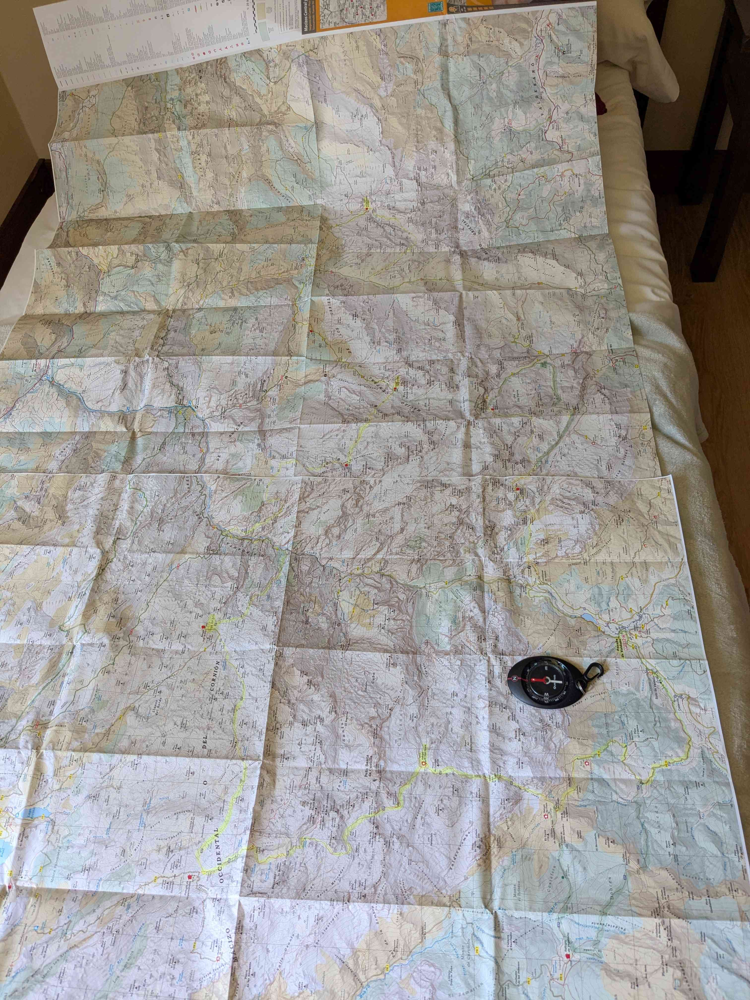

+++
title = "Bordeaux - Posada de Valdeón"
date = "2026-06-20"
draft = "false"
+++

As the mercury is about to hit forty degrees in Bordeaux in the coming days, what better than to escape this boiling pot to go to Cantabria, where the sea air, mixed with that of the mountains, creates a much milder microclimate.

Around nine o'clock, my friend Étienne and I set off on a journey of about seven hours by car, through the Landes, the Basque Country, and then the Spanish coast. When we leave France, the car already shows thirty-four degrees. Yet, in the twists of the Spanish motorway that snakes along the industrial coast, we drop to twenty-two.

The arrival in the Picos de Europa Natural Park is a wonder. The impressive gorges we cross give us a foretaste of the ruggedness of the terrain we are about to explore. The hotel offers us a breathtaking view of the peaks and we are very warmly welcomed.

Quick review of the route, organizing bags, a good shower, and we are ready for tapas as dinner.

