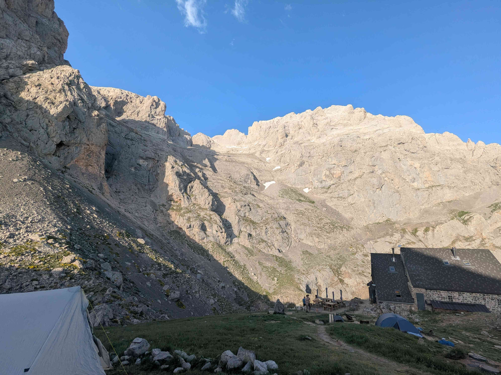
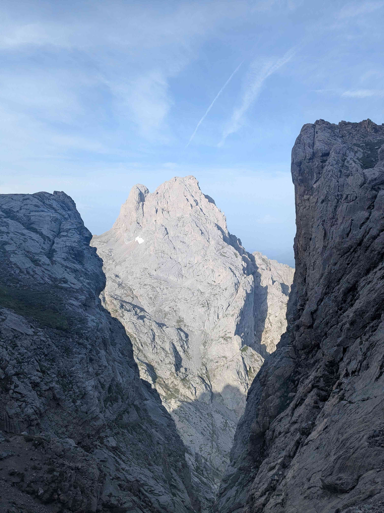
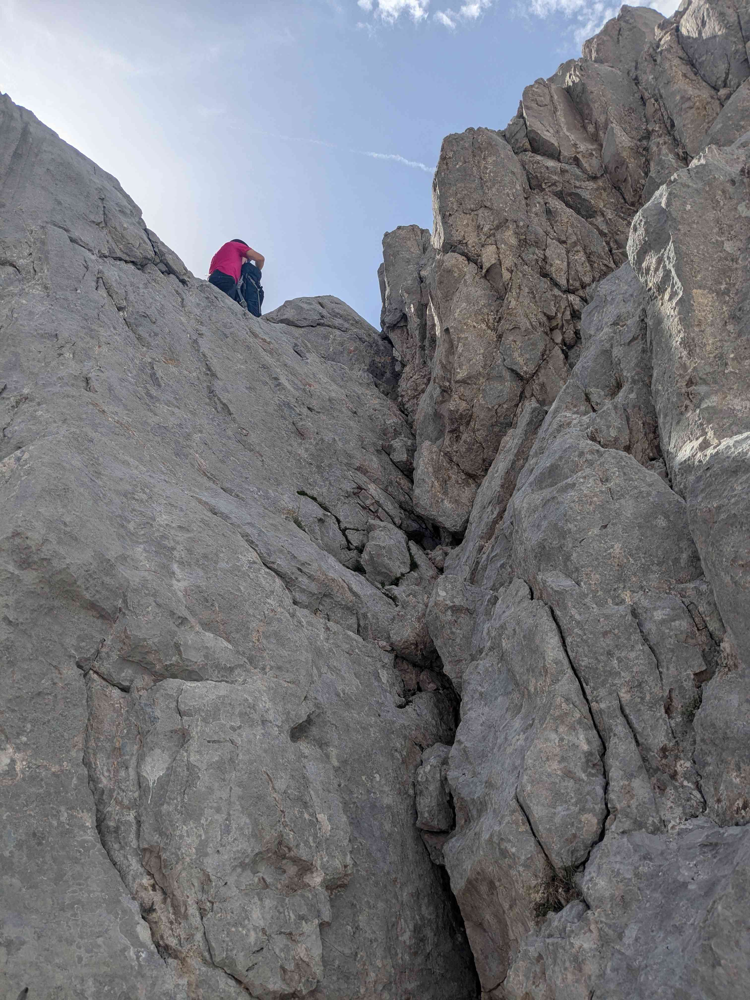
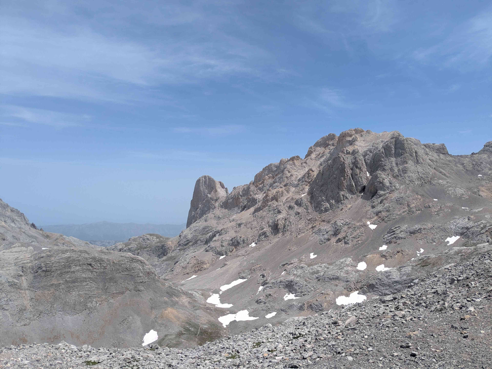
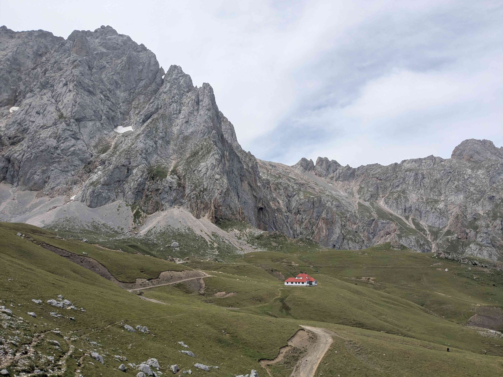
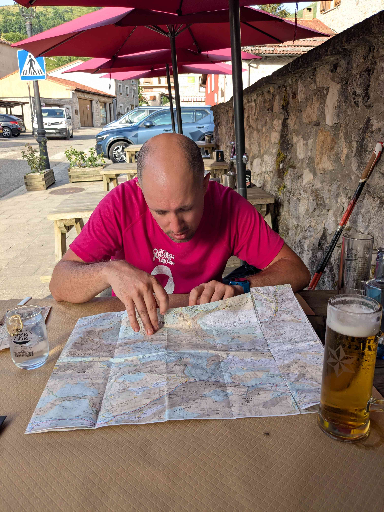

+++
title = "Collado Jermoso - Sotres"
date = "2026-06-22"
draft = "false"
+++

A l'approche du deuxième refuge, Cabana Veronica, c'est un véritable jeu de funambule, où chaque faux pas menace de nous envoyer au fond de crevasses noires. Enfin arrivés, je peux souffler un peu et nous profitons d'un bon déjeuner pour discuter avec des marcheuses belges.

Lorsque l'on se quitte, nous avons pour plan de partir vers le refuge d'Uriellu, ce qui implique de traverser le massif dans sa longueur. A l'arrivée au début du sentier... Malheur, tout s'est écoulé, les chaînes sont arrachées et des éboulis recouvrent le sentier. J'avais eu vent de cette mésaventure, qui a eu lieu en 2023, mais j'étais sûr que les dégâts auraient été réparés depuis. Malheureusement, nous devons faire demi-tour, hors de question de jouer notre vie là-dessus.

Nous entamons alors un immense détour, par la voie "normale" de l'Anillo de Picos, qui est beaucoup plus facile, à travers une large vallée verdoyante. Au son des cloches de vaches, nous dévalons mille huit cents mètres pour descendre au très joli village de Sotres où nous arrivons, à la dernière minute, à réserver deux lits en auberge de jeunesse.

Nous sommes brûlés par le soleil et épuisés. Un bon repas en ville arrosé de bonne bière nous remet tout d'aplomb pour prendre une douche et laver nos quelques vêtements. Si tout se passe bien, demain nous dormirons à Uriellu et nous pourrons ainsi reprendre la suite de notre voyage comme prévu.

