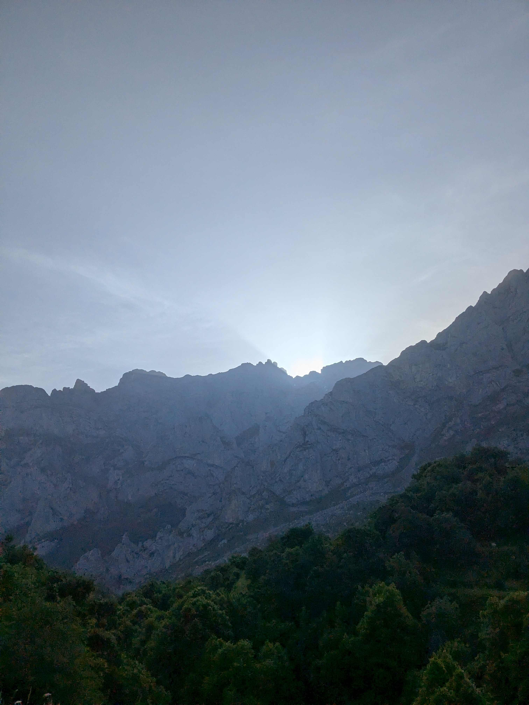
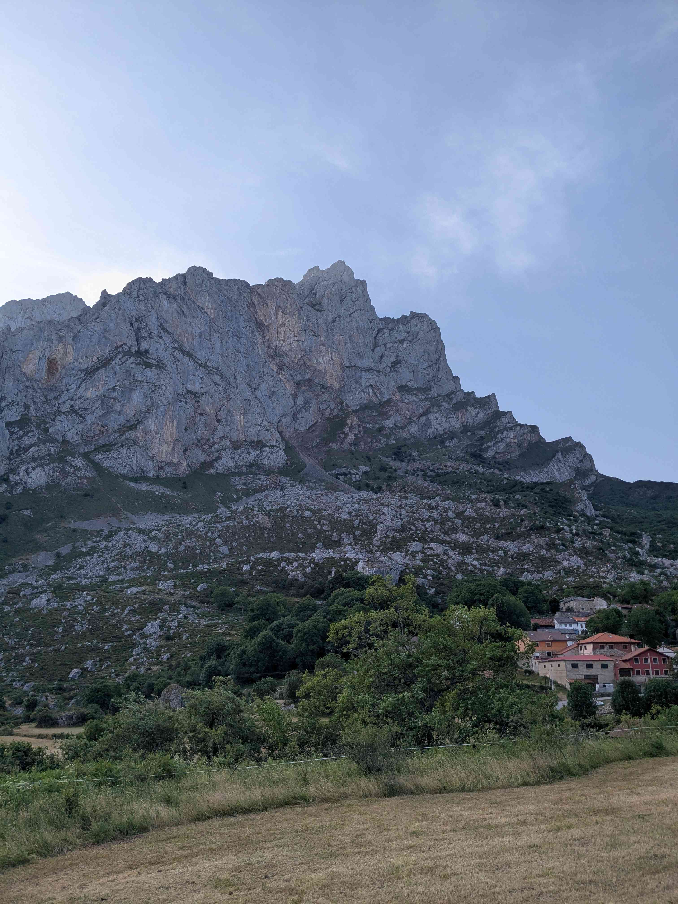
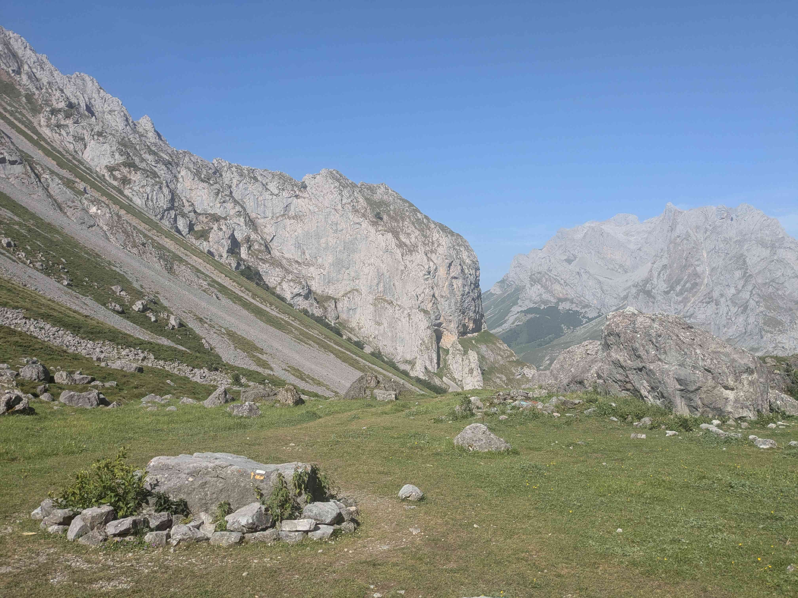
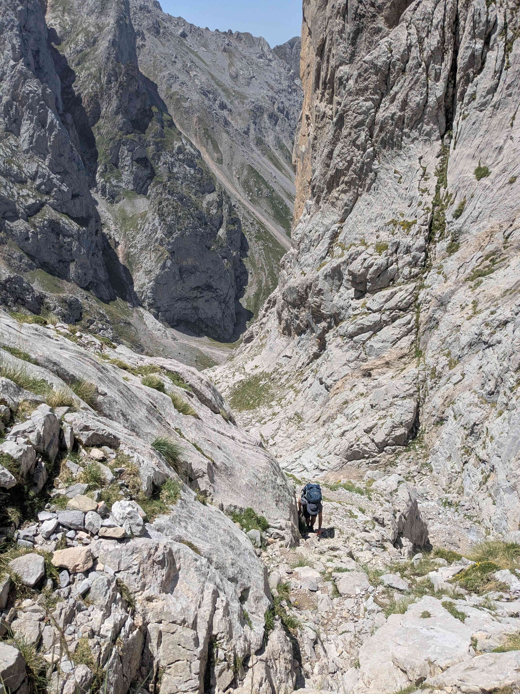

+++
title = "Posada de Valdeòn - Collado Jermoso"
date = "2026-06-21"
draft = "false"
+++

Difficile de se lever ce matin, après une si longue journée de conduite et un dîner bien arrosé. Pourtant, dès huit heures, nous garons la voiture dans un coin tranquille du village avant de nous mettre en route.

Le chemin, plat pendant les premiers kilomètres, nous permet de tranquillement dégourdir nos jambes. C'est tant mieux car peu après le village de Cordiñanes, la montée commence et elle est abrupte. Très rapidement, on se retrouve confrontés à des chaînes à flanc de falaise qui nous permettent de progresser plus sereinement sur la pierre blanche.

Après quelques lacets, le soleil se dévoile au détour d'un bloc rocheux et nous inonde de sa chaleur. Il n'en faut pas plus pour nous mettre définitivement en nage. Un replat herbeux, que l'on atteint après bien des efforts, nous donne l'occasion d'une véritable pause. Une compote et un biscuit plus tard, et nous repartons !

La deuxième partie de l'ascension est fidèle aux descriptions que l'on m'avait faites de ce trek : on dirait la Corse. Bien souvent, on se retrouve face à des murs de roche, qu'il faut escalader comme on peut. Alors que le soleil nous écrase, la découverte d'un ruisseau fait notre bonheur après cette matinée poussiéreuse.






Un dîner lyophilisé plus tard et nous nous couchons, très tôt, afin de récupérer de cette rude journée. Demain s'annonce extraordinaire, avec la traversée longitudinale du Massif Central pour rejoindre les environs de Bulnes.

