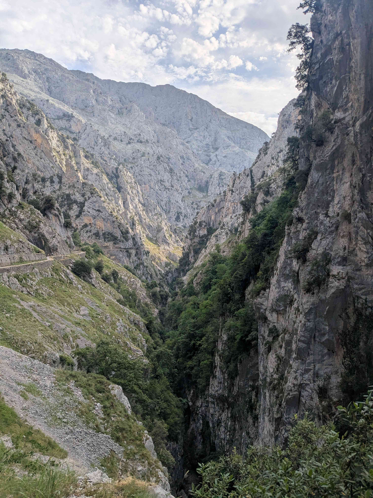
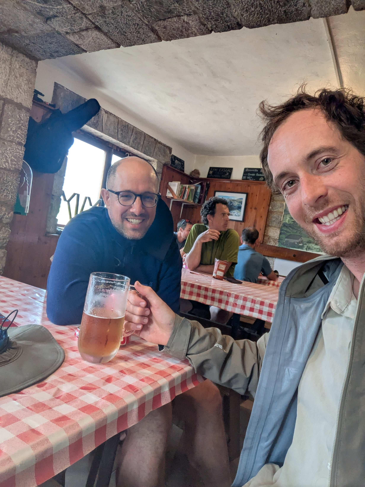

+++
title = "Rio Cares - Vega de Ario"
date = "2026-06-25"
draft = "false"
+++

While the storm raged for much of the night a few kilometers from our campsite, we surprisingly slept well in the warm humidity of the undergrowth. Getting out of the tent at six o'clock is not easy, though; everything is still soaked from yesterday, and it takes quite a bit of courage to pull on our damp, icy clothes.
I've clearly lost my muesli along the way, so Étienne supplies me with a brioche and the remnants of long-melted Maltesers.

When we set off, we discover with despair that the path is just as bad as yesterday's. We slide on small stones and constantly have to use our hands to grab the tufts of wild grass that serve as makeshift handholds. When we reach the top, the Spaniards are surprised to see us emerging from our mire; "It's high!" they say.

A short walk through the gorges on a wide, easy path, before diving back into the thicket on a path that couldn't be steeper: 40% average gradient for three kilometers! We run into a few hikers, which is reassuring compared to yesterday. A grandpa carries his water in glass Bacardi bottles; it amuses me.






The higher we climb, the more exposed the trail becomes and the stronger the wind gets. When we reach the rock on the ridge, we are cheerfully swept about by the wind and often have to lie flat against the wall to wait for the gust to pass. At the pass, the sky is black and a few drops further disrupt our plans. Yet it doesn't last, and we arrive at the very nice Vega de Ario refuge under a bright sun.






The lunch served to us is without a doubt the best so far, and we relish it, as usual, accompanied by a beer. We won't go any further because, at dessert time, a violent storm breaks out. I pitch the tent in record time; we finish eating in the common room.

Relaxation as soon as the last drops fall: laundry, shower, a walk around the area, and, without noticing, it's already aperitif time.
This day feels like a reward for all our efforts yesterday; morale is at an all-time high. A bit of cell service allows us to check the weather, which seems more favorable tomorrow. We fall asleep confident about the penultimate stage ahead of us.

