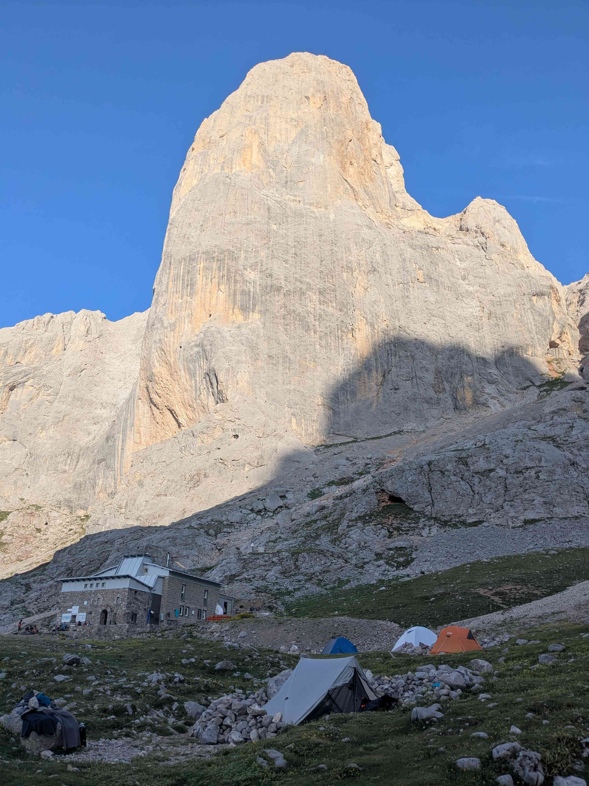

+++
title = "Sotres - Uriellu"
date = "2026-06-24"
draft = "false"
+++

How hard it is to get out of the small, not very cozy bed that welcomed us for the night! A breath of already warm air passes through the dormitory, the smell of hot coffee is everywhere. We linger a bit over breakfast, while trying to make ourselves understood by our roommates, who also seem to be doing the Anillo de Picos. It is clear that very few Spaniards speak English here, so we improvise with sign language.






Once we finally managed to extract ourselves from this little cocoon, the real heat is in the descent of the village and it will not leave us until sunset. We find the dusty track from yesterday, which takes us to the foot of pastures, which we climb up a steep path.

Quickly, the first refuge, the Terenosa, where we just have a soda before leaving again. This small dose of energy is necessary, given the climb that awaits us to go back up to the foot of Picu Uriellu, where the refuge of the same name is located. Around one o'clock and under oppressive heat, we are there. This gray and ochre peak that rises six hundred meters above us commands respect.

