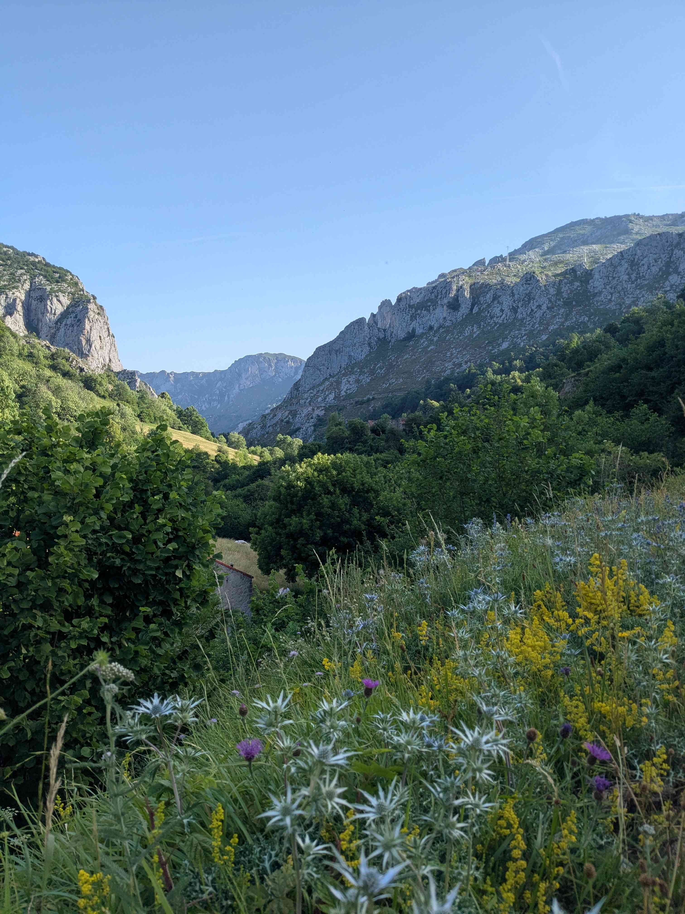
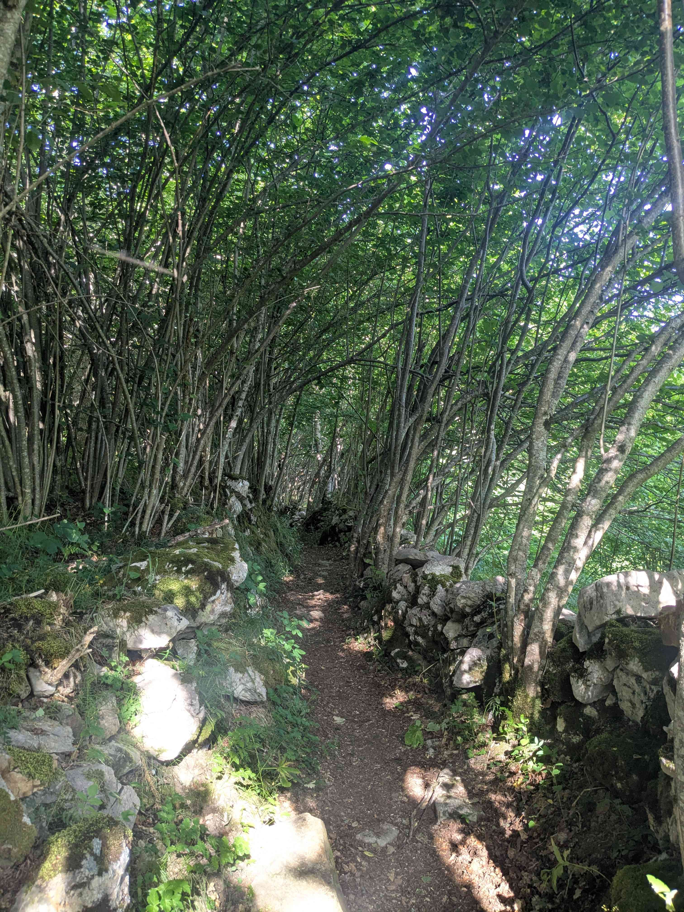
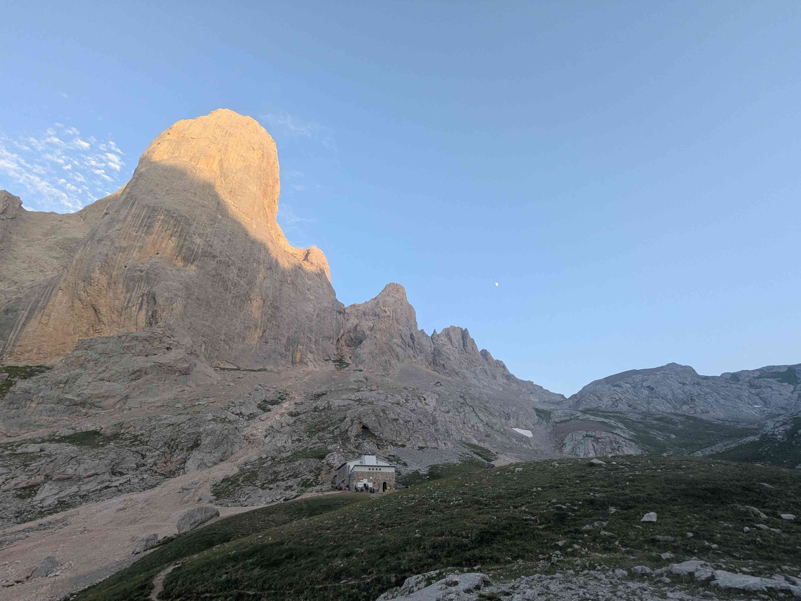
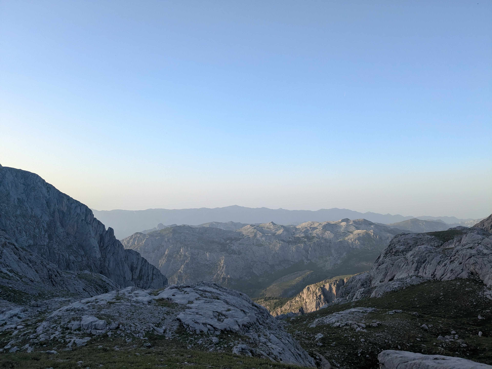

+++
title = "Sotres - Uriellu"
date = "2026-06-23"
draft = "false"
+++

Qu'il est dur de sortir du petit lit néanmoins pas très douillet qui nous a accueilli pour la nuit ! Un souffle d'air déjà chaud traverse le dortoir, l'odeur du café chaud est partout. On traîne un peu en déjeunant, tout en essayant de nous faire comprendre de nos camarades de chambrée, qui semblent faire aussi l'Anillo de Picos. Force est de constater que très peu d'Espagnols parlent anglais ici, alors on bricole en langue des signes improvisée.

Une fois que l'on a enfin réussi à s'extraire de ce petit cocon, la vraie chaleur s'installe lors de la descente du village et elle ne nous quittera plus jusqu'au coucher du soleil. Nous retrouvons la piste poussiéreuse d'hier, qui nous emmène au pied de pâturages, que nous gravissons par un raidillon.

Rapidement, le premier refuge, de la Terenosa, où l'on prend juste un soda avant de repartir. Cette petite dose d'énergie est nécessaire, vu la montée qui nous attend pour remonter au pied du Picu Uriellu, où se trouve le refuge du même nom. Vers treize heures et sous une chaleur écrasante, nous y sommes. Ce pic gris et ocre qui se dresse six cents mètres au-dessus de nous impose le respect.

Après un rapide déjeuner, nous décidons de continuer vers Los Cabrones, qui semble peut-être un peu plus accueillant... Malheureusement, nous prenons le mauvais chemin et après quelques dizaines de minutes d'errements, nous décidons de revenir sur nos pas et d'installer notre campement ici. Pas facile d'échapper au soleil brûlant, tout le monde se réfugie à l'ombre du refuge, qui heureusement fournit des bières en quantité industrielle.

Finalement, l'après-midi passe vite, entre les petites lessives, la douche sommaire et l'incontournable apéritif. J'ai même eu l'honneur de retirer ma première tique du voyage. On s'installe confortablement dans un petit cercle de pierre, en espérant que le vent nous laisse du repos cette nuit. Tout doucement, ce grand refuge et ses dizaines de campeurs s'endorment, alors que les derniers rayons de soleil éclairent tout juste la vallée.

