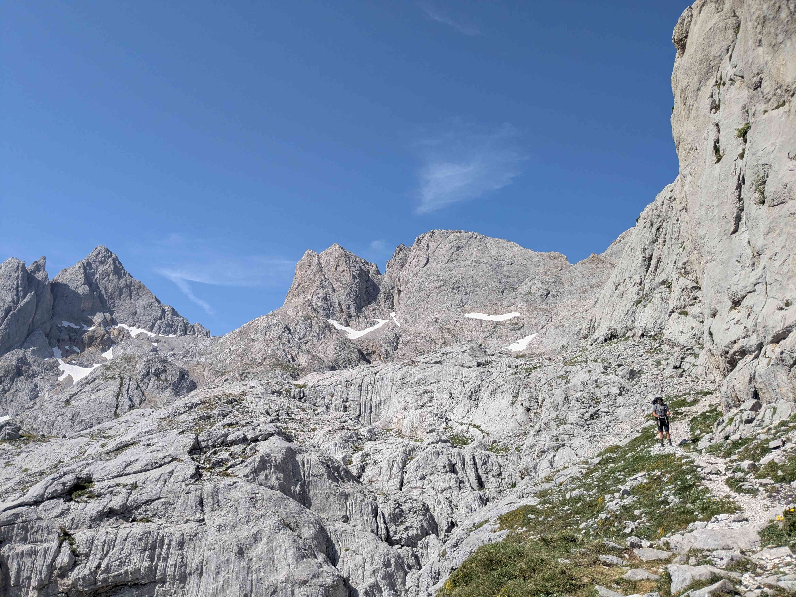
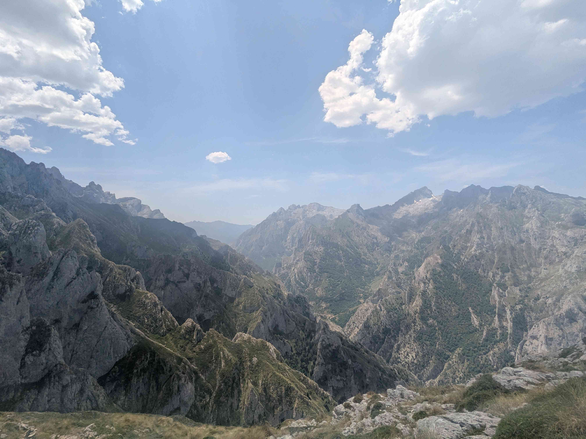
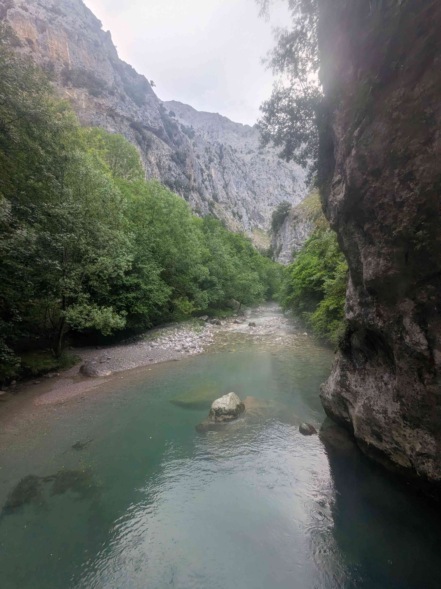

+++
title = "Uriellu - Rio Cares"
date = "2026-06-24"
draft = "false"
+++

The mood is good this morning. We slept well and a magnificent sunrise ignites the permanent mist that bathes the Picos de Europa. The efficiency of our duo has also improved; in about an hour, breakfast is eaten, the tent folded, gear packed. We can only make out two people who took the trail before us, that's our little pride.

<!--more-->







The climb is tough to the refuge of Los Cabrones, and includes one of the chained passages described on the map, as well as a ladder to cross a small pass. The wind blows hard enough to knock the horns off ibex, but everything goes well. On the other side, chaotic and desert-like landscapes, still a few patches of snow.

At Los Cabrones, they serve us a very dry ham sandwich, of which we devour half accompanied by a soda. Our plan is now to reach the refuge of Vega de Ario, but oddly everyone makes big eyes when we explain it to them...






Nevertheless, we set off, facing new dizzying passages, as well as some very sharp, rough, or slippery rocks. Our first doubts appear in a valley, where the map is categorical: we must take a path on the left to descend back into the valley. The path is there, but barely visible, hardly more than the trace of a herd's passage. We follow it, for a long time, until we emerge onto a dizzying ridge, flanked on both sides by deep valleys.

We begin the descent into what the Spanish call a "canal". Here, you can forget the notion of a path; we descend an immense scree slope several kilometers long, clinging as best we can to our poles, while carefully avoiding the majestic isards whose domain we are crossing.

Halfway down, a few large scattered raindrops disturb our progress. A handful of minutes later, first thunderclaps, then the deluge. We gear up, before continuing the descent. The closer we get to the river we must cross, the more the rain intensifies and the less visible the path becomes. Tangle of brambles and branches. How can this be the official route? We check and recheck, yet everything matches.

Finally, exhausted, we emerge onto a small bridge that crosses said river, near a waterfall. It is six in the evening, we will not go any further. Setting up the bivouac, swim in the icy water, good hot meal. The joy that had left us this afternoon gradually returns, and we still manage to enjoy the evening. Tomorrow, we will go up to the refuge and from there, establish a new battle plan for the coming days, taking into account the worsening weather.