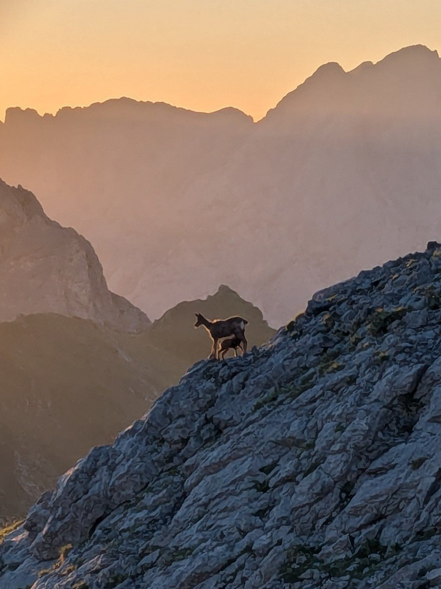
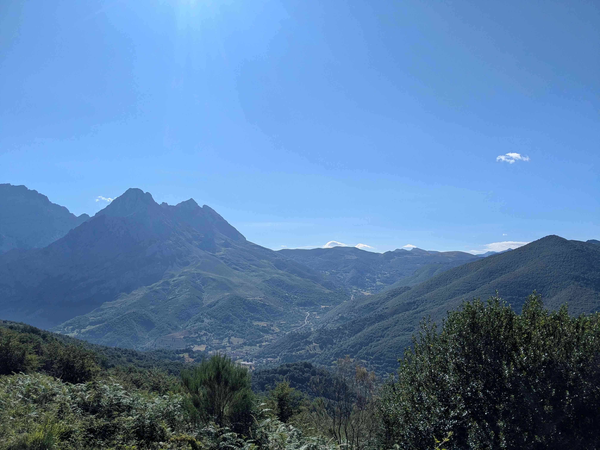
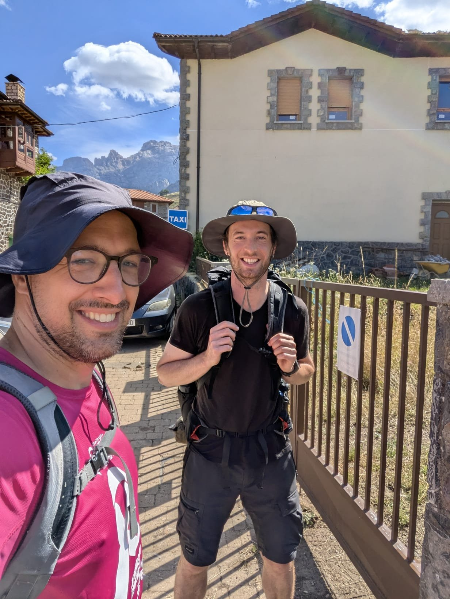

+++
title = "Vega Huerta - Posada de Valdeón"
date = "2026-06-27"
draft = "false"
+++

The wind calmed down late in the evening and the night was rather calm. Also, breakfast was taken in good spirits, especially as the rising sun and herds of isards offered us a fascinating spectacle.

<!--more-->

The supply bags are definitely empty, we perfectly calculated our rations, there is only one thing left to do: descend!
Actually, not quite, because we start the day with our usual exercise, climbing a scree slope. Surprisingly, it drizzles while the sun shines. We play at believing we are at the gates of Mordor, as fiery vapors rise from neighboring hills, where a kind of slash-and-burn practice is probably being carried out.






We begin the descent on unstable scree first, then progress on dusty hills, and finally in thick grass. As the path becomes wide and easy, we quicken our pace, again and again. So much so that we arrive at the bottom more than an hour before the estimated time.

Unsurprisingly, we treat ourselves to a beer and a sandwich, before changing into "civilian" clothes and hitting the road again. To break the journey, we make a family stop in the Landes region, before the final stretch to Bordeaux tomorrow.

The comparison between the Anillo de Picos and the GR20 is not overstated, what difficulty! Nevertheless, it will undoubtedly remain among my most beautiful trekking memories.

