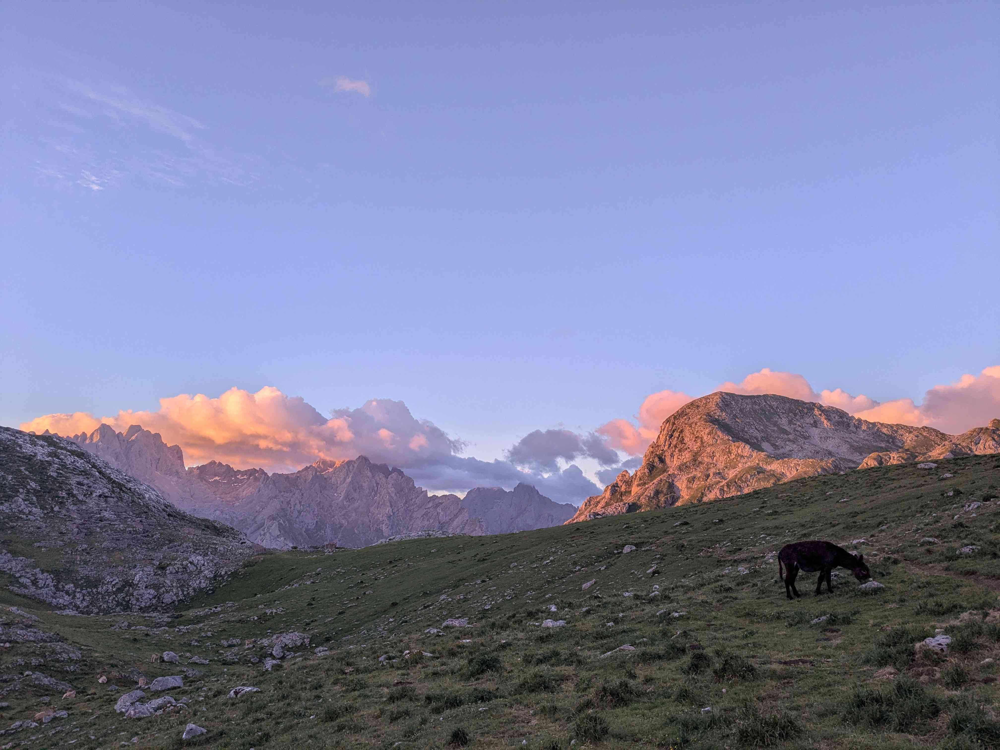
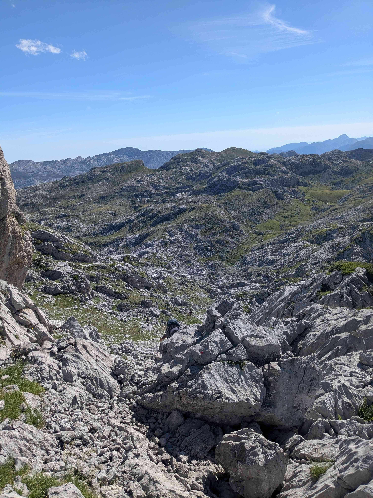
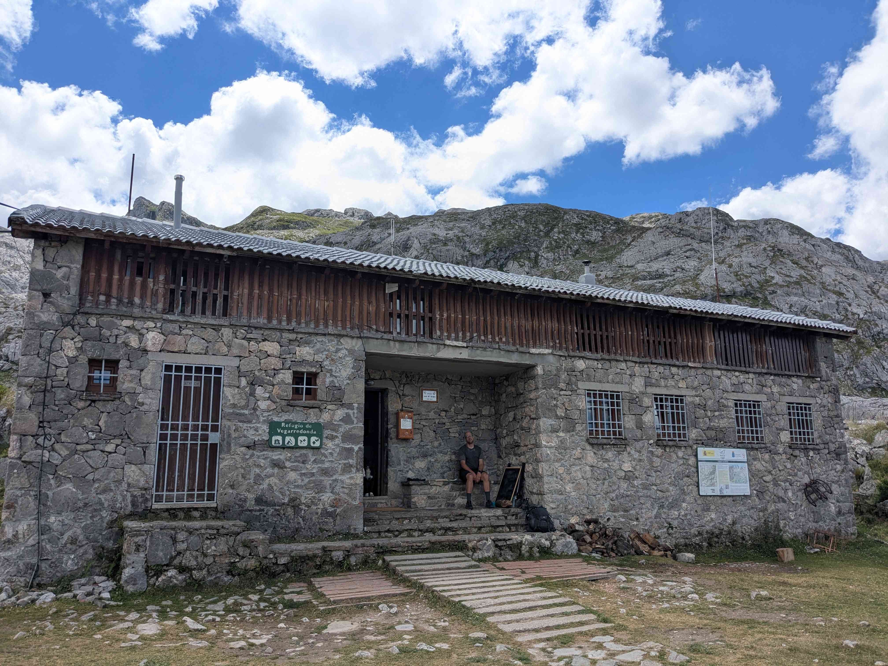
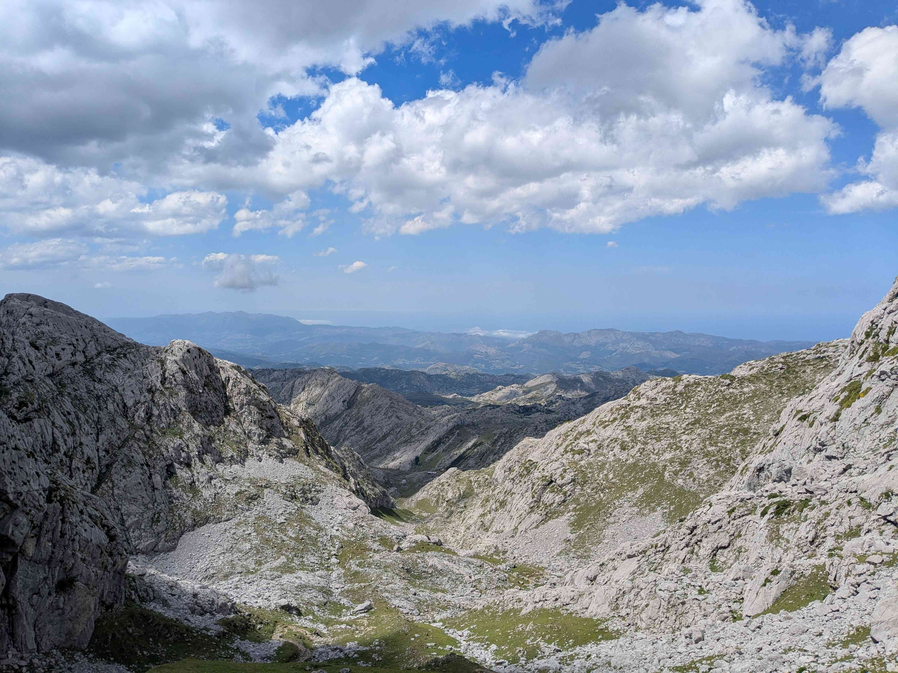
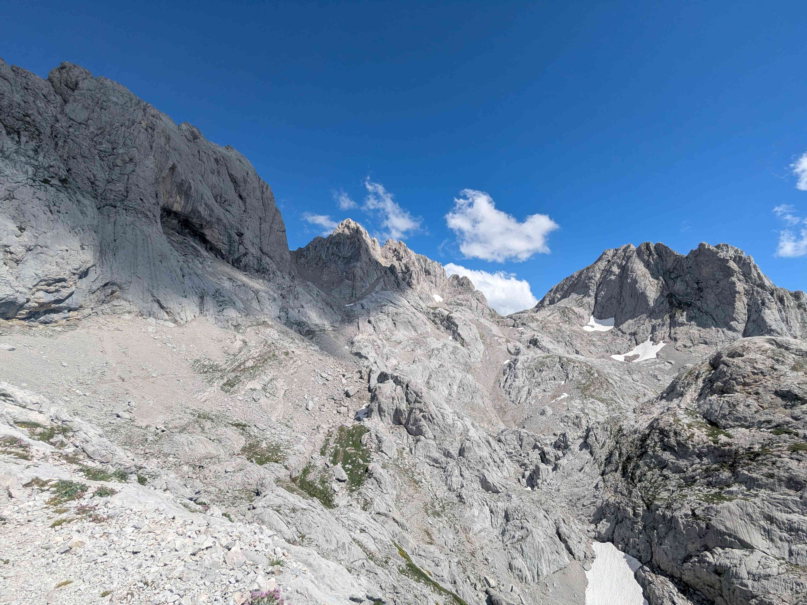
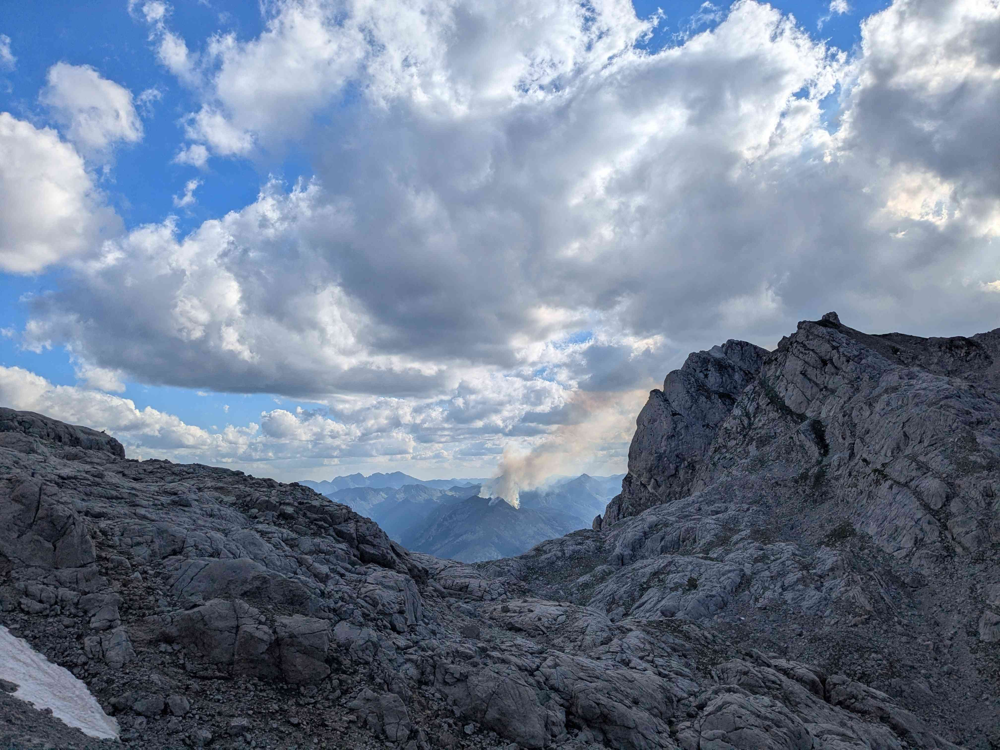
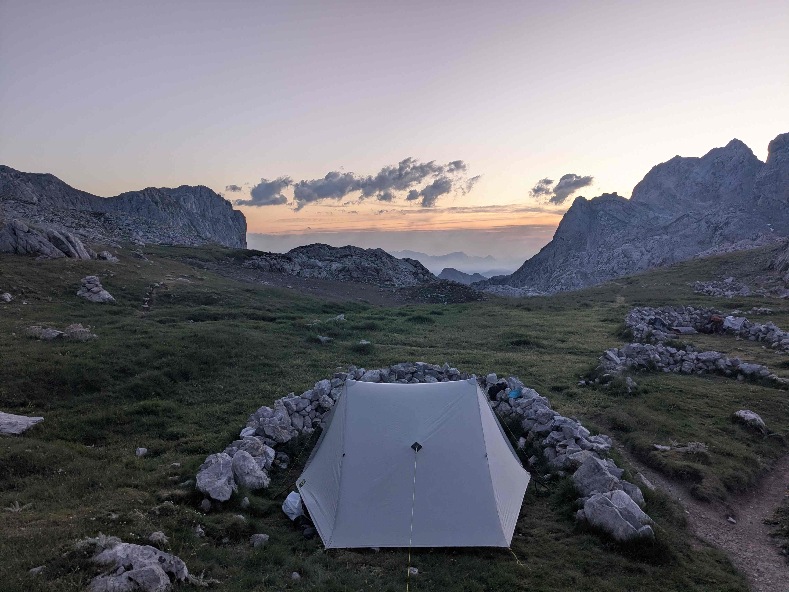

+++
title = "Vega de Ario - Vega Huerta"
date = "2026-06-26"
draft = "false"
+++

Alors que nous sommes déjà installés à la terrasse du refuge pour préparer notre petit-déjeuner, un employé sort la tête pour nous proposer du café : voilà qui introduit admirablement cette journée.

Nous partons sous un beau ciel bleu moucheté de nuages. Autant les premiers pas dans le chemin herbeux sont francs et faciles, autant l'orientation devient rapidement un problème lorsque nous attaquons la portion pierreuse du chemin. Des cairns partout, pas de marquage, on se perd deux fois malgré notre carte, perdant ainsi plus d'une heure.

Arrivés au premier refuge de la journée, Vegarredonda, on nous rassure : nombreux sont ceux qui s'égarent sur ce petit sentier. Le déjeuner est simple : deux œufs frits, un chorizo poêlé et deux tranches de pain blanc et sec. Dans toute autre occasion ce repas me laisserait indifférent, au bas mot, ici il m'emplit de joie, et d'énergie.

Alors que nous repartons pour une belle ascension de six cents mètres, on nous met en garde : la deuxième partie de la route est aussi difficile à suivre que la première, notamment dans les pierriers du cœur du massif. Aux premiers abords rien de compliqué, nous suivons une trace dans l'herbe rase et atteignons un premier sommet plutôt rapidement.

Les ennuis commencent plutôt après le passage d'une première crête et la découverte du plat de résistance. D'immenses pics rocheux s'interposent devant nous, reliés par des pierriers abrupts dans lesquels l'on distingue à peine un petit chemin d'isard. Alors que nous sommes en route sur ces sentes, un premier marquage jaune, "V. Huerta", vient nous rassurer quant aux risques d'égarement.

Nous le suivons à travers ces chaos rocheux, qu'il faut tantôt escalader, tantôt contourner par un éboulis ou un petit névé résiduel. Parfois quelques murs plus imposants nous barrent la route et il faut s'armer de courage pour les franchir, en s'abstenant bien de regarder derrière soi.

Finalement, nous arrivons après près de douze heures de marche au minuscule refuge de Vega Huerta, à côté duquel nous posons la tente. La soirée est venteuse, nous dînons à l'abri d'un mur de pierre, en riant de nos mésaventures du jour. La journée était trop dure, mais ce n'est pas grave, demain, c'est la fin !

