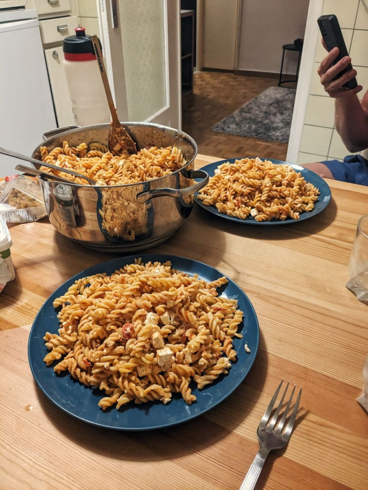

+++

title = "Alpen crossing"

draft = "false"

date = "2023-07-22 22:02:16.357161"
+++

Departure at 8am, water bottles fall, tires explode, in short, we are 300 cyclists.

I take the lead group which drags me at 30 km/h average towards Aosta before I get lost.

The climb up the pass is hell. 30 kilometers at 6% average, the bike loaded with 23 kilos, I sweat and get overtaken a lot, by everyone lightly loaded who sleep in hotels, or those just more experienced than me.







Several breaks later, deliverance awaits me at the summit. A quick glance at the GPS, surprisingly I'm still not too badly placed. The descent is dizzying, 40 kilometers of asphalt smooth as a billiard table.

Unfortunately, an accident blocks the road halfway. The silver lining is that many cyclists gather, thus recreating a small peloton. I notably meet one of the Frenchmen from yesterday, we decide to finish together to sleep in Lausanne.







End of descent, we rejoin a group. To make up for the delay, the pace is even faster, during relays you have to drag teammates at over 30 km/h to avoid being replaced.

In Montreux it's too much, with Sébastien, the French companion, we stop to do grocery shopping. 27 kilometers later, we arrive in Lausanne, a kilo of pasta and some tomato sauce on our hands.

The evening is short: shower, dinner, sleep, everything is done in 1h30.

Tomorrow morning a small pass awaits us again at sunrise, we need to be sharp. The second fellow, Laurent, struggling in the climb, will join us during the night.

## Comments

#### Séverine
Go on Ivan!
What a journey! And it's only the beginning... You must be soaking it all in. Thank you for taking us along, I'll take a few minutes each day to read you and admire your photos. Bravo 👏

#### François
Wow what a first day!
Very beautiful pass, already tough without luggage 😄 and the view at the top is superb.
Nice to ride in a group.
Can't wait to read the rest!

#### LO73
Cool, this little diary, so good!!! Have a great trip, it's a wonderful experience :)
