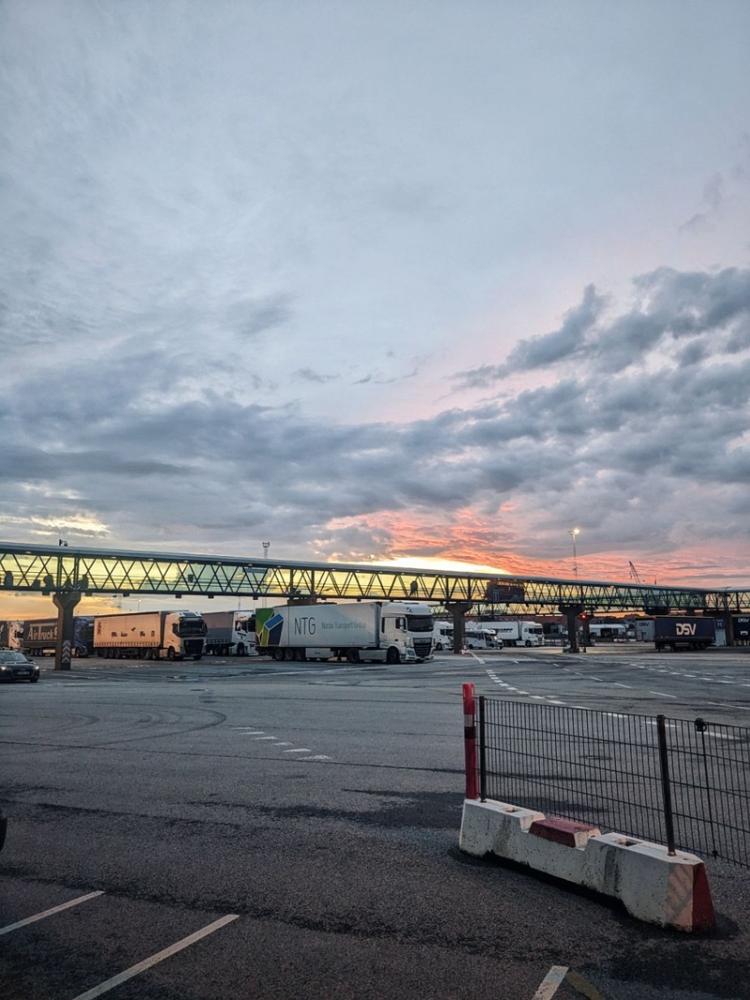

+++

title = "Bye Bye Denmark"

draft = "false"

date = "2023-07-30 23:05:11.235387"
+++

Today's stage is quite short, only 150 km. We sleep in late and have a hearty breakfast. In fact, we take our time, so as not to arrive too early at the ferry terminal.

Once we set off, everything goes very fast. The road flies by, the wind pushes us. Only a long and intense rain comes to spoil this otherwise very peaceful day.
<!--more-->






In Frederikshavn we do some shopping and go to the car wash to clean the bikes, which the 2,000 km have worn out.

After a big gathering with other participants in the terminal hall, there's the wait, the boarding, then settling in, in the big reclining seat lounge.







I gave the sleeping-bag trick to all my colleagues, so we end up, 15 stinky cyclists, sleeping on the ship's carpet.

Tomorrow we'll enjoy the breakfast on board to recover our health and calmly attack the first Norwegian hills.

## Comments

#### François
First part impressive! Thanks for sharing your adventure, it almost feels like we're participating (even though I only did 20 km of cycling in the same period, haha). Enjoy this little break and safe travels for the rest!

#### Maman
15 stinky cyclists... and snoring probably... I can picture the scene! 🥴☺️ You must not have been disturbed, ha! ha!
And now the wide open spaces! Something tells me the "machine" is going to cut loose, but still, be careful, it's far up there! Not too fast, right! Enjoy this splendid road! 😘

#### Georges
Very beautiful skies along the way!
