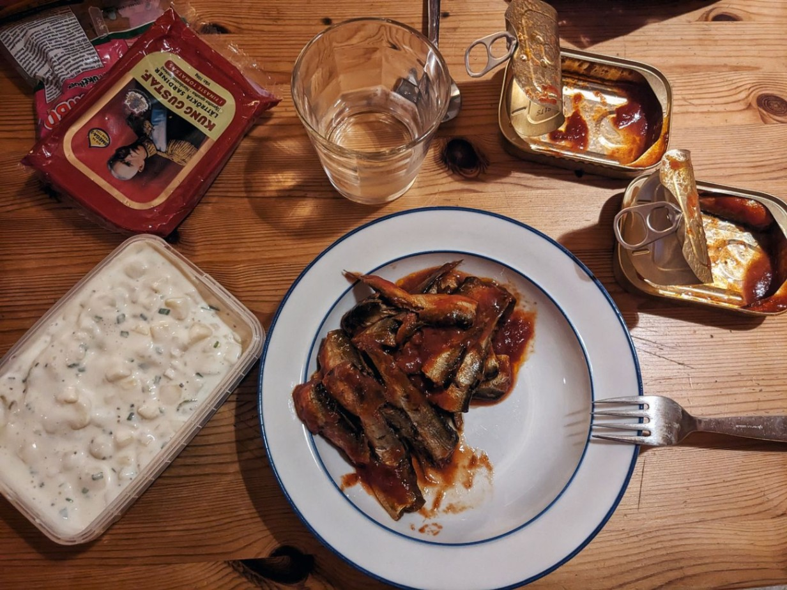

+++

title = "Like fish in water"

draft = "false"

date = "2023-08-01 21:28:57.559769"
+++

The 5am departure is freezing, I'm covered as much as possible and yet I'm dying of cold. After an hour the rain joins the party and our hardest day so far begins.

For more than four hours, not a word exchanged. We swallow our pain and each fight our own mental battle to hold on.
<!--more-->






We hadn't anticipated the fact that we are now in Scandinavia; it takes nearly 160 km of intense cold and rain before we stumble upon a proper gas station, heated, with hot coffees and hot dogs.

This meal sets us right, the temperature warms up, we quickly reach kilometer 230 where the last supermarket before our accommodation awaits. We therefore have to carry our food for over 80 km, not very pleasant.







I loaded up on sugar at the store and make short work of these last kilometers, dragging Sébastien, a Frenchman and a Swede in my wake.

The cabin where we sleep is very cozy and these accommodations, which in France would certainly cost a small fortune, are here cheaper than a hostel dormitory.







Tomorrow another long day awaits, with less elevation, but a real deluge in the afternoon.

## Comments

#### Maman
When I think you're about 200 km from Trondheim... Did you imagine back then that you would come back here, (almost), by bike?!! Over 300 km today... despite the cold, the rain, the elevation, bravo!! really!! What a comfort this little cabin 😍!
I'll be thinking of you tomorrow. Here it's starting to blow hard, storm announced in the coming hours...
A good restorative night, Ivan, and tomorrow fresh and ready to fight! 😉😘

#### Sandrine
Hi Ivan!
What a journey! I'm amazed and always impatient to read your summary every evening!
We're following you closely with Pascal and Françoise whom we joined in the Pyrenees.
Courage to you and your travel companions for this new day which will obviously challenge you again!
