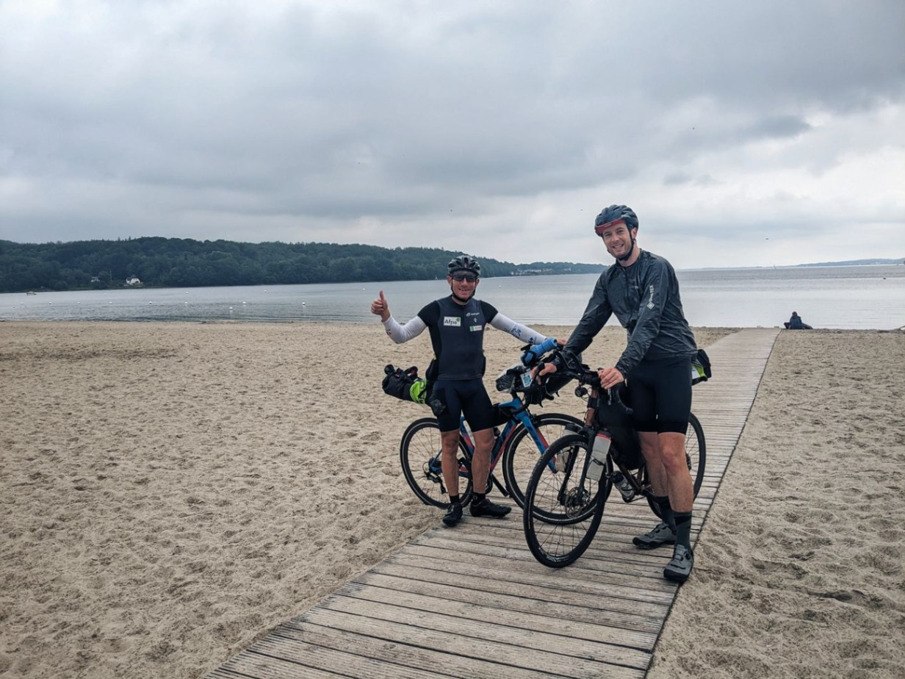
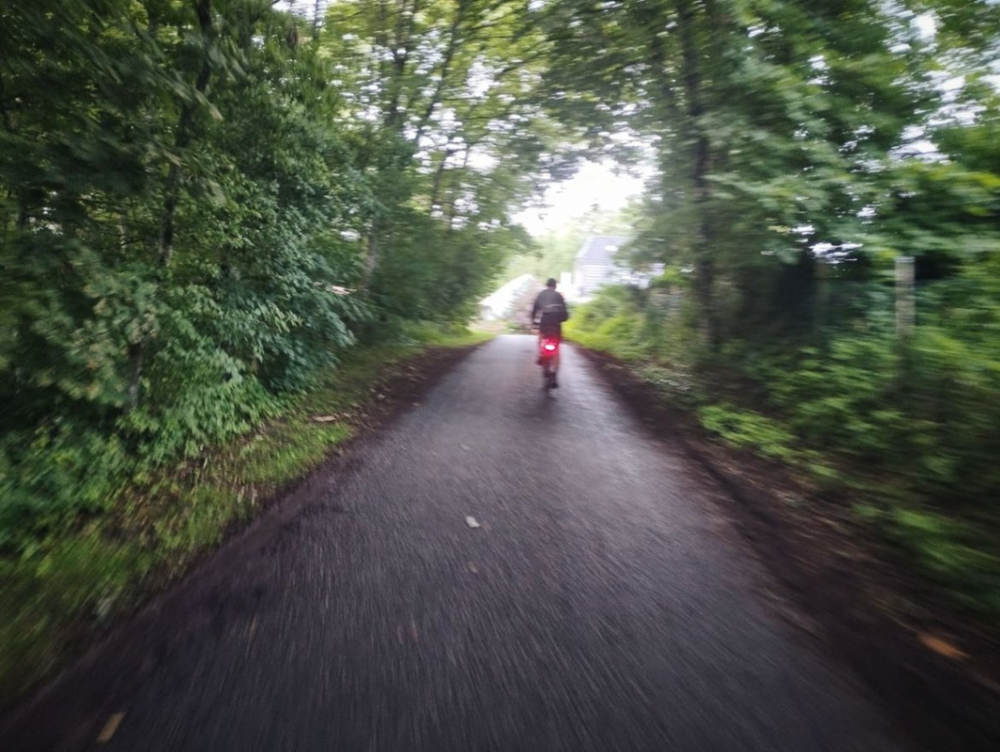

+++

title = "Danish cruising"

draft = "false"

date = "2023-07-29 21:31:43.071766"
+++

This morning two punctures delay us by almost an hour, after an already late start. Pierre has to find a bike shop to durably repair his tire while I continue the road with Sébastien.

Soon, we reach the Danish border. What excitement! It's the first country of the trip I've never visited. The landscapes have changed a lot, the flat fields giving way to immense pines that make it feel like we've already crossed to "the other side".







A powerful tailwind carries us north without too much effort. The kilometers fly by incredibly fast, we keep pedaling to increase the speed even more.

After our few compulsory breaks, I find a small motel almost on the route. It's the cheapest in town.









Surprisingly, the place is perfect! (At least, for us).
A room, two beds, a mini-kitchen and a table for dinner, that's what we dreamed of after this long day, marked by a few showers.







We fall asleep exhausted but proud of ourselves, our plan is going perfectly. Tomorrow we only have 160 km to do and we can rest at leisure on the ferry, to attack Sweden in top shape!








## Comments

#### Maman
Ah, I suspected as much, apart from the showers, what a beautiful road! What satisfaction to reach Denmark! Too bad for Pierre, the puncture is a bummer 🙄. Thanks Ivan for these beautiful photos! Given the state of the legs, a hotel night with a shower, essential, that's for sure!!
But there's some letting go on the gastronomy side... You really have to be very hungry there... 🥴!
Great race tomorrow!! 😘

#### Dad
I woke up last night around 4:17am, struck by a terrible calf cramp forcing me to move like a feline in the confined space of the tent, between basin, jerrycan, travel bags, always right leg straight and toes spread... After extricating myself from my canvas, I did some extra stretches and to make sure I wouldn't wake up my neighbors again - some Italians from Torino, ma che si... I set off, softly, for a few laps around a grove separating our lodging from the transalpines...
There, dizziness takes me because a sore rear makes my step unsteady. After a painful lap around the grove on the small ring, I decide by feel to park my now delicate bottom in the hollow of my folding chair, to think a bit about my condition... already, yesterday it was like needles in the knees, today a cramp followed by a groundless pain...
I convulsively consult my companion: where is Ivan?
Blog, tracker, WhatsApp...
Ah in the motel, not alone...
I feel reinvigorated and sleep overtakes me again.

Vai avanti Ivan
