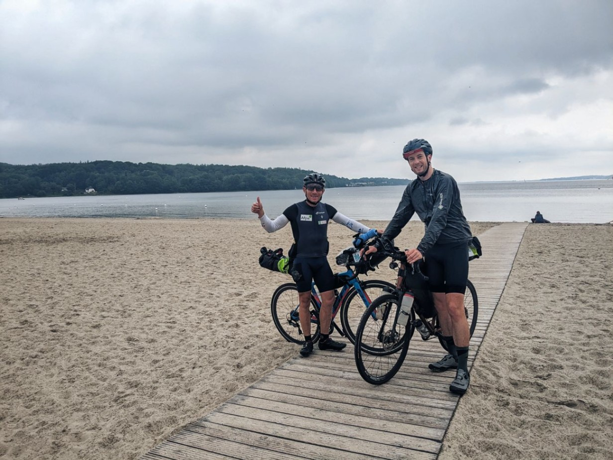
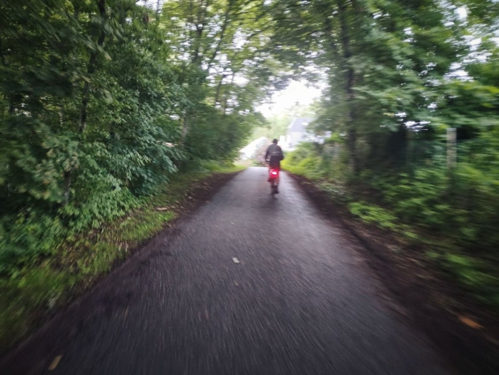

+++

title = "Danish cruising"

draft = "false"

date = "2023-07-29 21:31:43.071766"
+++

Ce matin deux crevaisons nous retardent de presque une heure, après un départ déjà tardif. Pierre doit rejoindre un vélociste pour réparer durablement son pneu tandis que je continue la route avec Sébastien.

Rapidement, nous rejoignons la frontière du Danemark. Quelle excitation ! C'est le premier pays du voyage que je n'ai jamais visité. Les paysages ont bien changé, les champs plats laissant place à d'immenses pins qui donnent l'impression d'être déjà passé de "l'autre côté".







Un vent de dos puissant nous porte vers le nord sans trop d'effort. Les kilomètres s'enchaînent incroyablement vite, nous continuons de pédaler pour augmenter encore la vitesse.

Après nos quelques pauses réglementaires, je déniche un petit motel presque sur le parcours. C'est le moins cher de la ville.









Étonnamment, l'établissement est parfait ! (En tout cas, pour nous).
Une chambre, deux lits, une mini-cuisine et une table pour dîner, voilà ce dont nous rêvions après cette longue journée, marquée par quelques averses.







Nous nous endormons épuisés mais fiers de nous, notre plan se déroule à merveille. Demain nous n'aurons que 160 km à effectuer et nous pourrons nous reposer à l'envie dans le ferry, pour attaquer la Suède en pleine forme !








## Commentaires

#### Maman
Ah, je m'en doutais bien, hormis les averses, quelle belle route ! Quelle satisfaction d'atteindre le Danemark ! Dommage pour Pierre, la crevaison, c'est la tuile 🙄. Merci Ivan pour ces belles photos ! Vu l'état des jambes, nuit à l'hôtel avec douche, indispensable, c'est sûr !!
Par contre, y'a du laisser-aller côté gastronomie... Faut vraiment avoir très faim là... 🥴 !
Belle course demain !! 😘

#### Dad
Je me suis réveillé cette nuit vers 4h17, meurtri par une terrible crampe au mollet m'obligeant à me déplacer tel un félin dans l'espace restreint de la tente, entre bassine, jerrican, sacs de voyage, toujours jambe droite tendue et orteils déployés... Après m'être extirpé de ma toile, j'effectuai quelques étirements complémentaires et pour me rendre certain de ne pas avoir à réveiller une nouvelle fois mes voisins - des Italiens de Torino, ma que si... je m'engage, à pas feutrés, pour quelques tours d'un bosquet séparant notre gîte de celui des transalpins...
Là, le vertige me prend car un mal de fesses rend mon pas peu assuré. Après un pénible tour de bosquet sur le petit braquet, je décide à tâtons de caler mon fessier devenu bien délicat au creux de ma chaise pliante, histoire de réfléchir un peu à ma condition... déjà, hier c'était comme des piques dans les genoux, aujourd'hui crampe suivie d'un mal sans fondement...
Je consulte convulsivement mon compagnon : où est Ivan ?
Blog, tracker, WhatsApp...
Ah dans le motel, pas tout seul...
Je me sens requinqué et le sommeil m'envahit à nouveau.

Vai avanti Ivan
