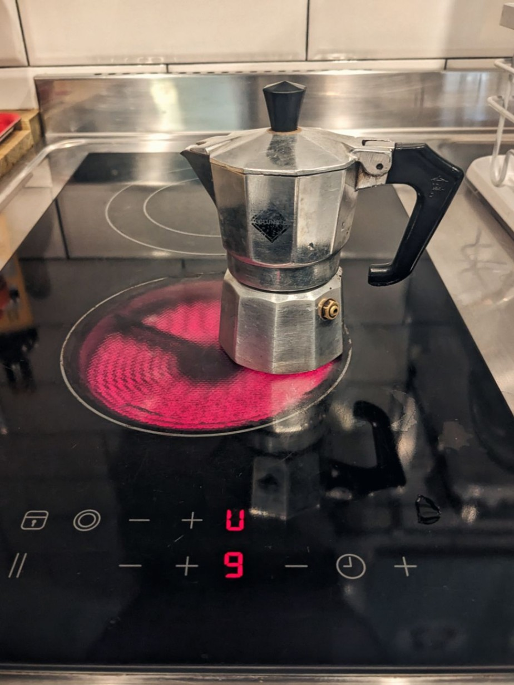
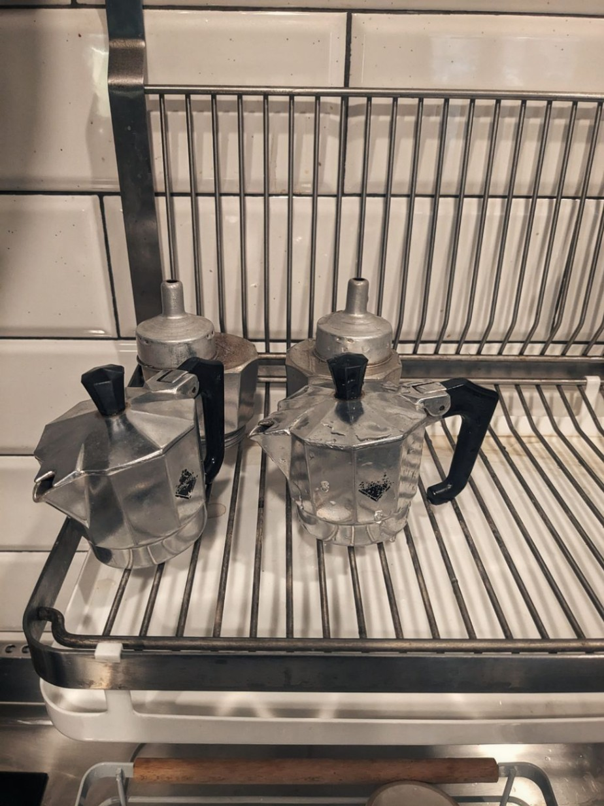
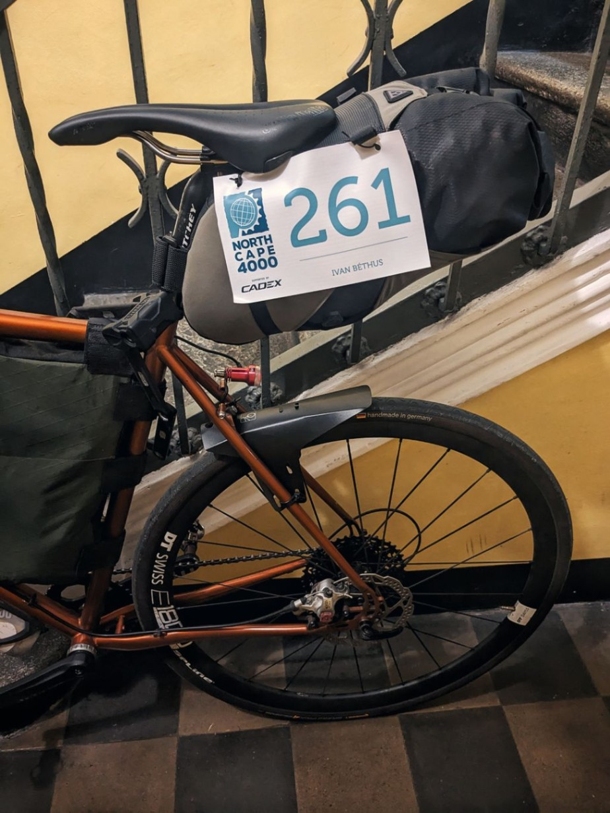

+++

title = "The last sip of beer"

draft = "false"

date = "2023-07-21 19:22:30.334160"
+++

The night was good sheltered by the fan. A late wake-up, but not too late, followed by two _Italian-style_ coffees - of course - later, it's time to do some small shopping in preparation for the next day.
<!--more-->

#### Thunder of Zeus

I barely set foot outside when a deluge pours down on me. Powerful lightning bolts streak across the sky and I have no choice but to take shelter waiting for the storm to pass.

As soon as the weather clears, my road resumes towards _Il Gigante_, the local "Giant", as one might guess. A raid on bars of all kinds, compotes, and other sports provisions. A few vacuum-packed focaccias too, can't hurt.






The return is calmer and allows me a soft landing at the hostel. I have lunch there then patiently wait for the time of the big meeting.

#### Three hundred of us set out...

3pm, _Reggia di Venaria_. Cyclists flock from all sides, hiccuping over the cobblestones of the royal palace. It's very beautiful, but this is no time for strolling.

Various signs and kakemonos point the way to a modest stand, on which small white envelopes are laid out. Each contains a cyclist's kit: a race number, a small cap bearing the event's logo, and a booklet to be stamped. I'm also handed my GPS tracker.

A beer is offered. I sip it quietly, in the peaceful shade of the brick walls. Discussions are lively and everyone checks out each other's bikes.

Carbon, steel, titanium, there's something for every taste! My Croix de Fer looks pale next to the speed monsters I see. Fortunately, this "race" is played out as much in the mind as in the legs.







Soon, a conversation starts with two Frenchmen. Exchange of tips gleaned from the web. They give me a nice surprise for this start of the journey: an apartment in Lausanne where I'm invited to spend the night. They, like me, plan to arrive there tomorrow around midnight. A rendezvous is set and numbers exchanged.

I leave this meeting with a light heart. The weather forecast is more clement than expected and the prospect of sleeping under a roof tomorrow evening delights me.

Moreover, these two new companions told me it would be possible to book a crossing to Oslo on the 30th! As soon as the shipping company office reopens, a phone call is in order. This crossing point conditions the entire first part of my trip; if I can reduce the necessary daily kilometers to Denmark, I'm all for it.

9pm, the panniers are ready, the cyclist too. It's almost time to sleep, tomorrow begins the craziest and greatest adventure of my life.

## Comments

#### Sandrine
Hi Ivan,
What a pleasure to follow you in your new adventures!
It seems some clouds have already failed to resist your arrival, or is it the power of "261"!
Apartment in Lausanne, hope of postponing the boat departure in Denmark, meeting nice people... So much good news indeed!!
And what a cap!!
The first pedal stroke tomorrow will probably stay in your memory for a long time!
Go Ivan!

#### Maman
Hi Ivan,
Reducing the pace a bit, before reaching Oslo, excellent news! This friendly meeting with these two riders, what luck!
Here we are back in the saddle with you! With always such enthusiastic pleasure in reading you! I'll be thinking of you tomorrow 😘!

#### Hervé
Hi Ivan, I wish you all the best in this cycling journey, I trust you to make it to the end of the adventure.

#### Patricia and Norbert
Hello Ivan
We are with you and will follow you regularly!
It's a beautiful adventure!!
