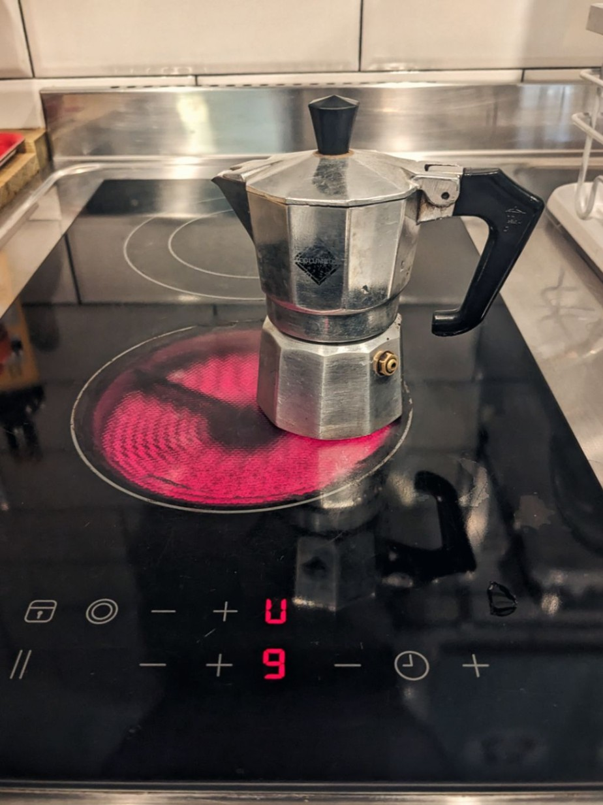
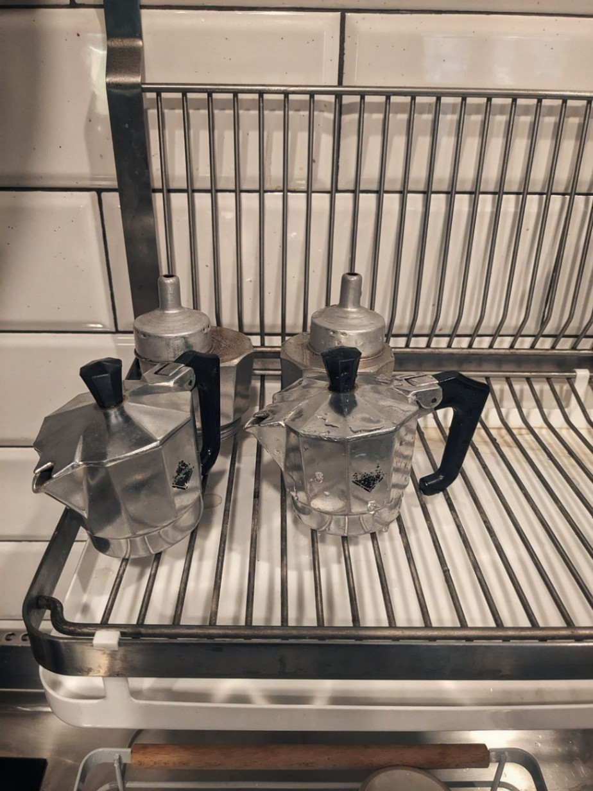
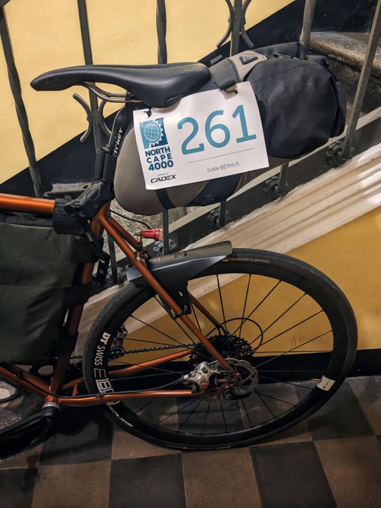

+++
speed = "4.011528"
title = "La dernière gorgée de bière"
gps = "NC4K_meeting.png"
draft = "false"
distance = "17322"
elevation = "95"
duration = "4:19:05"
date = "2023-07-21 19:22:30.334160"
+++

La nuit fut bonne à l'abri du ventilateur. Un réveil tardif, mais pas trop, suivi de deux cafés _à l'italienne_ - bien sûr -, plus tard, il est temps de faire de petites courses en prévision du lendemain.

#### Tonnerre de Zeus

À peine ai-je mis un pied dehors qu'un déluge s'abat sur moi. Des éclairs puissants zèbrent le ciel et je n'ai d'autre choix que de me mettre à l'abri en attendant que passe la tempête.

Dès que le temps se dégage, ma route reprend vers _Il Gigante_, le "Géant" local, on l'aura compris. Razzia de barres en tout genre, de compotes, et autres victuailles de sportif. Quelques focaccias sous vide aussi, ça ne peut pas faire de mal.






Le retour est plus calme et me permet un atterrissage en douceur à l'auberge. J'y déjeune puis attends patiemment l'heure du grand rendez-vous.

#### Nous partîmes trois cents...

15h, _Reggia di Venaria_. Des cyclistes affluent de toute part, hoquetant sur les pavés du palais royal. C'est très beau, mais l'heure n'est pas à la flânerie.

Des panonceaux et kakémonos en tout genre indiquent la voie vers un modeste stand, sur lequel sont disposées de petites enveloppes blanches. Chacune contient le kit d'un cycliste : un dossard, une petite casquette à l'effigie de l'événement et un carnet à faire tamponner. On me remet également mon tracker GPS.

Une bière est offerte. Je la sirote tranquillement, à l'ombre paisible des murs de briques. Les discussions vont bon train et chacun observe la monture des autres.

Du carbone, de l'acier, du titane, il y en a pour tous les goûts ! Mon Croix de Fer fait pâle figure face aux monstres de vitesse que j'aperçois. Heureusement, cette "course" se joue tout autant au mental qu'aux jambes.







Rapidement, une discussion s'engage avec deux Français. Échange de conseils glanés sur le web. Ils m'offrent une belle surprise pour ce début de voyage : un appartement à Lausanne dans lequel je suis invité à passer la nuit. Ils ont, comme moi, prévu d'y arriver demain vers minuit. Rendez-vous est donc pris et numéros échangés.

Je rentre de ce meeting le cœur léger. La météo s'annonce plus clémente que prévue et la perspective d'un sommeil sous un toit demain soir me ravit.

De plus, ces deux nouveaux compagnons m'ont appris qu'il serait possible de réserver une traversée vers Oslo le 30 ! Dès que le bureau de la compagnie maritime rouvre, un coup de fil s'impose. Ce point de passage conditionne toute la première partie de mon voyage, si je peux réduire les kilomètres journaliers nécessaires jusqu'au Danemark, je suis preneur.

21h, les sacoches sont prêtes, le cycliste également. Il est bientôt l'heure de dormir, demain commence la plus folle et gigantesque aventure de ma vie.

## Commentaires

#### Sandrine
Coucou Ivan,
Quel plaisir de te suivre dans tes nouvelles aventures !
On dirait que certains nuages n'ont déjà pas résisté devant ta venue, ou bien c'est le pouvoir du "261" !
Appartement à Lausanne, espoir de différer le départ en bateau au Danemark, rencontre de gens sympas... Que de bonnes nouvelles en effet !!
Et quelle casquette !!
Le premier coup de pédale de demain restera probablement longtemps dans ta mémoire !
Allez Ivan !

#### Maman
Coucou Ivan,
Réduire un peu la cadence finalement, avant d'atteindre le Oslo, excellente nouvelle ! Cette rencontre amicale avec ces deux coureurs, quelle chance !
Nous voilà à nouveau en selle avec toi ! Avec un plaisir toujours aussi enthousiaste de te lire ! Je pense bien à toi demain 😘 !

#### Hervé
Salut Ivan, je te souhaite le meilleur dans ce périple cycliste, j'ai confiance en toi pour que tu arrives au bout de l'aventure.

#### Patricia et Norbert
Hello Ivan
Nous sommes avec toi et allons te suivre régulièrement !
C'est une belle aventure !!
