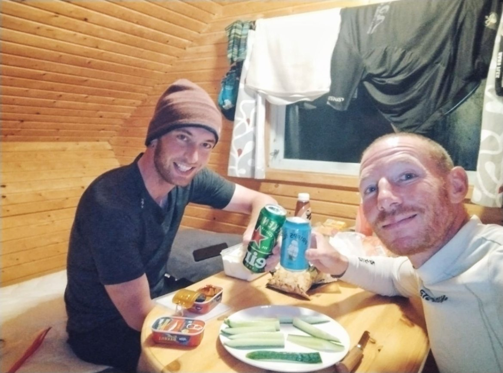

+++

title = "The great crossing"

draft = "false"

date = "2023-08-03 20:15:55.965344"
+++

Today it's _finally_ under a bright sun that we set out to conquer Lapland. Soon we meet Eduard, a Dutchman we've often crossed paths with on the road. We decide to ride together, as he's aiming for the same town as us, then to share a lodging.
<!--more-->






The day is radiant, but Lapland is a somewhat monotonous place and in any case very... empty! As Sébastien would say, it looks like Limousin, but a hundred times bigger.

To find water we have to knock on houses, never getting an answer. We end up stealing some from a garden.







Eduard is a very strong rider and he leads the crew to averages never reached before. Needless to say I'm suffering, but it's worth it, we arrive early!

Early enough to enjoy the evening and eat our fill.







Tomorrow a huge stage awaits us to the last checkpoint before the North Cape: Gällivare.







## Comments

#### Maman
What beautiful photos! What a pleasure to see you under this sun! You have a locomotive, is that Eduard?, That's great for morale and the calves! 😊
Only about 440 km before the gate of 4,000? Then there's still about 620 km before you get the little flag?!
I see it's dietetic tonight, cucumbers, no more joking!!
Good night! and tomorrow I feel it's going to accelerate again! Bravissimo!! 🙂 !
😘
