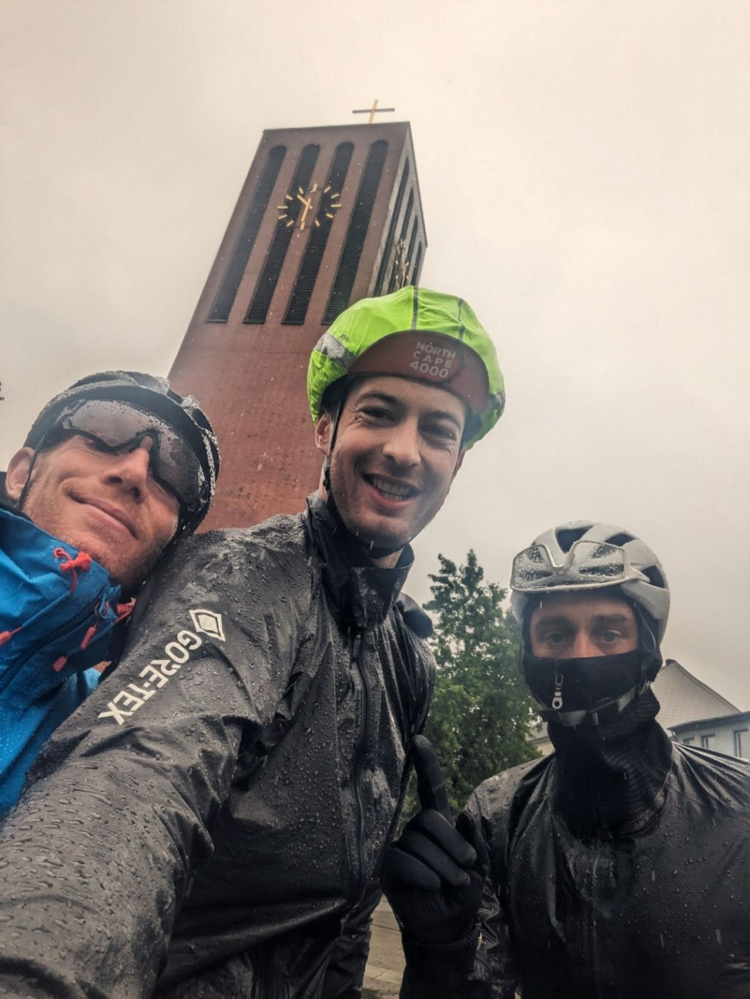

+++

title = "The Teutonic deluge"

draft = "false"

date = "2023-07-27 21:13:38.533605"
+++

We leave later this morning and plan a short day, to recover from yesterday. The German hotel is an immense labyrinth in which we get lost quite a bit before managing to get out. We empty the all-you-can-eat buffet to rebuild our strength.
<!--more-->





The rain is here and won't leave us all day, making this stage difficult and frankly a bit tedious. Despite everything, we benefit from a favorable wind that pushes us swiftly through the fields.

First break at 120km, we had never ridden so long without stopping. We devour phenomenal quantities of brötchen in a bakery before amused waitresses who exchange anecdotes in German about the NorthCape, we are clearly not the first to pass through here.







The second part of the day is marked by two punctures. We quickly repair then head back towards Lohne where we sleep in a room for two, with an inflatable mattress on the floor.

A good kebab got us back in shape. It's necessary because tomorrow, 280km are on the program!







## Comments

#### Titi
We say "temps de cochon" (pig weather), Germans have "Sauwetter", literally "sow weather". ^^ (pronounce saovéteur)
Well, a day to forget it seems. Yet the church photo suggests quite nice architecture. Thanks once again for these summaries.
Good luck for tomorrow's day!

#### Maman
Water everywhere, streaming, small puffy eyes, tired faces, punctures... but the beer, but the extravagant sandwiches, but the camaraderie you can sense, but those smiles!! We'd love to be there!
Thank you for all that Ivan 😊
and courage to the whole team! 🙂

#### Les Goiseau
Impressive!!
Big kisses from Vendée Ivan and good luck!!

#### Christian Pomarez
Bravo and good luck for the rest
Warm regards from the Landes.
It's a section I did during my travels in Germany
