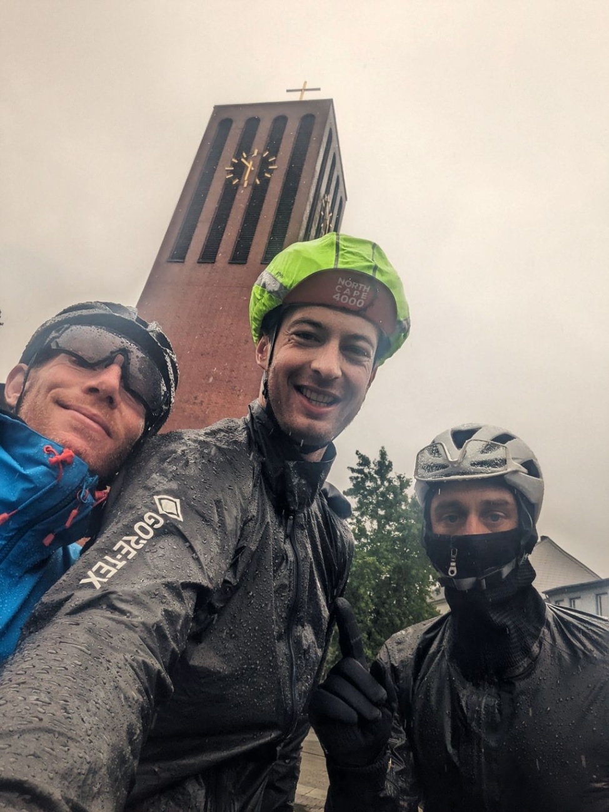

+++
speed = "18.897783"
title = "Le déluge teutonique"
gps = "Morning_Ride (1).png"
draft = "false"
distance = "219524"
elevation = "1156"
duration = "11:36:59"
date = "2023-07-27 21:13:38.533605"
+++

Nous partons plus tard ce matin et prévoyons une petite journée, pour récupérer de la veille. L'hôtel allemand est un labyrinthe immense dans lequel nous nous perdons pas mal avant de réussir à sortir. Nous vidons le buffet à volonté pour refaire nos forces.






La pluie est au rendez-vous et ne nous quittera pas de la journée, ce qui rend cette étape difficile et franchement un peu pénible. Malgré tout, nous bénéficions d'un vent favorable qui nous pousse à vive allure à travers les champs.

Première pause à 120km, jamais nous n'avions roulé aussi longtemps sans marquer d'arrêt. Nous avalons des quantités phénoménales de brötchen dans une boulangerie devant des serveuses hilares qui s'échangent en allemand des anecdotes sur la NorthCape, nous ne sommes manifestement pas les premiers à passer ici.







La deuxième partie de la journée est marquée par deux crevaisons. Nous réparons prestement puis repartons vers Lohne où nous dormons dans une chambre pour deux, avec un matelas gonflable au sol.

Un bon kebab nous a remis en forme. C'est nécessaire car demain, 280km sont au programme !







## Commentaires

#### Titi
On dit temps de cochon, les allemands ont "Sauwetter", littéralement "temps de truie". ^^ (prononce le saovéteur)
Bon, journée à oublier on dirait. Pourtant, la photo de l'église laisse imaginer une architecture assez sympa. Merci une fois de plus pour ces résumés.
Bon courage pour la journée de demain !

#### Maman
L'eau partout, qui ruisselle, les petits yeux gonflés, les visages fatigués, les crevaisons ... mais la bière, mais les sandwichs extravagants, mais la connivence qu'on devine, mais ces sourires !!  On aimerait y être! 
Merci pour tout ça Ivan 😊  
et courage à toute la cordée !🙂

#### Les Goiseau
Impressionnant !!
Grosses bises de la Vendée  Ivan et bon courage !!

#### Christian Pomarez
Bravo et bon courage pour la suite

Bien amicalement des Landes.
C'est un tronçon que j'ai fait durant mes voyages en Allemagne
