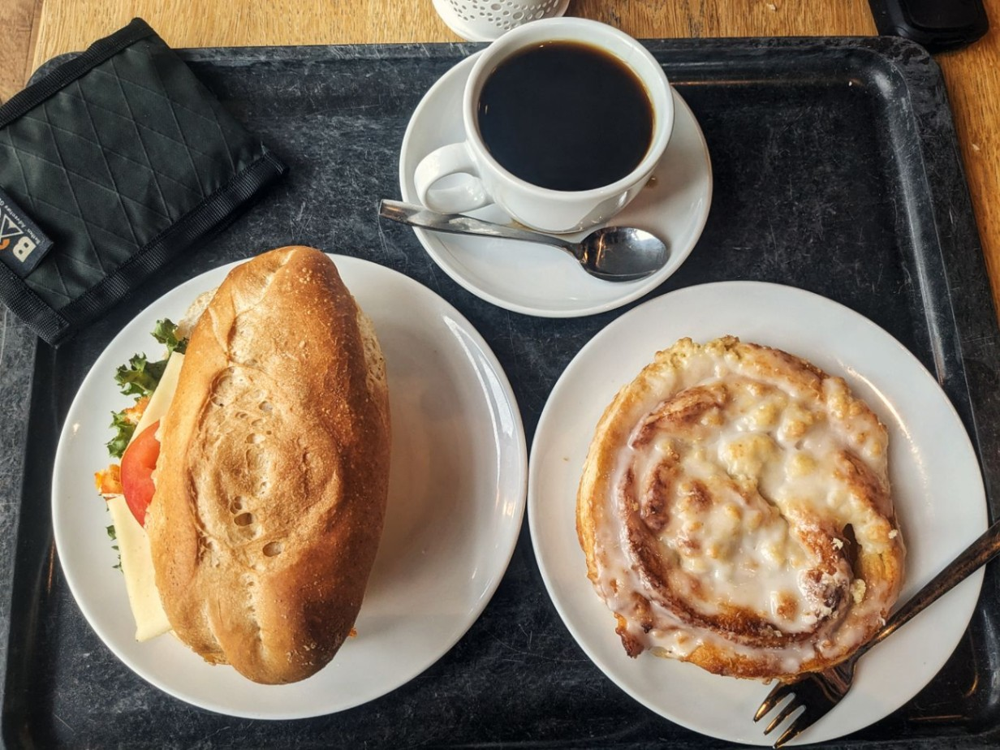

+++

title = "The four seasons"

draft = "false"

date = "2023-07-28 21:53:18.605433"
+++

For a change, departure under drizzle and grey skies this morning. A first puncture occurs in Bremen, then we take a monumental shower, the kind that penetrates every layer of our clothing.
<!--more-->





At the 120th kilometer, I catch up with my companions who had distanced me. They leave while I have lunch.

For the first time, I'll be able to ride alone over a long distance.

The road is prettier than usual and I enjoy the scenery, especially since in the late afternoon, the sun returns (it will reach up to thirty degrees!).







After crossing the Elbe by boat I find my two friends and we finish the day together, wandering through the golden countryside.

The evening takes place in a kitsch hotel in Rendsburg, we buy sandwiches and beers at the gas station, which we devour on the plastic terrace table. In short, a normal evening, on the NorthCape.






I was able to exchange my ferry ticket with another participant today, so I'll make the crossing on Sunday. Tomorrow we'll push forward as far as possible with Sébastien, then we'll finish calmly on Sunday, before attacking the second half, the wild part, of the journey...

## Comments

#### Nina
Can't wait to read what you think of Denmark :) The coast towards Frederikshavn reminded me of Brittany, especially near Skagen!
Safe travels :)

#### Titi
Good averages. You seem to be getting some color back. The food photos don't make you dream, Germany I guess. ^^
Glad you found a solution for your crossing.
Good luck tomorrow!

#### Maman
Saturday seems to have been a good day!
About 150 km to go, it's the embarkation point for Oslo! But are you only 2 left?
I'll take the opportunity to discover northwestern Denmark. It looks really nice... those colorful houses, those tall sailboats...
A foretaste of the rest of the adventure!
Good night Ivan, may tomorrow give you wings!! 😘
