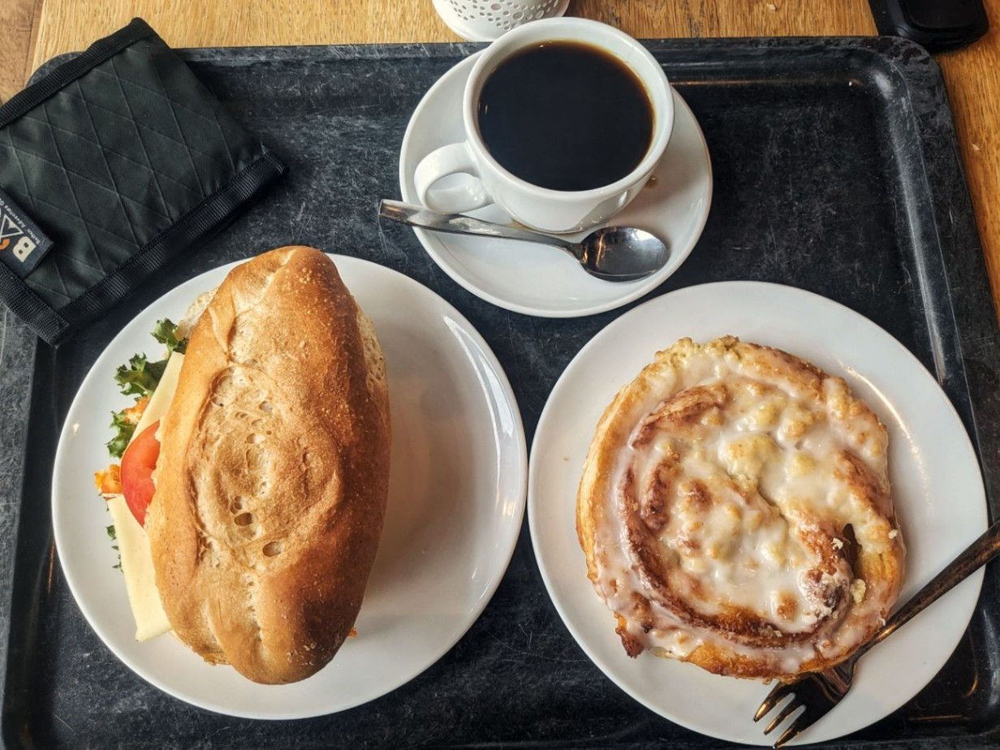

+++

title = "Les quatre saisons"

draft = "false"

date = "2023-07-28 21:53:18.605433"
+++

Pour changer, départ sous le crachin et la grisaille ce matin. Une première crevaison intervient à Brême, puis nous prenons une douche monumentale, du genre qui pénètre toutes les couches de notre tenue.
<!--more-->





Au 120e kilomètre, je retrouve mes comparses qui m'avaient distancé. Ils repartent pendant que je déjeune.

Pour la première fois, je vais pouvoir rouler seul sur une longue distance.

La route est plus jolie que d'habitude et je profite des paysages, d'autant qu'en fin d'après-midi, le soleil revient (il fera jusqu'à trente degrés !).







Après le passage de l'Elbe en bateau je retrouve mes deux amis et nous finissons la journée ensemble, en sillonnant la campagne dorée.

La soirée a lieu dans un hôtel kitsch de Rendsburg, nous achetons des sandwichs et des bières à la station-service, que nous dévorerons sur la table en plastique de la terrasse. En somme, une soirée normale, sur la NorthCape.






J'ai pu échanger mon billet de ferry avec un autre participant aujourd'hui, je ferai donc la traversée dimanche. Demain nous nous avançons le plus possible avec Sébastien, puis nous finirons tranquillement dimanche, avant d'attaquer la deuxième moitié, sauvage, du voyage...

## Commentaires

#### Nina
Hâte de lire ce que tu penses du Danemark :) La côte vers Frederikshavn m'avait fait penser à la Bretagne, surtout vers Skagen !
Bonne route :)

#### Titi
Des bonnes moyennes. On a l'impression que tu retrouves des couleurs. Les photos de bouffe font pas rêver, l'Allemagne quoi. ^^
Content que tu aies trouvé une solution pour ta traversée.
Bon courage demain !

#### Maman
Samedi a été une bonne journée on dirait !
Dans 150 km environ, c'est l'embarcadère pour Oslo ! Mais vous n'êtes plus que 2 ?
J'en profite pour découvrir le Danemark du nord-ouest. Ça a l'air très chouette... ces maisons colorées, ces grands voiliers...
Un avant-goût de la suite de l'aventure !
Bonne nuit Ivan, que demain te donne des ailes !! 😘
