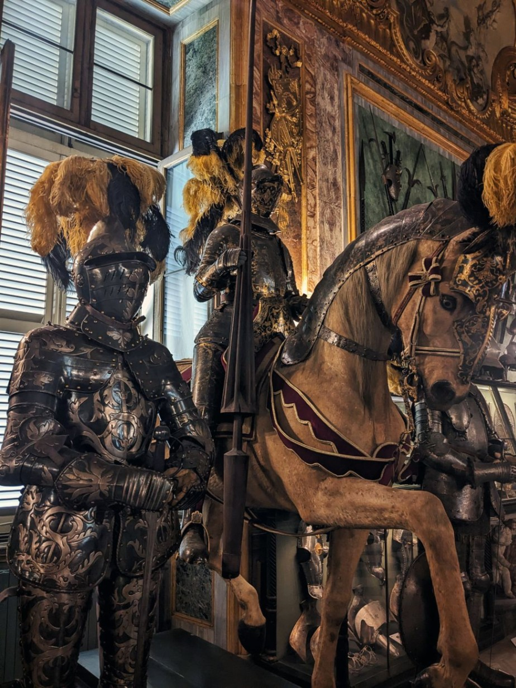

+++
title = "Lost in translation"
date = "2023-07-20 19:28:59.594228"
draft = "false"
+++

Last-minute changes of plans caused a small unforeseen event: I spend a whole extra day in Turin with no other goal than to wait for the fateful kick-off of the adventure.

#### (Dis)Orientation

The arrival took place the night before, at 11pm, a bit late, this bus. Of course, my network provider gives up on me: no mobile data.

After a good half-hour struggling in the streets of the not-quite-asleep city wrapped in a humid heat that would peel the wallpaper off, I find the hostel, my keys, my room.






A good shower cleans me of the accumulated grime from the Intercités and then the sticky Flixbus, I can sleep peacefully - and alone - in my dormitory.

#### Bella Torino

After two hours of battle with my operator, the connection works again, I won't have to buy a paper map of Scandinavia.

I dash to the Decathlon in the city center to perfect my gear, I buy a waterproof helmet cover, as plenty of rain is forecast for the coming days.







A quick tour of the center later, I set my sights on a quasi-bakery where I order - of course - a focaccia. I enjoy it in a shady park.

Small rivers of fat spurt out with each bite. Fortunately, a nearby fountain quenches my thirst. It's much worse (or better) than anything I've eaten before! Not very suitable for the 34°C that are forecast though.

#### Art or trash

Following this dubious taste break, I head towards the grand _Museo Reali_ where I treat myself to an excellent _caffè lungo_ in the shade of the arcades.

3pm, I'm hanging around, the heatwave arrives, suffocating, relentless. But a simple ticket takes care of it, the museum is air-conditioned, it will be my haven of peace for the afternoon.







I walk past the collections with a glassy eye and a foggy mind. The NC4K occupies my thoughts and somewhat overshadows the old trinkets displayed here and there.

I nevertheless delight in the ancient collections in the basement, remains of distant and prestigious Middle-Eastern ancestors.






At 6pm I'm already on my way back, with small provisions in my bag. Tonight avocado/philadelphia/GMO chicken wraps will do the trick.

I take advantage of the calm at the hostel to take a cool shower and collapse on my bed. An army of fans has been deployed to rout the heat, in vain.

Tonight many roommates have joined me. They are about to meet the one my friend Guillaume calls "the bear". Good night to them...

## Comments

#### Dad
I hope you don't look too much like Bill Murray though!!
I feel you're both a bit nervous and very eager to get going...
Did you show the Italians your beautiful jersey that went around the British Isles last year? I think they'd be impressed!
Buona notte a Torino...
And tomorrow morning don't forget the "Bicerin" on Piazza San Carlo!

#### Nina
Ok the best series of the summer is back, the first season was excellent and this pilot episode looks promising! I have full confidence in the writing, which will once again offer us tasty culinary details.
